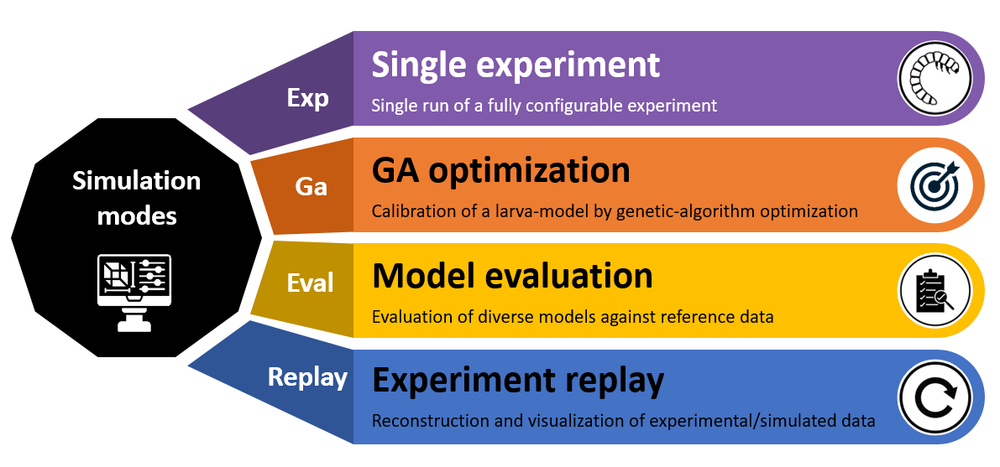

# Simulation Modes

Larvaworld provides **five distinct simulation modes**, each designed for different research workflows. Understanding these modes enables you to choose the right tool for your specific question.

All modes share the same underlying agent-based architecture and configuration pipeline, but differ in **how simulations are scheduled, how parameters are varied, and what kind of outputs they emphasize**:

- **Exp** – run a single experiment configuration (one condition, one output dataset/video).
- **Batch** – launch many `Exp`-like simulations over a grid of parameters or conditions (parameter sweeps, replicates).
- **Ga** – wrap simulations in an evolutionary loop to **optimize model parameters** against a fitness function.
- **Eval** – compare one or more model configurations against **reference datasets** using standardized metrics.
- **Replay** – visualize previously recorded experimental or simulated datasets without re-running the simulation.

Conceptually, these correspond to the simulation modes described in the Larvaworld paper [[Sakagiannis et al., 2025](https://doi.org/10.1101/2025.06.15.659765)]: starting from single-condition runs, through large-scale parameter exploration, to automated model fitting and evaluation against behavioral data.

---

## Overview



**Figure**: CLI simulation modes available in Larvaworld and their command-line arguments.

---

## Mode Comparison

```{mermaid}
graph TB
    subgraph "Single Experiment - Exp"
        E1[Single simulation<br/>One configuration]
        E2[One or multiple agents<br/>Fixed parameters]
        E3[Output: Dataset + Video]
    end

    subgraph "Batch Run - Batch"
        B1[Multiple simulations<br/>Parameter sweep]
        B2[Parallel execution<br/>Different conditions]
        B3[Output: Multiple datasets<br/>Comparative analysis]
    end

    subgraph "Genetic Algorithm - Ga"
        G1[Optimization loop<br/>Evolutionary search]
        G2[Population of genomes<br/>Fitness evaluation]
        G3[Output: Best genome<br/>Evolution history]
    end

    subgraph "Model Evaluation - Eval"
        V1[Compare models<br/>Against reference data]
        V2[Multiple model configs<br/>Fixed reference dataset]
        V3[Output: Statistical comparison<br/>KS test results]
    end

    subgraph "Dataset Replay - Replay"
        R1[Replay real data<br/>Visualization only]
        R2[Tracked trajectories<br/>From experiments]
        R3[Output: Video + Plots<br/>No simulation]
    end

    style E1 fill:#805aab,stroke:#5f497a,stroke-width:2px,color:#fff
    style B1 fill:#4caf50,stroke:#388e3c,stroke-width:2px,color:#000
    style G1 fill:#ed7d31,stroke:#b54d21,stroke-width:2px,color:#fff
    style V1 fill:#ffc000,stroke:#b38600,stroke-width:2px,color:#000
    style R1 fill:#4472c4,stroke:#2f5597,stroke-width:2px,color:#fff
```

---

## 1. Single Experiment (Exp)

### Purpose

Run **one simulation** with fixed parameters for testing, exploration, or video generation.

### Command-Line Usage

```bash
larvaworld Exp dish -N 5 -duration 3.0
```

### Python Usage

```python
from larvaworld.lib.sim import ExpRun

exp = ExpRun(experiment='chemotaxis', duration=5.0)
exp.simulate()
dataset = exp.datasets[0]
```

### Characteristics

- **Configuration**: One experiment ID (e.g., `'chemotaxis'`, `'dish'`)
- **Agents**: N larvae with specified model
- **Parameters**: Fixed throughout simulation
- **Execution**: Sequential, single run
- **Duration**: Seconds to minutes

### Outputs

- **Dataset**: Single `LarvaDataset` with pose and brain data
- **Video**: Optional real-time rendering or export (MP4, AVI)
- **Plots**: Analysis figures via `exp.analyze()`
- **Storage**: `DATA/SimGroup/exp_runs/{experiment}/{id}/`

### Use Cases

- ✅ Quick testing of configurations
- ✅ Video generation for presentations
- ✅ Single condition analysis
- ✅ Model demonstration

---

## 2. Batch Run (Batch)

### Purpose

Run **multiple simulations** with parameter variations to explore parameter space.

### Command-Line Usage

```bash
larvaworld Batch PItest_off -Nsims 10
```

### Python Usage

```python
from larvaworld.lib import reg
from larvaworld.lib.sim import BatchRun

# Load preconfigured Batch settings from registry
batch_conf = reg.conf.Batch.getID("PItest_off")

# Launch batch run with parallel execution
batch = BatchRun(experiment="PItest_off", **batch_conf)
par_df, figs = batch.simulate(n_jobs=4)
```

### Characteristics

- **Configuration**: One experiment ID + parameter sweep
- **Agents**: Multiple agent configurations
- **Parameters**: Varied across runs
- **Parallelization**: Uses `agentpy.Experiment` for multi-core execution
- **Iterations**: `Nsims` repetitions per parameter combination
- **Duration**: Hours

### Outputs

- **Datasets**: Multiple `LarvaDataset` objects (one per run)
- **Summary**: Aggregated results across conditions
- **Comparison**: Statistical analysis across parameter space
- **Storage**: `DATA/SimGroup/batch_runs/{experiment}/`

### Use Cases

- ✅ Parameter sensitivity analysis
- ✅ Robustness testing
- ✅ Comparative studies
- ✅ Statistical power analysis

:::{note}
`BatchRun` is an **advanced feature** that relies on preconfigured Batch entries in the registry (`reg.conf.Batch`). For most users, starting with `Exp` and `Eval` modes is recommended before moving to Batch-based parameter sweeps.
:::

---

## 3. Genetic Algorithm (Ga)

### Purpose

**Optimize model parameters** using evolutionary search to match target behaviors.

### Command-Line Usage

```bash
larvaworld Ga exploration -Ngenerations 50
```

### Python Usage

```python
from larvaworld.lib.sim.genetic_algorithm import GAevaluation, optimize_mID

# Define fitness function against reference dataset
evaluator = GAevaluation(
    refID="exploration.30controls",
    metric_definition="angular",
)

# Run genetic algorithm to optimize locomotory model
results = optimize_mID(
    mID0="explorer",                      # Base model to optimize
    ks=["crawler.f", "turner.ang_v"],     # Parameter keys to vary
    evaluator=evaluator,
    Ngenerations=50,
)

best_conf = results["explorer"]  # Optimized model configuration
```

### Characteristics

- **Configuration**: Base experiment + parameter space to optimize
- **Genomes**: Population of parameter sets
- **Fitness**: Evaluated against reference data or target metrics
- **Evolution**: Selection, crossover, mutation
- **Generations**: `Ngenerations` iterations (e.g., 50)
- **Duration**: Hours to days

### Outputs

- **Best Genome**: Optimized parameter set
- **Evolution History**: Fitness over generations
- **Final Population**: All genomes with fitness scores
- **Plots**: Fitness convergence, parameter evolution
- **Storage**: `DATA/SimGroup/ga_runs/{experiment}/`

### Use Cases

- ✅ Model parameter fitting
- ✅ Behavior matching to real data
- ✅ Multi-objective optimization
- ✅ Sensitivity-guided parameter search

For detailed workflows, see {doc}`../working_with_larvaworld/ga_optimization_advanced`.

---

## 4. Model Evaluation (Eval)

### Purpose

**Compare multiple models** against experimental reference data using statistical tests.

### Command-Line Usage

```bash
larvaworld Eval -refID exploration.30controls -mIDs explorer navigator
```

### Python Usage

```python
from larvaworld.lib.sim import EvalRun

eval_run = EvalRun(
    refID='exploration.30controls',         # Reference dataset
    modelIDs=['explorer', 'navigator', 'forager'],  # Models to compare
    duration=5.0,
    Nagents=20  # Per model
)
eval_run.simulate()
eval_run.plot_results()  # Statistical comparison plots
eval_run.plot_models()   # Model-specific visualizations

# Access results
print(eval_run.error_dict['end'])   # Endpoint metric errors
print(eval_run.error_dict['step'])  # Distribution metric errors
```

### Characteristics

- **Configuration**: Multiple model IDs + reference dataset
- **Models**: Different behavioral configurations to compare
- **Reference**: Real experimental data (`refID`)
- **Metrics**: 40+ behavioral metrics evaluated
- **Statistical Tests**: Kolmogorov-Smirnov (KS) tests
- **Duration**: Hours

### Outputs

- **Comparison Report**: KS D-statistic per metric per model
- **Statistical Tests**: p-values for each comparison
- **Plots**: Box plots, trajectories, metric distributions
- **Rankings**: Models ranked by overall fit
- **Storage**: `DATA/SimGroup/eval_runs/{experiment}/`

### Use Cases

- ✅ Model validation
- ✅ Model selection
- ✅ Behavioral fingerprinting
- ✅ Hypothesis testing

For detailed workflows, see {doc}`../working_with_larvaworld/model_evaluation`.

---

## 5. Dataset Replay (Replay)

### Purpose

**Visualize real tracked data** without running a simulation.

### Command-Line Usage

```bash
larvaworld Replay -refID exploration.30controls -video_name replay.mp4
```

### Python Usage

```python
from larvaworld.lib.sim import ReplayRun

replay = ReplayRun(
    refID='exploration.30controls',
    screen_kws={
        'vis_mode': 'video',
        'video_name': 'exploration_replay.mp4'
    }
)
replay.run()  # No simulation, just visualization
```

### Characteristics

- **Configuration**: Reference dataset ID
- **No Simulation**: No agent stepping, no physics
- **Replay Only**: Playback of recorded trajectories
- **Visualization**: Real-time rendering or video export
- **Fast**: No computational overhead
- **Duration**: Seconds to minutes

### Outputs

- **Video**: Rendered trajectories (MP4, AVI)
- **Images**: Snapshots at specific timepoints
- **Plots**: Same analysis as simulation data
- **No HDF5**: Uses existing reference dataset

### Use Cases

- ✅ Visualizing experimental data
- ✅ Creating videos from tracked data
- ✅ Quality control of imported datasets
- ✅ Comparative visualization

For detailed workflows, see {doc}`../working_with_larvaworld/replay`.

---

## Comparison Table

| Feature                 | Exp      | Batch         | Ga                     | Eval            | Replay             |
| ----------------------- | -------- | ------------- | ---------------------- | --------------- | ------------------ |
| **# Simulations**       | 1        | N × M × Nsims | Ngenerations × Nagents | Nmodels × Nruns | 0 (replay only)    |
| **Parameter Variation** | Fixed    | Sweep         | Evolving               | Fixed per model | N/A                |
| **Parallel Execution**  | No       | Yes           | Yes                    | Yes             | N/A                |
| **Optimization**        | No       | No            | Yes                    | No              | No                 |
| **Reference Data**      | Optional | Optional      | Required               | Required        | Required           |
| **Statistical Tests**   | No       | Optional      | Yes (fitness)          | Yes (KS tests)  | No                 |
| **Video Output**        | Yes      | Optional      | Optional               | Optional        | Yes                |
| **HDF5 Storage**        | Yes      | Yes           | Yes                    | Yes             | No (uses existing) |
| **Duration**            | Minutes  | Hours         | Hours-Days             | Hours           | Seconds-Minutes    |

---

## Decision Guide

```
Do you need to run a simulation?
├─ No → Use **Replay** (visualize existing data)
└─ Yes
   ├─ Single configuration? → Use **Exp** (quick test/video)
   ├─ Parameter exploration? → Use **Batch** (sweep parameters)
   ├─ Find best parameters? → Use **Ga** (optimize)
   └─ Compare models? → Use **Eval** (validate against real data)
```

---

## Performance Considerations

| Mode       | CPU Usage   | Memory      | Disk I/O | Time Complexity                |
| ---------- | ----------- | ----------- | -------- | ------------------------------ |
| **Exp**    | Single core | Low         | Low      | O(N_steps)                     |
| **Batch**  | Multi-core  | Medium      | High     | O(N_sims × N_steps)            |
| **Ga**     | Multi-core  | Medium-High | High     | O(N_gen × N_agents × N_steps)  |
| **Eval**   | Multi-core  | Medium      | Medium   | O(N_models × N_runs × N_steps) |
| **Replay** | Single core | Low         | Low      | O(N_frames)                    |

---

## Related Documentation

- {doc}`architecture_overview` - Platform architecture
- {doc}`experiment_types` - Pre-configured experiments
- {doc}`../working_with_larvaworld/single_experiments` - Running experiments
- {doc}`../tutorials/index` - Step-by-step tutorials
