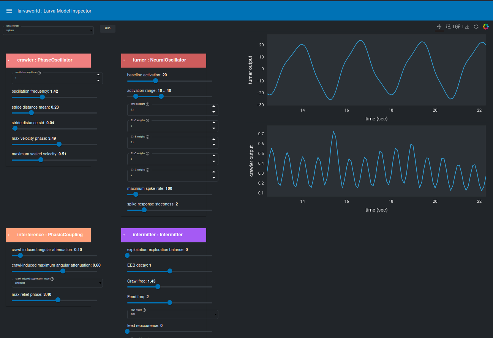

# Figure 8: Web-based Application - Model Inspector

## 📊 Image



## Description

**Web-based Larvaworld application to inspect the modular composition of any preconfigured locomotory larva-model.**

This application allows users to:
1. **Select a model** by its unique ID from a drop-down list of all available models
2. **View configuration** of all 4 basic modules comprising the locomotory layer:
   - Crawler (peristaltic crawling)
   - Turner (body bending)
   - Feeder (feeding behavior)
   - Intermitter (run/pause switching)
3. **Real-time plotting** of simulation variables (e.g., input/output) dynamically in the middle panel

---

## Purpose

This web application demonstrates:
- ✅ **Interactive model exploration**: Browse all available models
- ✅ **Module inspection**: View detailed configuration of each behavioral module
- ✅ **Real-time visualization**: Dynamic plots of model behavior
- ✅ **Educational tool**: Understand how different modules contribute to behavior
- ✅ **Parameter sensitivity**: See how changes affect output

---

## Developer Note

**Status**: Some web apps don't run properly yet (future contract fix).

This is one of several web-based applications available (see **Table 10: Web-based Applications** for complete list).

---

## Usage in ReadTheDocs

**Placement**: Web Applications / Interactive Tools section

```rst
Web-based Applications
~~~~~~~~~~~~~~~~~~~~~~

Larvaworld provides several interactive web applications for model exploration 
and experimentation.

Model Inspector
^^^^^^^^^^^^^^^

.. figure:: _static/images/fig8_web_app.png
   :alt: Model Inspector Web Application
   :align: center
   :width: 100%
   
   **Figure 8**: Web-based model inspector application. Users can select any 
   preconfigured locomotory model from a dropdown menu and inspect the 
   configuration of its four behavioral modules (Crawler, Turner, Feeder, 
   Intermitter). Real-time simulation variables are plotted dynamically in 
   the central panel.

**Features:**

- **Model Selection**: Choose from all available preconfigured models
- **Module Configuration**: View detailed parameters for each behavioral module
- **Real-time Simulation**: Dynamic plotting of input/output variables
- **Interactive Parameters**: Adjust values and see immediate effects

**Available Applications:**

For a complete list of web-based tools, see :ref:`table-web-applications`.

.. note::
   Web applications are currently under active development. Some features 
   may not work as expected and will be improved in future releases.

**Launching Web Apps:**

.. code-block:: bash

   # Launch model inspector app
   larvaworld -app model_inspector
   
   # Launch all apps dashboard
   larvaworld -app all

The applications will open in your default web browser at ``localhost:5006``.
```

---

## Related Content

- **Table 10**: Web-based applications (complete list with descriptions)
- **Diagram 14**: Brain Module Architecture (shows modules being inspected)
- **Tutorial**: Using web applications

---

## Technical Details

### Modules Shown in Application:

1. **Crawler Module**
   - Frequency, amplitude, phase
   - Peristaltic wave parameters

2. **Turner Module**
   - Turn amplitude, frequency
   - Reorientation parameters

3. **Feeder Module**
   - Head-sweeping parameters
   - Feeding triggers

4. **Intermitter Module**
   - Run/pause/turn switching
   - State transition probabilities

### Real-time Variables Plotted:

- **Input**: Total sensory input (A_in)
- **Output**: Linear velocity, angular velocity
- **Module activity**: Individual module contributions
- **State**: Current behavioral state

---

## Source

- **Paper**: Larvaworld PLOS Comp.Biology Software_v05
- **File**: `/images/Apps/larvaworld_app_model_inspector.png`
- **Caption** (LaTeX lines 872-873)
- **Label**: `fig:app.models`
- **Related**: Table 5 (Web-based applications) in paper (Table 10 in our docs)

