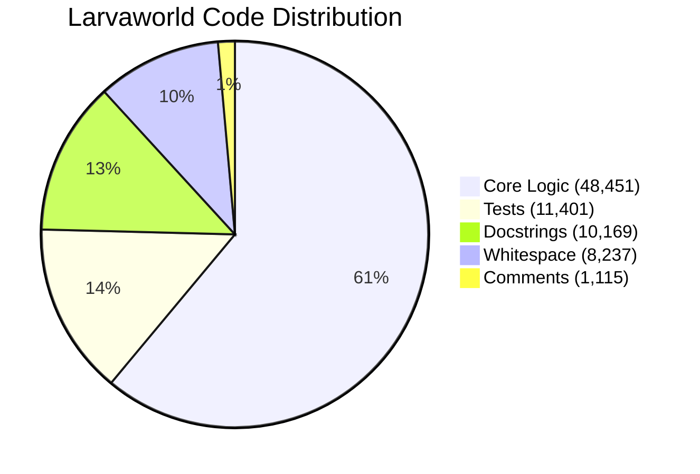

# Code Distribution by Lines

## 📊 What This Diagram Shows

This pie chart visualizes **how the Larvaworld codebase is organized by line count**, breaking down the total 79,373 lines into five distinct categories:

1. **Core Logic** (61%): The actual implementation code that makes Larvaworld function
2. **Tests** (14%): Comprehensive test suite ensuring code quality and reliability
3. **Docstrings** (13%): Embedded documentation for all classes, functions, and modules
4. **Whitespace** (10%): Blank lines that improve code readability
5. **Comments** (1%): Inline explanatory comments

### Why This Matters

This distribution demonstrates:

- ✅ **High code-to-documentation ratio**: 13% docstrings shows excellent documentation coverage
- ✅ **Strong test coverage**: 14% test code (nearly 1:5 ratio) indicates robust quality assurance
- ✅ **Readable codebase**: 10% whitespace shows attention to code formatting and readability
- ✅ **Self-documenting code**: Low comment percentage (1%) suggests clear, well-structured code that needs minimal inline explanation

### Key Insight

The Larvaworld platform is a **professionally structured research codebase** with strong emphasis on testing and documentation, making it accessible for both users and contributors.

---

## Mermaid Diagram



---

## Verification Data

**Status:** ✅ VERIFIED with actual codebase analysis
**Date:** November 18, 2025
**Total Lines:** 79,373

### Breakdown by Category

| Category       | Lines  | Percentage | Description                                    |
| -------------- | ------ | ---------- | ---------------------------------------------- |
| **Core Logic** | 48,451 | 61%        | Source code without comments/blanks/docstrings |
| **Tests**      | 11,401 | 14%        | All test files                                 |
| **Docstrings** | 10,169 | 13%        | API documentation (verified with AST parsing)  |
| **Whitespace** | 8,237  | 10%        | Blank lines in source                          |
| **Comments**   | 1,115  | 1%         | Inline # comments                              |

### Source Breakdown

**SOURCE CODE (src/larvaworld/):**

- Total lines: 57,803
- Code lines: 48,451
- Blank lines: 8,237
- Comment lines: 1,115
- Docstring lines: 10,169

**TEST CODE (tests/):**

- Total lines: 11,401
- Code lines: 7,723
- Blank lines: 2,594
- Comment lines: 1,084

---

## For ReadTheDocs

```rst
.. image:: _static/images/code_distribution_pie.png
   :alt: Larvaworld Code Distribution
   :align: center
   :width: 800px

The Larvaworld codebase comprises **79,373 lines** distributed across five categories:

- **Core Logic** (48,451 lines, 61%): Implementation code
- **Tests** (11,401 lines, 14%): Comprehensive test suite
- **Docstrings** (10,169 lines, 13%): API documentation
- **Whitespace** (8,237 lines, 10%): Code formatting
- **Comments** (1,115 lines, 1%): Inline explanations

This distribution reflects a well-documented, thoroughly tested research platform
with strong emphasis on code quality and maintainability.
```
