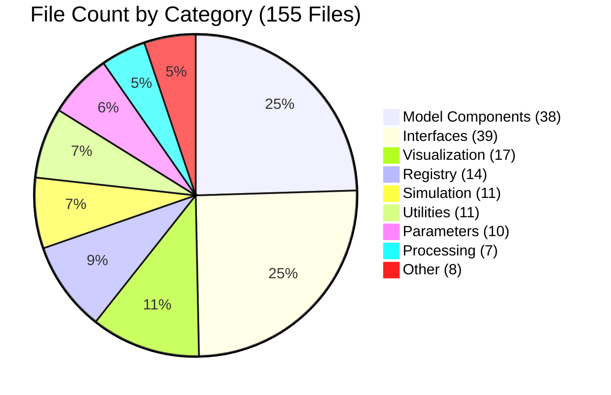

# File Count by Category

## 📊 What This Diagram Shows

This pie chart visualizes **how Python files are distributed across different functional modules** in the Larvaworld codebase. The total of **155 Python files** is organized into nine main categories based on their primary functionality.

### Categories Explained

1. **Model Components** (25%): Agent models, environments, behavioral modules, body physics
2. **Interfaces** (25%): CLI tools, web dashboards, and legacy GUI components
3. **Visualization** (11%): Plotting, graphing, and data visualization tools
4. **Registry** (9%): Configuration registry, parameter management, stored configurations
5. **Simulation** (7%): Simulation engines, genetic algorithms, batch runs
6. **Utilities** (7%): Helper functions, common tools, aux modules
7. **Parameters** (6%): Parameter definitions, configuration classes
8. **Processing** (5%): Data processing, analysis pipelines, dataset handling
9. **Other** (5%): Auxiliary files, compatibility layers, special-purpose modules

### Why This Matters

This distribution demonstrates:
- ✅ **Balanced architecture**: No single module dominates the codebase
- ✅ **Strong model layer**: 25% dedicated to agent and environment modeling
- ✅ **Multiple interfaces**: 25% for various user interaction methods (CLI, web, GUI)
- ✅ **Comprehensive visualization**: 11% for data plotting and presentation
- ⚠️ **Legacy code included**: GUI (28 files) is deprecated but still counted

### Key Insight

The Larvaworld platform has a **modular, well-distributed architecture** with dedicated components for modeling, simulation, visualization, and user interfaces. The high count in "Interfaces" reflects the platform's evolution through multiple interaction paradigms (CLI → GUI → Web Apps).

---

## Mermaid Diagram



---

## Verification Data

**Status:** ✅ VERIFIED with actual file counts  
**Date:** November 18, 2025  
**Total Files:** 155

### Breakdown by Category

| Category | Files | Percentage | Location |
|----------|-------|------------|----------|
| **Model Components** | 38 | 24.5% | `lib/model/` |
| **Interfaces** | 39 | 25.2% | `cli/`, `dashboards/`, `gui/` |
| **Visualization** | 17 | 11.0% | `lib/plot/` |
| **Registry** | 14 | 9.0% | `lib/reg/` |
| **Simulation** | 11 | 7.1% | `lib/sim/` |
| **Utilities** | 11 | 7.1% | `lib/util/` |
| **Parameters** | 10 | 6.5% | `lib/param/` |
| **Processing** | 7 | 4.5% | `lib/process/` |
| **Other** | 8 | 5.2% | `lib/screen/`, etc. |

### Interface Components Breakdown

The "Interfaces" category (39 files) consists of:
- **GUI** (28 files): Legacy desktop GUI - *deprecated but still present*
- **Dashboards** (8 files): Modern web-based apps (Holoviz stack)
- **CLI** (3 files): Command-line interface tools

**Note:** If GUI is excluded (as it's deprecated), the active interface layer has only 11 files.

---

## For ReadTheDocs

```rst
.. image:: _static/images/file_count_by_category.png
   :alt: Python Files by Category
   :align: center
   :width: 800px

The Larvaworld codebase consists of **155 Python files** organized into nine functional categories:

- **Model Components** (38 files, 25%): Agent models, environments, behavioral modules
- **Interfaces** (39 files, 25%): CLI, web dashboards, and legacy GUI
- **Visualization** (17 files, 11%): Plotting and data presentation tools
- **Registry** (14 files, 9%): Configuration and parameter management
- **Simulation** (11 files, 7%): Simulation engines and optimization
- **Utilities** (11 files, 7%): Helper functions and tools
- **Parameters** (10 files, 6%): Configuration class definitions
- **Processing** (7 files, 5%): Data processing pipelines
- **Other** (8 files, 5%): Auxiliary modules

This modular architecture ensures clear separation of concerns and maintainability.
```


