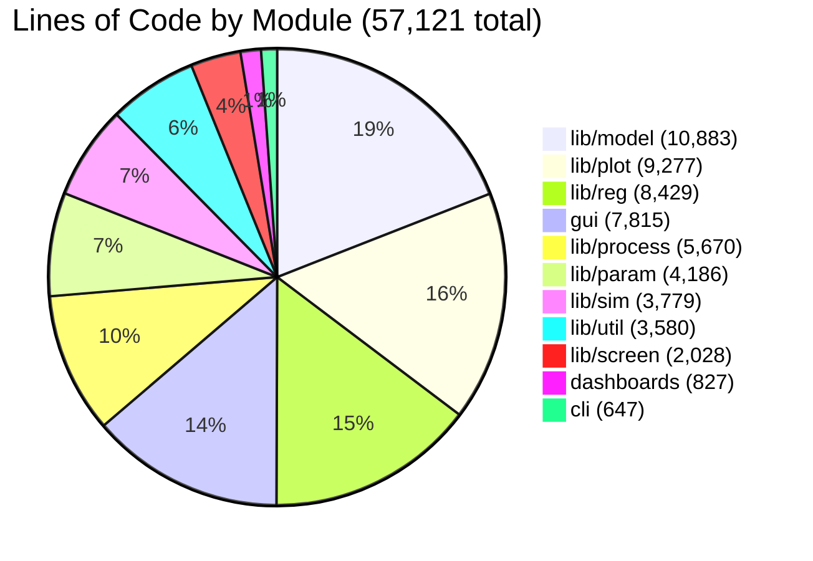

# Lines of Code by Module

## 📊 What This Diagram Shows

This pie chart visualizes **how code volume is distributed across different functional modules** in the Larvaworld platform. The total of **57,121 lines of source code** is organized into eleven main modules, showing which areas of the codebase are most substantial.

### Module Categories Explained

1. **lib/model** (19%): Agent models, behavioral modules, body physics, DEB energetics
2. **lib/plot** (16%): Visualization tools, plotting functions, figure generation
3. **lib/reg** (15%): Registry system, configuration management, stored parameters
4. **gui** (14%): Legacy desktop GUI - _deprecated but substantial codebase_
5. **lib/process** (10%): Data processing pipelines, dataset analysis, metrics computation
6. **lib/param** (7%): Parameter definitions, configuration classes, schemas
7. **lib/sim** (7%): Simulation engines, experiment types, runtime control
8. **lib/util** (6%): Utility functions, helpers, common tools
9. **lib/screen** (4%): Screen rendering, pygame interface, real-time display
10. **dashboards** (1%): Modern web applications (Holoviz/Panel stack)
11. **cli** (1%): Command-line interface tools

### Why This Matters

This distribution demonstrates:

- ✅ **Model-centric design**: 19% dedicated to agent and environment modeling
- ✅ **Strong visualization**: 16% for comprehensive plotting capabilities
- ✅ **Robust configuration**: 15% for flexible parameter management
- ⚠️ **Legacy burden**: 14% is deprecated GUI code (7,815 lines)
- ✅ **Data-focused**: 10% for processing and analysis pipelines
- ✅ **Lightweight interfaces**: Modern CLI + dashboards = only 2.6% combined

### Key Insight

The Larvaworld platform is **primarily a modeling and visualization engine** with comprehensive data processing capabilities. The substantial legacy GUI (14%) represents technical debt from earlier development phases, while the modern interface layer (CLI + web dashboards) is intentionally minimal, focusing development effort on core scientific functionality.

---

## Mermaid Diagram



---

## Verification Data

**Status:** ✅ VERIFIED with actual line counts
**Date:** November 18, 2025
**Total Lines:** 57,121

### Breakdown by Module

| Module          | Lines  | Percentage | Primary Functionality                      |
| --------------- | ------ | ---------- | ------------------------------------------ |
| **lib/model**   | 10,883 | 19.0%      | Agent models, behavioral modules, physics  |
| **lib/plot**    | 9,277  | 16.2%      | Visualization, plotting, figure generation |
| **lib/reg**     | 8,429  | 14.8%      | Registry, configuration, stored parameters |
| **gui**         | 7,815  | 13.7%      | Legacy desktop GUI (deprecated)            |
| **lib/process** | 5,670  | 9.9%       | Data processing, analysis pipelines        |
| **lib/param**   | 4,186  | 7.3%       | Parameter definitions, schemas             |
| **lib/sim**     | 3,779  | 6.6%       | Simulation engines, experiment types       |
| **lib/util**    | 3,580  | 6.3%       | Utilities, helpers, common tools           |
| **lib/screen**  | 2,028  | 3.6%       | Screen rendering, pygame display           |
| **dashboards**  | 827    | 1.4%       | Modern web apps (Panel/Holoviz)            |
| **cli**         | 647    | 1.1%       | Command-line interface                     |

### Active vs Legacy Code

**Active Development:**

- Core modules (model, plot, reg, process, param, sim, util, screen): **47,632 lines (83%)**
- Modern interfaces (cli, dashboards): **1,474 lines (3%)**

**Legacy/Deprecated:**

- GUI: **7,815 lines (14%)**

**If GUI were removed**, the active codebase would be **49,306 lines** with:

- Core scientific functionality: 97%
- Modern interfaces: 3%

---

## For ReadTheDocs

```rst
.. image:: _static/images/lines_of_code_by_module.png
   :alt: Lines of Code Distribution by Module
   :align: center
   :width: 800px

The Larvaworld source code (57,121 lines) is distributed across eleven functional modules:

**Core Modules:**

- **lib/model** (10,883 lines, 19%): Agent models and behavioral modules
- **lib/plot** (9,277 lines, 16%): Visualization and plotting tools
- **lib/reg** (8,429 lines, 15%): Configuration registry and parameter management
- **lib/process** (5,670 lines, 10%): Data processing pipelines
- **lib/param** (4,186 lines, 7%): Parameter definitions and schemas
- **lib/sim** (3,779 lines, 7%): Simulation engines
- **lib/util** (3,580 lines, 6%): Utility functions
- **lib/screen** (2,028 lines, 4%): Screen rendering

**Interface Modules:**

- **gui** (7,815 lines, 14%): Legacy desktop GUI (*deprecated*)
- **dashboards** (827 lines, 1%): Modern web applications
- **cli** (647 lines, 1%): Command-line tools

The codebase is model-centric and visualization-focused, with 83% dedicated to core
scientific functionality and only 2.6% for modern interfaces (CLI + web dashboards).
```
