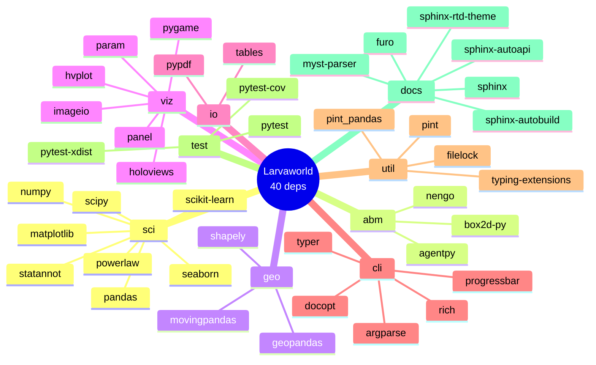

# Larvaworld Dependencies

## 📊 What This Diagram Shows

This mind map displays **all 40 direct Python dependencies** of the Larvaworld platform, as declared in `pyproject.toml`. Each node represents a package that Larvaworld directly depends on.

### Why This Matters

Understanding the dependency tree shows:

- ✅ **Foundation**: Scientific stack (numpy, pandas, scipy, matplotlib)
- ✅ **Specialization**: Agent-based modeling (agentpy), physics (box2d-py), neural (nengo)
- ✅ **Modern tooling**: CLI (typer, rich), web apps (holoviz stack), testing (pytest)
- ✅ **Scope control**: Only 40 direct dependencies keeps the platform maintainable

### Key Insight

Larvaworld uses **40 carefully selected packages** covering scientific computing, visualization, agent modeling, and development tools. The platform leverages mature, well-maintained libraries rather than building from scratch.

---

## Mermaid Diagram



---

## Verification Data

**Status:** ✅ VERIFIED with pyproject.toml
**Date:** November 18, 2025
**Total Dependencies:** 40 packages

### Breakdown by Purpose

| Purpose                  | Packages                                                                      | Count |
| ------------------------ | ----------------------------------------------------------------------------- | ----- |
| **Scientific Computing** | numpy, pandas, scipy, matplotlib, seaborn, scikit-learn, powerlaw, statannot  | 8     |
| **Geospatial**           | geopandas, shapely, movingpandas                                              | 3     |
| **Visualization**        | holoviews, hvplot, panel, param, pygame, imageio                              | 6     |
| **Data Storage**         | tables, pypdf                                                                 | 2     |
| **CLI/UI**               | typer, rich, argparse, docopt, progressbar                                    | 5     |
| **Agent Modeling**       | agentpy                                                                       | 1     |
| **Physics (optional)**   | box2d-py                                                                      | 1     |
| **Neural (optional)**    | nengo                                                                         | 1     |
| **Utilities**            | pint, pint_pandas, typing-extensions, filelock                                | 4     |
| **Testing**              | pytest, pytest-cov, pytest-xdist                                              | 3     |
| **Documentation**        | sphinx, sphinx-rtd-theme, sphinx-autoapi, sphinx-autobuild, furo, myst-parser | 6     |

### Direct Dependencies from pyproject.toml

**Main dependencies (29):**

- Scientific: numpy, pandas, scipy, matplotlib, seaborn, scikit-learn, powerlaw, statannot
- Geospatial: geopandas, shapely, movingpandas
- Visualization: holoviews, hvplot, panel, param, pygame, imageio
- Data: tables, pypdf
- CLI: typer, rich, argparse, docopt, progressbar
- Agent: agentpy
- Utils: pint, pint_pandas, typing-extensions, filelock

**Dev dependencies (3):**

- pytest, pytest-cov, pytest-xdist

**Docs dependencies (6):**

- sphinx, sphinx-rtd-theme, sphinx-autoapi, sphinx-autobuild, furo, myst-parser

**Optional dependencies (2):**

- box2d-py (physics)
- nengo (neural)

---

## For ReadTheDocs

```rst
.. image:: _static/images/dependencies_mindmap.png
   :alt: Larvaworld Dependencies
   :align: center
   :width: 800px

Larvaworld depends on **40 Python packages**:

**Core Scientific Stack:**
numpy, pandas, scipy, matplotlib, seaborn, scikit-learn

**Specialized Tools:**
- agentpy (agent-based modeling)
- box2d-py (physics, optional)
- nengo (neural networks, optional)

**Visualization:**
holoviews, hvplot, panel, pygame

**Geospatial:**
geopandas, shapely, movingpandas

**User Interface:**
typer, rich (CLI)

**Development:**
pytest (testing), sphinx (documentation)
```
