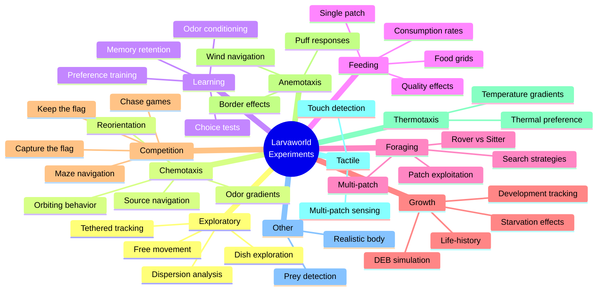

# Experiment Types (Conceptual View)

## 📊 What This Diagram Shows

This mind map illustrates the **11 major experiment categories** available in Larvaworld, organized by **behavioral/scientific concept** rather than code structure. This is the **conceptual overview** for understanding what types of experiments are available.

### Why This Matters

This diversity demonstrates:

- ✅ **Comprehensive coverage**: From basic exploration to complex multi-agent games
- ✅ **Multi-sensory**: Chemotaxis, thermotaxis, anemotaxis, tactile detection
- ✅ **Behavioral complexity**: Learning, foraging strategies, competition
- ✅ **Life-history**: Growth and DEB (Dynamic Energy Budget) simulations
- ✅ **Flexibility**: 60+ pre-configured experiments ready to use

### Key Insight

Larvaworld is a **versatile experimental platform** covering the full spectrum of Drosophila larval behavioral assays, from simple locomotion to sophisticated learning and competitive interactions, all validated against real experimental data.

---

## Mermaid Diagram



---

## Important Note

**This is a CONCEPTUAL VIEW** using descriptive category names (Learning, Competition, etc.) for easier understanding.

**For the EXACT CODE STRUCTURE** (actual dictionary keys used in `sim_conf.py`), see `05_b_experiment_types_by_code_structure.md`.

**Key differences:**

- Conceptual: "Learning" → Code: `"odor_preference"`
- Conceptual: "Competition" → Code: `"games"`
- Conceptual: "Chemo-anemotaxis" → Code: `"chemanemotaxis"` (no hyphen)

---

## Verification Data

**Status:** ✅ VERIFIED with actual codebase
**Date:** November 19, 2025
**Source:** `/src/larvaworld/lib/reg/stored_confs/sim_conf.py`

### Complete Experiment Categories

| Category             | Count | Key Experiments                                                        | Description                                |
| -------------------- | ----- | ---------------------------------------------------------------------- | ------------------------------------------ |
| **Exploration**      | 5     | `dish`, `dispersion`, `focus`, `tethered`                              | Basic locomotion and spatial patterns      |
| **Chemotaxis**       | 9     | `chemotaxis`, `chemorbit`, `chemorbit_x2`, `chemotaxis_RL`             | Odor navigation and gradients              |
| **Learning**         | 6     | `PItrain`, `PItrain_mini`, `PItest_off`, `PItest_on`                   | Olfactory conditioning, preference shift   |
| **Foraging**         | 11    | `patch_grid`, `double_patch`, `random_food`, `uniform_food`            | Food search, exploitation, rover vs sitter |
| **Growth**           | 12    | `growth`, `RvsS`, `RvsS_on`, `RvsS_off`, `RvsS_on_qXX`                 | DEB simulations, life-history, starvation  |
| **Competition**      | 4     | `capture_the_flag`, `keep_the_flag`, `catch_me`, `maze`                | Multi-agent games and challenges           |
| **Anemotaxis**       | 3     | `anemotaxis`, `anemotaxis_bordered`, `puff_anemotaxis_bordered`        | Wind navigation                            |
| **Thermotaxis**      | 1     | `thermotaxis`                                                          | Temperature gradient navigation            |
| **Tactile**          | 3     | `tactile_detection`, `tactile_detection_x4`, `multi_tactile_detection` | Touch-based sensing                        |
| **Chemo-anemotaxis** | 1     | `single_puff`                                                          | Combined odor and wind                     |
| **Other**            | 2     | `realistic_imitation`, `prey_detection`                                | Box2D body, zebrafish model                |

**Total:** 57 predefined experiments across 11 categories

### Category Details

#### 1. Exploration (5 experiments)

```python
- dish               # Free movement in circular dish
- dispersion         # Spatial spread in large arena (200mm)
- dispersion_x2      # Two model comparison
- tethered           # Fixed position, locomotion patterns
- focus              # Single agent tracking
```

#### 2. Chemotaxis (9 experiments)

```python
- chemotaxis              # Gradient navigation
- chemorbit               # Gaussian odor source orbiting
- chemorbit_OSN           # OSN-based navigation
- chemorbit_x2            # Model comparison
- chemorbit_x4            # 4-model comparison
- chemotaxis_diffusion    # Diffusion-based odor
- chemotaxis_RL           # RL-based navigation
- reorientation           # Stationary reorientation
- food_at_bottom          # Food + odor at arena bottom
```

#### 3. Learning (6 experiments)

```python
- PItrain               # Full preference training (41 min)
- PItrain_mini          # Short training (1 min)
- PItest_off            # Test without food
- PItest_off_OSN        # OSN model test
- PItest_on             # Test with food
- PItest_off_RL         # RL model test (105 min)
```

#### 4. Foraging (11 experiments)

```python
- patchy_food           # Scattered food patches
- patch_grid            # Grid of food patches
- MB_patch_grid         # With mushroom body models
- noMB_patch_grid       # Without mushroom body
- random_food           # Random food distribution
- uniform_food          # Uniform food coverage
- food_grid             # Regular food grid
- single_odor_patch     # Single food+odor patch
- single_odor_patch_x4  # 4-model comparison
- double_patch          # Two patches (rover vs sitter)
- 4corners              # Food at four corners
```

#### 5. Growth (12 experiments)

```python
- growth                # Full development (24h)
- RvsS                  # Rover vs Sitter phenotypes (3h)
- RvsS_on               # With food (20 min)
- RvsS_off              # Without food (20 min)
- RvsS_on_q75           # Food quality 75%
- RvsS_on_q50           # Food quality 50%
- RvsS_on_q25           # Food quality 25%
- RvsS_on_q15           # Food quality 15%
- RvsS_on_1h_prestarved # 1h pre-starvation
- RvsS_on_2h_prestarved # 2h pre-starvation
- RvsS_on_3h_prestarved # 3h pre-starvation
- RvsS_on_4h_prestarved # 4h pre-starvation
```

#### 6. Competition (4 experiments)

```python
- capture_the_flag  # Capture and return flag to base
- keep_the_flag     # Possess flag as long as possible
- catch_me          # Chase/tag game
- maze              # Navigate maze to goal
```

#### 7. Anemotaxis (3 experiments)

```python
- anemotaxis          # Wind navigation
- anemotaxis_bordered # With arena borders
- puff_anemotaxis_bordered # Puff-based wind
```

#### 8. Thermotaxis (1 experiment)

```python
- thermotaxis  # Temperature gradient navigation
```

#### 9. Tactile (3 experiments)

```python
- tactile_detection       # Touch-based patch detection
- tactile_detection_x4    # 4-model comparison (RL vs control)
- multi_tactile_detection # Multiple patches
```

#### 10. Chemo-anemotaxis (1 experiment)

```python
- single_puff  # Combined odor puff + wind (2.5s)
```

#### 11. Other (2 experiments)

```python
- realistic_imitation  # Box2D multi-segment body
- prey_detection       # Zebrafish prey capture
```

---

## For ReadTheDocs

```rst
Experiment Types
~~~~~~~~~~~~~~~~

.. image:: _static/images/experiment_types.png
   :alt: Larvaworld Experiment Types
   :align: center
   :width: 800px

Larvaworld provides **57 predefined experiment configurations** across **11 behavioral categories**:

**Core Behavioral Assays:**

- **Exploration** (5): Free movement, dispersion, trajectory analysis
- **Chemotaxis** (9): Odor navigation, gradient climbing, source localization
- **Learning** (6): Olfactory conditioning, preference training and testing
- **Foraging** (11): Food search, patch exploitation, rover vs sitter phenotypes

**Specialized Assays:**

- **Growth** (12): DEB simulations, life-history, starvation effects
- **Competition** (4): Multi-agent games (capture-the-flag, chase, maze)
- **Anemotaxis** (3): Wind-based navigation
- **Thermotaxis** (1): Temperature gradient navigation
- **Tactile** (3): Touch-based sensing and detection
- **Chemo-anemotaxis** (1): Combined odor and wind cues

**Advanced:**

- **Other** (2): Box2D realistic body, zebrafish prey detection

Each experiment is fully configurable through the registry system
(``reg.conf.Exp.confIDs``) and can be customized for specific research needs.
```
