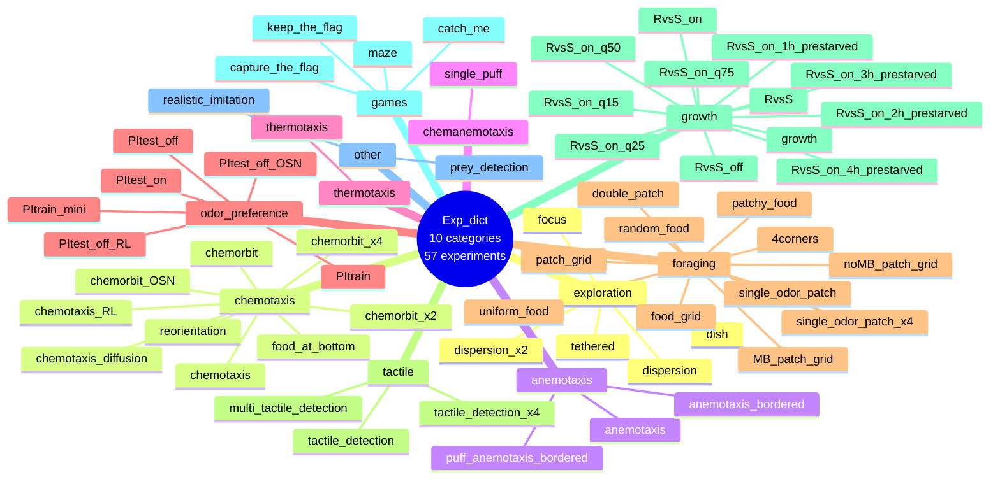

# Experiment Types (Code Structure)

## 📊 What This Diagram Shows

This mind map shows the **EXACT clustering structure** as defined in `/src/larvaworld/lib/reg/stored_confs/sim_conf.py`, using the actual dictionary keys from the code.

### Why This Matters

This is the **true organizational structure** in the codebase:

- ✅ **Exact keys**: Uses actual dictionary keys (`odor_preference`, `games`, `chemanemotaxis`)
- ✅ **Code-accurate**: Reflects how experiments are organized in `Exp_dict()`
- ✅ **Registry compatible**: Keys match `reg.conf.Exp.confIDs`
- ✅ **10 categories**: As defined in the code (not conceptual grouping)

### Key Insight

This is how experiments are **actually stored and accessed** in Larvaworld. Use these exact keys when calling `reg.conf.Exp.get(key)`.

---

## Mermaid Diagram



---

## Verification Data

**Status:** ✅ VERIFIED with actual codebase
**Date:** November 19, 2025
**Source:** `/src/larvaworld/lib/reg/stored_confs/sim_conf.py`, lines 390-556

### Exact Code Structure

```python
# From sim_conf.py, Exp_dict() function
d = {
    "exploration": {id: exp(id=id, **kws) for id, kws in d0.items()},  # 5
    "chemotaxis": {id: exp(id=id, en=ENR.source_proc(), **kws) for id, kws in d1.items()},  # 9
    "anemotaxis": {id: exp(...) for id, kws in d2.items()},  # 3
    "chemanemotaxis": {id: exp(...) for id, kws in d3.items()},  # 1
    "thermotaxis": {"thermotaxis": thermo_exp(...)},  # 1
    "odor_preference": {
        "PItest_off": prE(...),
        "PItest_off_OSN": prE(...),
        "PItest_on": prE(...),
        "PItrain_mini": prE(...),
        "PItrain": prE(...),
        "PItest_off_RL": prE(...),
    },  # 6
    "foraging": {
        "patchy_food": fE(...),
        "patch_grid": fE(...),
        "MB_patch_grid": fE(...),
        "noMB_patch_grid": fE(...),
        "random_food": fE(...),
        "uniform_food": fE(...),
        "food_grid": fE(...),
        "single_odor_patch": fE(...),
        "single_odor_patch_x4": fE(...),
        "double_patch": fE(...),
        "4corners": exp(...),
    },  # 11
    "tactile": {
        "tactile_detection": tE(...),
        "tactile_detection_x4": tE(...),
        "multi_tactile_detection": tE(...),
    },  # 3
    "growth": {
        "growth": dE(...),
        "RvsS": dE(...),
        "RvsS_on": dE(...),
        "RvsS_off": dE(...),
        "RvsS_on_q75": dE(...),
        "RvsS_on_q50": dE(...),
        "RvsS_on_q25": dE(...),
        "RvsS_on_q15": dE(...),
        "RvsS_on_1h_prestarved": dE(...),
        "RvsS_on_2h_prestarved": dE(...),
        "RvsS_on_3h_prestarved": dE(...),
        "RvsS_on_4h_prestarved": dE(...),
    },  # 12
    "games": {
        "maze": gE(...),
        "keep_the_flag": gE(...),
        "capture_the_flag": gE(...),
        "catch_me": gE(...),
    },  # 4
    "other": {
        "realistic_imitation": exp(...),
        "prey_detection": exp(...),
    },  # 2
}

return AttrDict.merge_dicts(list(d().values()))
```

### Category Summary

| Key (Code)        | Count | Description                            |
| ----------------- | ----- | -------------------------------------- |
| `exploration`     | 5     | Basic locomotion patterns (from `d0`)  |
| `chemotaxis`      | 9     | Odor navigation (from `d1`)            |
| `anemotaxis`      | 3     | Wind navigation (from `d2`)            |
| `chemanemotaxis`  | 1     | Combined odor+wind (from `d3`)         |
| `thermotaxis`     | 1     | Temperature gradients                  |
| `odor_preference` | 6     | Olfactory learning (PI tests/training) |
| `foraging`        | 11    | Food search and exploitation           |
| `tactile`         | 3     | Touch-based sensing                    |
| `growth`          | 12    | DEB simulations and life-history       |
| `games`           | 4     | Multi-agent competitive tasks          |
| `other`           | 2     | Box2D body, zebrafish model            |

**Total:** 57 experiments across 10 categories

### Key Naming Notes

**Important differences from conceptual names:**

- **NOT** "Learning" → Use `"odor_preference"` (actual key)
- **NOT** "Competition" → Use `"games"` (actual key)
- **NOT** "Chemo-anemotaxis" → Use `"chemanemotaxis"` (actual key, no hyphen)

### Code Usage

**Correct way to access experiments:**

```python
from larvaworld import reg

# List all categories
categories = list(reg.conf.Exp.confIDs.keys())
# ['exploration', 'chemotaxis', 'anemotaxis', 'chemanemotaxis',
#  'thermotaxis', 'odor_preference', 'foraging', 'tactile',
#  'growth', 'games', 'other']

# Get experiment from category
exp_conf = reg.conf.Exp.get("odor_preference.PItrain")

# Or access by ID
exp_conf = reg.conf.Exp.getID("PItrain")

# List all experiments in a category
odor_prefs = reg.conf.Exp.confIDs['odor_preference']
# ['PItest_off', 'PItest_off_OSN', 'PItest_on',
#  'PItrain_mini', 'PItrain', 'PItest_off_RL']
```

### Comparison with Conceptual Diagram

**Conceptual view (05_experiment_types.md):**

- Uses descriptive names (Learning, Competition, etc.)
- Organized by behavioral/scientific concept
- Easier for understanding experimental paradigms

**Code structure view (THIS FILE):**

- Uses exact code keys
- Organized as in `sim_conf.py`
- Required for programmatic access

Both views are valuable:

- Use **conceptual** for understanding what experiments do
- Use **code structure** for actually running experiments

---

## For ReadTheDocs

```rst
Experiment Registry Structure
~~~~~~~~~~~~~~~~~~~~~~~~~~~~~~~

Experiments in Larvaworld are organized into **10 categories** in the code:

**Code Structure** (``sim_conf.py``):

.. code-block:: python

   categories = [
       'exploration',      # 5 experiments
       'chemotaxis',       # 9 experiments
       'anemotaxis',       # 3 experiments
       'chemanemotaxis',   # 1 experiment
       'thermotaxis',      # 1 experiment
       'odor_preference',  # 6 experiments
       'foraging',         # 11 experiments
       'tactile',          # 3 experiments
       'growth',           # 12 experiments
       'games',            # 4 experiments
       'other',            # 2 experiments
   ]

**Accessing Experiments:**

.. code-block:: python

   from larvaworld import reg

   # By category.experiment
   exp = reg.conf.Exp.get("odor_preference.PItrain")

   # By ID
   exp = reg.conf.Exp.getID("PItrain")

   # List all in category
   experiments = reg.conf.Exp.confIDs['games']
   # ['maze', 'keep_the_flag', 'capture_the_flag', 'catch_me']

**Important:** Use the exact keys as shown above (e.g., ``odor_preference``,
not "Learning"; ``games``, not "Competition").

For a conceptual overview organized by behavioral paradigms,
see :ref:`experiment-types-conceptual`.
```
