# Experiment Configuration Pipeline

## 📊 What This Diagram Shows

This flowchart illustrates the **step-by-step configuration process** for setting up and running an experiment in Larvaworld, from selecting a predefined template to executing the simulation.

### Why This Matters

This pipeline demonstrates:
- ✅ **Structured workflow**: Clear sequence from configuration to execution
- ✅ **Modular configuration**: Separate stages for environment, agents, simulation, and analysis
- ✅ **Template-based**: Predefined experiments that can be customized
- ✅ **Flexibility**: Each stage offers multiple configuration options
- ✅ **Research-ready**: Automatic metric selection and reference data comparison

### Key Insight

Larvaworld provides a **systematic configuration pipeline** that balances ease-of-use (predefined templates) with flexibility (customizable parameters at each stage), making it accessible for both quick exploratory runs and detailed research experiments.

---

## Mermaid Diagram

```mermaid
flowchart LR
    Start([Select Experiment Type]) --> LoadTemplate[Load Experiment Template<br/>Predefined configuration]
    
    LoadTemplate --> ConfigEnv{Configure<br/>Environment}
    
    ConfigEnv --> ArenaType[Arena Type<br/>Circular, rectangular, custom]
    ConfigEnv --> OdorSetup[Odorscape Setup<br/>Sources, gradients]
    ConfigEnv --> FoodSetup[Food Setup<br/>Patches, grid, quality]
    ConfigEnv --> Obstacles[Obstacles<br/>Borders, walls]
    
    ArenaType --> ConfigAgents
    OdorSetup --> ConfigAgents
    FoodSetup --> ConfigAgents
    Obstacles --> ConfigAgents
    
    ConfigAgents{Configure<br/>Agents} --> ModelSelect[Select Larva Model<br/>Basic to complex]
    ConfigAgents --> NumAgents[Number of Agents<br/>N larvae]
    ConfigAgents --> InitPos[Initial Positions<br/>Distribution]
    ConfigAgents --> InitState[Initial State<br/>Age, hunger, etc.]
    
    ModelSelect --> ConfigSim
    NumAgents --> ConfigSim
    InitPos --> ConfigSim
    InitState --> ConfigSim
    
    ConfigSim{Configure<br/>Simulation} --> Duration[Duration<br/>Minutes]
    ConfigSim --> Epochs[Epochs<br/>Pre/test/post]
    ConfigSim --> Timestep[Timestep<br/>dt = 0.1 s]
    ConfigSim --> VisMode[Visualization<br/>video/screen/image/none]
    
    Duration --> Analysis
    Epochs --> Analysis
    Timestep --> Analysis
    VisMode --> Analysis
    
    Analysis{Configure<br/>Analysis} --> Metrics[Metrics to Compute<br/>Auto-select by exp type]
    Analysis --> RefData[Reference Data<br/>Compare to real?]
    Analysis --> Output[Output Options<br/>Save location, format]
    
    Metrics --> Ready
    RefData --> Ready
    Output --> Ready
    
    Ready[Ready to Run] --> Execute([Execute Simulation])
    
    style Start fill:#2196f3,stroke:#1976d2,stroke-width:3px,color:#fff
    style ConfigEnv fill:#ff9800,stroke:#f57c00,stroke-width:3px,color:#000
    style ConfigAgents fill:#9c27b0,stroke:#7b1fa2,stroke-width:3px,color:#fff
    style ConfigSim fill:#4caf50,stroke:#388e3c,stroke-width:3px,color:#000
    style Analysis fill:#f44336,stroke:#d32f2f,stroke-width:3px,color:#fff
    style Execute fill:#2196f3,stroke:#1976d2,stroke-width:3px,color:#fff
```



---

## Verification Data

**Status:** ✅ VERIFIED with actual codebase  
**Date:** November 18, 2025  
**Source:** `/src/larvaworld/lib/reg/generators.py`, `/src/larvaworld/lib/sim/`

### Pipeline Steps Verified

#### 1. Select Experiment Type ✅
- **Code**: `reg.conf.Exp.confID_selector()`
- **Implementation**: `ExpConf` class in `generators.py` (line 1055+)
- **Available**: 57 predefined experiments across 11 categories

#### 2. Load Template ✅
- **Code**: `ct.getID(experiment)` from `reg.conf.Exp`
- **Implementation**: `Exp_dict()` in `stored_confs/sim_conf.py` (line 172+)
- **Returns**: Complete experiment configuration dictionary

#### 3. Configure Environment ✅
- **Code**: `env_params = ClassAttr(gen.Env, ...)` 
- **Implementation**: `Env_dict()` in `stored_confs/sim_conf.py` (line 39+)
- **Options**:
  - **Arena Type**: `E.dish()`, `E.rect()`, `E.arena_200mm`, custom shapes
  - **Odorscape**: `odorscape` parameter with `Odor` sources and gradients
  - **Food**: `food` parameter with `FoodGroup`, `FoodGrid`, patches
  - **Obstacles**: `borders`, `obstacles` lists

#### 4. Configure Agents ✅
- **Code**: `larva_groups = ClassDict(item_type=gen.LarvaGroup, ...)`
- **Implementation**: `LarvaGroup` class in `larvagroup.py` (line 160+)
- **Options**:
  - **Model Selection**: `mID` parameter (e.g., 'explorer', 'navigator', 'forager')
  - **Number**: `N` parameter (default: 10)
  - **Initial Positions**: `loc` (center), `s` (spread), `mode` ('uniform', 'periphery', etc.), `shape`
  - **Initial State**: `age` (hours), `hunger` level, developmental stage

#### 5. Configure Simulation ✅
- **Code**: Parameters in `ABModel.__init__()` and `BaseRun.__init__()`
- **Implementation**: `ABM_model.py` (line 412+), `base_run.py` (line 14+)
- **Options**:
  - **Duration**: `duration` parameter in minutes (default: 5.0), converted to `Nsteps`
  - **Epochs**: `trials` dict with `epochs` list (pre-test, test, post-test phases)
  - **Timestep**: `dt` parameter in seconds (default: 0.1 s) - docstring line 32, 430
  - **Visualization**: `screen_kws` with `vis_mode`: 'video', 'screen', 'image', or offline (none)

#### 6. Configure Analysis ✅
- **Code**: `enrichment`, `collections`, reference data handling
- **Implementation**: `enrichment = ClassAttr(gen.EnrichConf, ...)`, `collections` parameter
- **Options**:
  - **Metrics**: `collections` list selector (default: ['pose'], options: 'brain', 'midline', 'contour', etc.)
  - **RefData**: `refID` parameter for loading reference datasets via `reg.conf.Ref.loadRef()`
  - **Output**: `dir` (save location), `store_data` (boolean), HDF5 format

#### 7. Execute ✅
- **Code**: `ExpRun.simulate()` method
- **Implementation**: `single_run.py` (line 22+), inherits from `BaseRun`
- **Process**: Initializes model → `sim_setup()` → `sim_step()` loop → data storage

### Code Evidence

```python
# Step 1 & 2: Select and Load Template
class ExpConf(SimOps):
    experiment = reg.conf.Exp.confID_selector()
    
# Step 3: Configure Environment
    env_params = ClassAttr(gen.Env, doc="The environment configuration")

# Step 4: Configure Agents
    larva_groups = ClassDict(item_type=gen.LarvaGroup, doc="The larva groups")

# Step 5: Configure Simulation
class ABModel:
    def __init__(self, dt: float = 0.1, duration: float = None, ...):
        # dt: Defaults to 0.1 seconds
        # duration: In minutes
        
# Step 6: Configure Analysis  
    enrichment = ClassAttr(gen.EnrichConf, doc="The post-simulation processing")
    collections = param.ListSelector(default=["pose"], objects=reg.parDB.output_keys)

# Step 7: Execute
class ExpRun(BaseRun):
    def simulate(self):
        # Run simulation
```

### Key Configuration Parameters

| Stage | Parameter | Type | Example Values |
|-------|-----------|------|----------------|
| **Environment** | Arena | str | 'dish', 'arena_200mm', 'rect' |
| | Odorscape | dict | Sources with positions, intensities |
| | Food | dict | Patches, grids, quality (0-1) |
| | Obstacles | list | Borders, walls |
| **Agents** | Model ID | str | 'explorer', 'navigator', 'forager' |
| | Number | int | 1-1000 |
| | Position mode | str | 'uniform', 'periphery', 'circle' |
| | Age | float | 0-120 hours |
| **Simulation** | Duration | float | 0.5-1440 minutes |
| | Timestep | float | 0.1 seconds (default) |
| | Epochs | list | ['pre', 'test', 'post'] |
| | Vis mode | str | 'video', 'screen', 'image', None |
| **Analysis** | Collections | list | ['pose', 'brain', 'midline'] |
| | Reference | str | Dataset ID for comparison |
| | Output dir | str | Auto-generated path |

---

## For ReadTheDocs

```rst
Experiment Configuration Pipeline
~~~~~~~~~~~~~~~~~~~~~~~~~~~~~~~~~~

.. image:: _static/images/experiment_configuration_pipeline.png
   :alt: Larvaworld Experiment Configuration Pipeline
   :align: center
   :width: 1000px

Configuring and running an experiment in Larvaworld follows a **structured 7-step pipeline**:

**1. Select Experiment Type**
   Choose from 57 predefined experiment templates across 11 behavioral categories.

**2. Load Template**
   The system loads a complete configuration including environment, agents, and analysis settings.

**3. Configure Environment**
   Customize the virtual world:
   
   - **Arena Type**: Circular dish, rectangular arena, custom shapes
   - **Odorscape**: Add odor sources with gradients
   - **Food Setup**: Single patch, grid, random distribution, quality levels
   - **Obstacles**: Borders, walls, custom obstacles

**4. Configure Agents**
   Set up the larval population:
   
   - **Model Selection**: From basic to complex behavioral models
   - **Number of Agents**: 1 to 1000+ larvae
   - **Initial Positions**: Uniform, periphery, cluster, custom distributions
   - **Initial State**: Age (developmental stage), hunger level, physiological state

**5. Configure Simulation**
   Control simulation parameters:
   
   - **Duration**: Experiment length in minutes (0.5 to 1440)
   - **Epochs**: Temporal phases (pre-test, test, post-test)
   - **Timestep**: dt = 0.1 seconds (default, adjustable)
   - **Visualization**: Real-time video, screen rendering, image snapshots, or offline mode

**6. Configure Analysis**
   Specify data collection and analysis:
   
   - **Metrics**: Auto-selected based on experiment type (pose, brain, midline, contour, etc.)
   - **Reference Data**: Compare simulation to real experimental data
   - **Output Options**: Save location, HDF5 storage, plot generation

**7. Execute Simulation**
   Run the experiment via ``ExpRun.simulate()`` or CLI.

**Example Usage:**

.. code-block:: python

   # Quick run with template
   exp = ExpRun(experiment='chemotaxis')
   exp.simulate()
   
   # Customized run
   exp = ExpRun(
       experiment='chemotaxis',
       parameters={
           'env_params': reg.conf.Env.getID('odor_gradient'),
           'larva_groups': {'g1': reg.gen.LarvaGroup(mID='navigator', N=20)},
           'duration': 10.0,  # 10 minutes
       }
   )
   exp.simulate()
```

