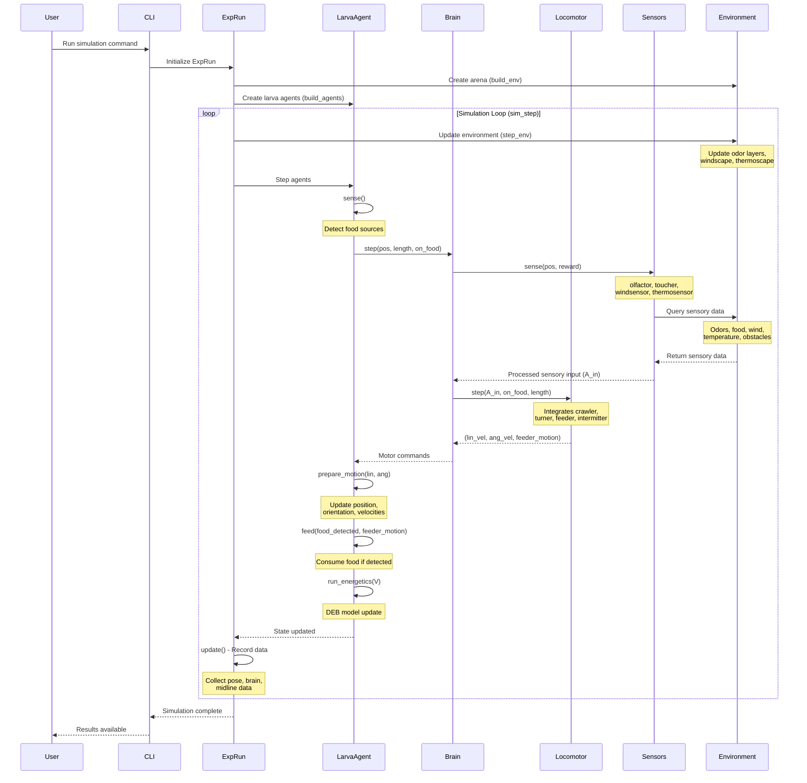

# Module Interaction - Simulation Loop

## 📊 What This Diagram Shows

This sequence diagram illustrates the **real-time interaction flow during a simulation timestep**, showing how the simulation engine, larva agents, brain, and environment communicate to produce realistic behavior.

### Why This Matters

This interaction pattern demonstrates:

- ✅ **Agent-based architecture**: Clear separation between simulation control and agent autonomy
- ✅ **Sensorimotor loop**: Fundamental sense → process → act → update cycle
- ✅ **Modular brain**: Brain coordinates sensors and locomotor for behavioral control
- ✅ **Real-time processing**: All components synchronized to simulation timestep
- ✅ **Data recording**: Continuous state recording for analysis

### Key Insight

Larvaworld implements a **hierarchical agent-based model** where autonomous larva agents sense their environment, process sensory information through a brain module, generate motor commands via a locomotor, and execute actions that modify the environment—all orchestrated by a simulation engine running in discrete timesteps.

---

## Mermaid Diagram



---

## Verification Data

**Status:** ✅ VERIFIED with actual codebase
**Date:** November 19, 2025
**Source:** `/src/larvaworld/lib/sim/`, `/src/larvaworld/lib/model/`

### Component Verification

#### 1. ExpRun (Simulation Engine) ✅

- **File**: `single_run.py` (line 22)
- **Class**: `ExpRun(BaseRun)`
- **Key Methods**:
  - `setup()`: Initialize environment and agents (line 42)
  - `build_env(env_params)`: Create arena (line 96 in `base_run.py`)
  - `build_agents(larva_groups, parameter_dict)`: Create agents (line 61)
  - `sim_step()`: Main loop (line 60 in `base_run.py`)
  - `step_env()`: Update environment layers (line 74 in `base_run.py`)
  - `step()`: Agent stepping (line 69)
  - `update()`: Data recording (line 80)

#### 2. LarvaAgent (LarvaMotile) ✅

- **File**: `_larva.py` (line 295)
- **Class**: `LarvaMotile(LarvaSegmented)`
- **Key Methods**:
  - `step()`: Main agent step (line 601)
  - `sense()`: Detect environment (line 598)
  - `prepare_motion(lin, ang)`: Execute movement
  - `feed(food_detected, feeder_motion)`: Feeding behavior
  - `run_energetics(V)`: DEB metabolism update

#### 3. Brain ✅

- **File**: `brain.py` (line 207)
- **Class**: `DefaultBrain(Brain)`
- **Attributes**:
  - `olfactor`: Olfactory sensor (can be None)
  - `toucher`: Tactile sensor (can be None)
  - `windsensor`: Wind sensor (can be None)
  - `thermosensor`: Temperature sensor (can be None)
  - `locomotor`: Locomotor module (always present)
- **Key Methods**:
  - `step(pos, on_food, **kwargs)`: Returns (lin, ang, feed_motion) (line 249)
  - `sense(pos, reward)`: Update all sensors (line 178)
  - `A_in`: Total sensory input (property, line 186)

#### 4. Sensors (Brain Attributes) ✅

- **File**: `sensor.py`, `brain.py`
- **Implementation**: Sensors are attributes of Brain, not separate modules
- **Types**:
  - `Olfactor`: Odor detection
  - `Toucher`: Food/obstacle touch sensing
  - `WindSensor`: Wind direction sensing
  - `Thermosensor`: Temperature sensing
- **Method**: `step(sensory_dict)`: Process sensory input

#### 5. Locomotor ✅

- **File**: `locomotor.py` (line 32)
- **Class**: `Locomotor(NestedConf)`
- **Sub-modules**:
  - `crawler`: Forward crawling peristalsis
  - `turner`: Lateral bending/turning
  - `feeder`: Feeding behavior
  - `intermitter`: Run/pause/turn switching
- **Key Method**:
  - `step(A_in, on_food, **kwargs)`: Returns (lin, ang, feed_motion) (line 167)

#### 6. Environment ✅

- **File**: `base_run.py`, `envs/`
- **Components**:
  - `space`: Arena geometry
  - `odor_layers`: Odorscape (dict of ValueLayer)
  - `windscape`: Wind field (ValueLayer or None)
  - `thermoscape`: Temperature field (ValueLayer or None)
  - `food_grid`: Food distribution (FoodGrid or None)
  - `sources`: Food sources (list)
  - `obstacles`: Physical obstacles (list)
- **Update Method**: `step_env()` updates odor diffusion and windscape (line 74)

### Code Flow Verification

#### Initialization Phase

```python
# 1. User runs CLI command
# cli/main.py

# 2. Create ExpRun
exp = ExpRun(experiment='chemotaxis', duration=5.0)

# 3. Setup simulation
exp.sim_setup(steps=exp.p.steps, seed=None)
  → exp.setup()
    → exp.build_env(exp.p.env_params)  # Create arena, odorscape, food
    → exp.build_agents(exp.p.larva_groups, parameter_dict)  # Create larvae
```

#### Simulation Loop (Each Timestep)

```python
# BaseRun.sim_step() - line 60
def sim_step(self):
    if not self.is_paused:
        self.step_env()          # [1] Update environment
        self.step()              # [2] Step all agents
        self.screen_manager.step()  # [3] Update visualization
        self.update()            # [4] Record data
        self.t += 1

# [1] Update Environment - line 74
def step_env(self):
    for id, layer in self.odor_layers.items():
        layer.update_values()  # Diffusion update
    if self.windscape is not None:
        self.windscape.update()

# [2] Step All Agents - line 69 (ExpRun.step)
def step(self):
    if not self.larva_collisions:
        self.larva_bodies = self.get_larva_bodies()
    if len(self.sources) > 10:
        self.space.accessible_sources_multi(self.agents)
    self.agents.step()  # Calls each agent's step()
    if self.Box2D:
        self.space.Step(self.dt, 6, 2)
        self.agents.updated_by_Box2D()

# [3] Agent Step - LarvaMotile.step() line 601
def step(self):
    m = self.model
    self.cum_dur += m.dt
    self.sense()  # Detect food
    pos = self.olfactor_pos

    # Check accessible sources
    if m.space.accessible_sources:
        self.food_detected = m.space.accessible_sources[self]
    elif self.brain.locomotor.feeder or self.brain.toucher:
        self.food_detected = util.sense_food(
            pos, sources=m.sources, grid=m.food_grid, radius=self.radius
        )
    self.resolve_carrying(self.food_detected)

    # Brain processing
    lin, ang, self.feeder_motion = self.brain.step(
        pos, length=self.length, on_food=self.on_food
    )

    # Motion execution
    self.prepare_motion(lin=lin, ang=ang)

    # Feeding
    V = self.feed(self.food_detected, self.feeder_motion)
    self.amount_eaten += V * 1000
    self.cum_food_detected += int(self.on_food)

    # Energetics
    if self.deb is not None:
        self.run_energetics(V)

# [4] Brain Step - DefaultBrain.step() line 249
def step(self, pos, on_food=False, **kwargs):
    self.sense(pos=pos, reward=on_food)  # Update all sensors
    return self.locomotor.step(A_in=self.A_in, on_food=on_food, **kwargs)

# [4a] Brain Sense - Brain.sense() line 178
def sense(self, pos=None, reward=False):
    kws = {"pos": pos}
    for m, M in self.modalities.items():
        if M.sensor:
            M.sensor.update_gain_via_memory(mem=M.mem, reward=reward)
            M.A = M.sensor.step(M.func(**kws))  # Query environment

# [4b] Locomotor Step - Locomotor.step() line 167
def step(self, A_in, on_food=False, **kwargs):
    # Integration of crawler, turner, feeder, intermitter
    # Returns (linear_velocity, angular_velocity, feed_motion)
    ...
    return lin, ang, self.feed_motion

# [5] Data Recording - ExpRun.update() line 80
def update(self):
    self.agents.nest_record(self.collectors["step"])
```

### Key Corrections from Original Diagram

| Original                 | Corrected                  | Reason                                               |
| ------------------------ | -------------------------- | ---------------------------------------------------- |
| SimEngine                | ExpRun (extends BaseRun)   | Actual class name                                    |
| Sensor (separate module) | Sensors (Brain attributes) | Sensors are brain.olfactor, brain.toucher, etc.      |
| Crawler (separate)       | Locomotor.crawler          | Crawler is a sub-module of Locomotor                 |
| Feeder (separate)        | Locomotor.feeder           | Feeder is a sub-module of Locomotor                  |
| Brain → Crawler          | Brain → Locomotor.step()   | Brain calls locomotor.step(), not individual modules |
| Brain → Feeder           | (part of Locomotor)        | Feeder is integrated in Locomotor.step()             |

### Timing and Synchronization

- **Timestep (dt)**: 0.1 seconds (default)
- **Synchronization**: All components synchronized to `ExpRun.t`
- **Order of Execution**:
  1. Environment update (odor diffusion, wind)
  2. All agents step in parallel (agentpy AgentList)
  3. Screen/visualization update
  4. Data recording

### Data Flow

```
Environment State
    ↓ (sensory queries)
Sensors (Brain attributes)
    ↓ (A_in: total sensory input)
Brain.sense()
    ↓ (A_in)
Locomotor.step()
    ↓ (lin, ang, feeder_motion)
LarvaAgent.prepare_motion()
    ↓ (position, orientation updates)
Environment State (modified)
```

---

## For ReadTheDocs

```rst
Module Interaction During Simulation
~~~~~~~~~~~~~~~~~~~~~~~~~~~~~~~~~~~~

.. image:: _static/images/module_interaction.png
   :alt: Module Interaction Sequence
   :align: center
   :width: 1000px

The simulation runs in a continuous loop with synchronized timesteps (**dt = 0.1s**):

**Initialization:**

1. User runs simulation via CLI
2. ``ExpRun`` creates environment (arena, odorscape, food)
3. ``LarvaAgent`` instances are created and placed

**Each Timestep:**

1. **Environment Update** (``step_env()``)

   - Odor layers diffuse
   - Wind field updates
   - Temperature field updates

2. **Agent Sensing** (``LarvaAgent.sense()``)

   - Detect nearby food sources
   - Update agent internal state

3. **Brain Processing** (``Brain.step()``)

   - **Sensors query environment**: olfactor, toucher, windsensor, thermosensor
   - **Process sensory input**: Convert raw data to neural signals (``A_in``)
   - **Locomotor generates commands**: Integrates crawler, turner, feeder, intermitter
   - **Returns**: ``(linear_velocity, angular_velocity, feeder_motion)``

4. **Motion Execution** (``LarvaAgent.prepare_motion()``)

   - Update position based on linear velocity
   - Update orientation based on angular velocity
   - Update body bend angle

5. **Feeding** (``LarvaAgent.feed()``)

   - Consume food if on food source and feeder active
   - Update ``amount_eaten``

6. **Energetics** (``LarvaAgent.run_energetics()``)

   - DEB model updates reserves, structure, maturity
   - Update age, hunger, developmental stage

7. **Data Recording** (``ExpRun.update()``)

   - Record pose (position, orientation, velocities)
   - Record brain state (sensory inputs, motor outputs)
   - Record midline (if Box2D enabled)

**Key Architecture:**

- **Hierarchical Control**: ExpRun → LarvaAgent → Brain → Locomotor
- **Modular Brain**: Brain owns sensors and locomotor as attributes
- **Integrated Locomotor**: Single module containing crawler, turner, feeder, intermitter
- **Autonomous Agents**: Each larva independently senses, decides, and acts

**Example Code:**

.. code-block:: python

   # Initialize simulation
   exp = ExpRun(experiment='chemotaxis', duration=5.0)
   exp.simulate()

   # Access results
   dataset = exp.datasets[0]
   print(f"Agent trajectories: {dataset.position.shape}")
   print(f"Brain data: {dataset.brain_data.keys()}")
```
