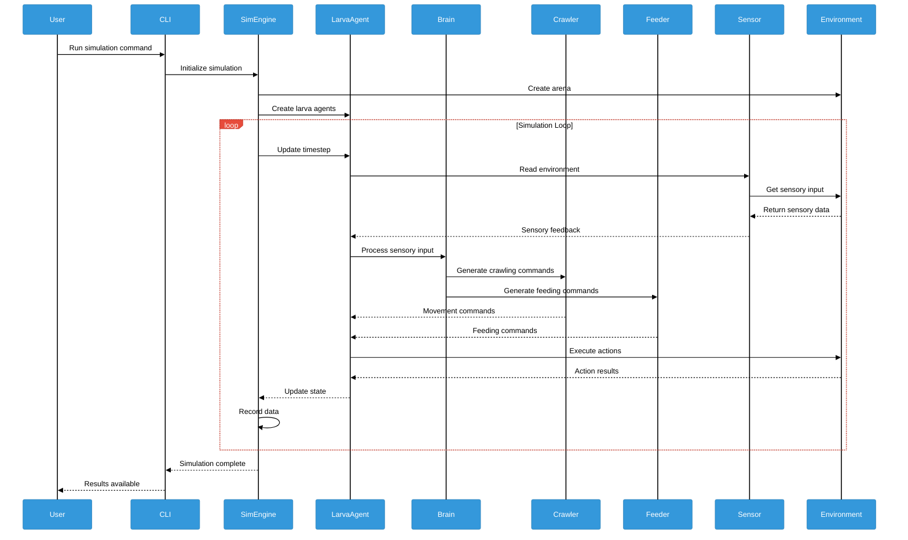

# Diagram 5: Module Interaction

This sequence diagram shows the real-time interaction flow during simulation execution, enhanced with colors for better visualization.

## Description

The Module Interaction Diagram shows the interaction between modules during a simulation, with sequence diagram illustrating command and response flow, enhanced with a color-coded system for better visualization.

### Color Legend

**Note**: Sequence diagrams in Mermaid have limited color customization support. The colors shown here are applied through theme variables:

- **🔵 Blue (Actors)**: Participant backgrounds and borders
- **🔴 Red (Labels)**: Message labels and boxes
- **🟠 Orange (Activations)**: Activation boxes and lifelines
- **⚫ Black (Text)**: All text elements and lines
- **⚪ White (Background)**: Diagram background

**Color Mapping to Components**:

- **User**: Human operator and user interface
- **CLI**: User interface components
- **SimEngine**: Application layer components (Simulation Engine)
- **LarvaAgent**: Agent system components
- **Brain**: Neural processing components
- **Crawler/Feeder**: Behavioral modules
- **Sensor**: Sensory system components
- **Environment**: Environment and arena components

### Simulation Sequence

#### Initialization Phase

1. **User Command**: User runs simulation command via CLI
2. **Simulation Setup**: CLI initializes the simulation engine
3. **Environment Creation**: Simulation engine creates the virtual arena
4. **Agent Creation**: Larva agents are created and initialized

#### Simulation Loop (Continuous)

The simulation runs in a continuous loop with the following sequence:

1. **Timestep Update**: Simulation engine updates the current timestep
2. **Sensory Input**:

   - Larva agent requests sensory input from sensors
   - Sensors query the environment for current stimuli
   - Environment returns sensory data (odors, obstacles, food)
   - Sensors provide processed sensory feedback to larva agent

3. **Neural Processing**:

   - Larva agent sends sensory input to brain for processing
   - Brain processes sensory information and makes decisions
   - Brain generates motor commands for different behavioral modules

4. **Motor Command Generation**:

   - Brain sends crawling commands to crawler module
   - Brain sends feeding commands to feeder module
   - Behavioral modules process commands and generate motor actions

5. **Action Execution**:

   - Larva agent executes motor commands in the environment
   - Environment processes actions and returns results
   - Larva agent receives feedback on action outcomes

6. **State Update and Recording**:
   - Larva agent updates its internal state
   - Simulation engine records current state and data
   - Process repeats for next timestep

#### Completion Phase

1. **Simulation Complete**: Simulation engine signals completion
2. **Results Available**: CLI notifies user that results are ready

### Key Interactions

#### Bidirectional Communication

- **Larva ↔ Environment**: Continuous bidirectional interaction
- **Sensor ↔ Environment**: Real-time sensory data exchange
- **Brain ↔ Modules**: Command and feedback exchange

#### Hierarchical Processing

- **Simulation Engine**: Orchestrates overall simulation flow
- **Larva Agent**: Coordinates internal modules and external interactions
- **Brain**: Manages multiple behavioral modules
- **Behavioral Modules**: Execute specific motor commands

#### Parallel Processing

- **Crawler and Feeder**: Operate simultaneously during each timestep
- **Multiple Sensors**: Process different sensory modalities in parallel
- **State Updates**: Multiple components update state concurrently

### Design Patterns

#### Observer Pattern

- **Sensors observe environment changes**: Sensors continuously monitor environmental stimuli
- **Event-driven updates**: Changes in environment trigger sensor updates
- **Decoupled communication**: Sensors and environment are loosely coupled

#### Command Pattern

- **Brain generates motor commands**: Brain creates specific commands for behavioral modules
- **Command execution**: Behavioral modules execute commands independently
- **Command queuing**: Commands can be queued and executed in sequence

#### State Pattern

- **Continuous state updates**: System state is updated at each timestep
- **State persistence**: State information is recorded and maintained
- **State transitions**: System transitions between different states

#### Facade Pattern

- **Simulation Engine as facade**: Simulation engine provides simplified interface
- **Complex subsystem management**: Engine manages complex interactions between subsystems
- **Unified interface**: Single point of access for simulation control

### Behavioral Coordination

#### Sensory-Motor Loop

The fundamental loop of behavioral control:

1. **Environment** provides sensory stimuli
2. **Sensors** detect and process stimuli
3. **Brain** processes sensory information
4. **Motor** systems execute behavioral responses
5. **Environment** is modified by actions
6. **Loop continues** with updated environmental state

#### Module Coordination

- **Brain as coordinator**: Brain manages multiple behavioral modules
- **Conflict resolution**: Brain resolves conflicts between competing behaviors
- **Priority management**: Brain manages behavioral priorities and switching
- **Resource allocation**: Brain allocates resources among behavioral modules

#### Conflict Resolution

- **Crawl-Bend interference**: Conflicts between crawling and bending behaviors
- **Behavioral switching**: Smooth transitions between different behaviors
- **Priority-based resolution**: Higher priority behaviors override lower priority ones
- **Context-dependent resolution**: Resolution depends on current context and state

### Performance Characteristics

#### Real-time Processing

- **Continuous operation**: Simulation runs continuously without interruption
- **Timestep synchronization**: All components synchronized to same timestep
- **Efficient processing**: Optimized for real-time performance
- **Scalable architecture**: Can handle multiple agents and complex environments

#### Data Flow Efficiency

- **Minimal data transfer**: Only necessary data is transferred between components
- **Efficient serialization**: Data is efficiently serialized and deserialized
- **Caching mechanisms**: Frequently accessed data is cached for performance
- **Parallel processing**: Multiple operations can be processed in parallel

#### Memory Management

- **Efficient memory usage**: Memory is used efficiently across all components
- **Garbage collection**: Unused objects are properly cleaned up
- **Memory pooling**: Common objects are pooled for reuse
- **Memory monitoring**: Memory usage is monitored and optimized

### Integration Points

#### External Systems

- **Data import**: Integration with external data sources
- **Result export**: Export of simulation results to external systems
- **Configuration management**: Integration with configuration systems
- **Monitoring systems**: Integration with monitoring and logging systems

#### User Interfaces

- **CLI integration**: Command-line interface for simulation control
- **GUI integration**: Graphical interface for interactive simulation
- **Web interface**: Web-based interface for remote simulation control
- **API integration**: Programmatic interface for external applications

### Error Handling

#### Robust Error Recovery

- **Graceful degradation**: System continues operating even with component failures
- **Error isolation**: Errors in one component don't affect others
- **Automatic recovery**: System automatically recovers from transient errors
- **Error reporting**: Comprehensive error reporting and logging

#### Validation and Verification

- **Input validation**: All inputs are validated before processing
- **State verification**: System state is verified at each timestep
- **Consistency checks**: Data consistency is checked throughout simulation
- **Integrity verification**: Data integrity is verified at all stages

### Scalability Considerations

#### Multi-Agent Support

- **Multiple larvae**: System can handle multiple larva agents
- **Agent coordination**: Agents can coordinate and interact with each other
- **Scalable performance**: Performance scales with number of agents
- **Resource management**: Resources are efficiently managed across agents

#### Complex Environments

- **Large environments**: System can handle large and complex environments
- **Dynamic environments**: Environments can change dynamically during simulation
- **Multiple environment types**: Support for different types of environments
- **Environment optimization**: Environments are optimized for performance

#### Distributed Processing

- **Parallel execution**: Simulation can be distributed across multiple processors
- **Load balancing**: Workload is balanced across available processors
- **Communication optimization**: Inter-process communication is optimized
- **Fault tolerance**: System is fault-tolerant in distributed environments
