# Architecture Overview

## 📊 What This Diagram Shows

This high-level architecture diagram illustrates the **five main layers** of the Larvaworld platform and their interactions, providing a bird's-eye view of the system's structure.

### Why This Matters

This layered architecture demonstrates:

- ✅ **Separation of concerns**: Each layer has distinct responsibilities
- ✅ **Modularity**: Components can be developed and tested independently
- ✅ **Extensibility**: New features can be added at appropriate layers
- ✅ **Data flow**: Clear path from user input through simulation to visualization
- ✅ **Multiple interfaces**: Flexible access through CLI, Web, and GUI

### Key Insight

Larvaworld follows a **layered architecture** pattern where user interfaces drive simulations of agent-based models, which generate data that flows through processing and storage layers to visualization and back to the user—enabling a complete research workflow from experiment design to result interpretation.

---

## Mermaid Diagram

```mermaid
graph TB
    UI[User Interfaces<br/>CLI • Web • GUI]
    Sim[Simulation Engine<br/>Exp • Batch • GA • Eval]
    Model[Models<br/>Agents • Envs • Modules]
    Data[Data Layer<br/>Import • Storage • Analysis]
    Viz[Visualization<br/>Plots • Video • Dashboards]

    UI --> Sim
    Sim --> Model
    Model --> Data
    Data --> Viz
    Viz --> UI

    style UI fill:#2196f3,stroke:#1976d2,stroke-width:2px,color:#fff
    style Sim fill:#4caf50,stroke:#388e3c,stroke-width:2px,color:#000
    style Model fill:#9c27b0,stroke:#7b1fa2,stroke-width:2px,color:#fff
    style Data fill:#f44336,stroke:#d32f2f,stroke-width:2px,color:#fff
    style Viz fill:#ff9800,stroke:#f57c00,stroke-width:2px,color:#000
```



---

## Verification Data

**Status:** ✅ VERIFIED with actual codebase
**Date:** November 19, 2025
**Source:** Full codebase structure under `/src/larvaworld/`

### Layer 1: User Interfaces ✅

**CLI (Command Line Interface)**

- **Location**: `/src/larvaworld/cli/`
- **Files**:
  - `main.py`: Entry point (`main()` function, line 11)
  - `argparser.py`: `SimModeParser` class (line 397)
- **Functionality**: Argparse-based CLI for running simulations
- **Command**: `larvaworld <mode> [options]`
- **Modes**: Exp, Batch, Ga, Eval, Replay

**Web Dashboards**

- **Location**: `/src/larvaworld/dashboards/`
- **Files** (8 modules):
  - `main.py`: Dashboard launcher
  - `experiment_viewer.py`: View experiment results
  - `track_viewer.py`: Inspect trajectories
  - `model_inspector.py`: Explore models
  - `module_inspector.py`: Inspect behavioral modules
  - `neural_oscillator_inspector.py`: Visualize neural oscillators
  - `lateral_oscillator_inspector.py`: Lateral dynamics
- **Technology**: Panel (Holoviz stack), Bokeh
- **Access**: Interactive web applications

**GUI (Graphical User Interface) - Deprecated**

- **Location**: `/src/larvaworld/gui/`
- **Files**: 28 files across `gui_aux/` and `tabs/`
- **Status**: ⚠️ **Deprecated** but still present
- **Technology**: PySimpleGUI-based desktop application
- **Note**: Legacy interface maintained for backward compatibility; not included in the PyPI entry points and may not be fully supported in current releases

### Layer 2: Simulation Engine ✅

**Simulation Modes**

| Mode       | Class        | File                   | Line | Purpose                        |
| ---------- | ------------ | ---------------------- | ---- | ------------------------------ |
| **Exp**    | `ExpRun`     | `single_run.py`        | 22   | Single experiment run          |
| **Batch**  | `BatchRun`   | `batch_run.py`         | 95   | Multiple parallel experiments  |
| **GA**     | `GAlauncher` | `genetic_algorithm.py` | 305  | Genetic algorithm optimization |
| **Eval**   | `EvalRun`    | `model_evaluation.py`  | 40   | Model evaluation vs real data  |
| **Replay** | `ReplayRun`  | `dataset_replay.py`    | 17   | Replay recorded trajectories   |

**Common Base**

- **BaseRun** (`base_run.py`, line 14): Base class for all simulation modes
- **ABModel** (`ABM_model.py`, line 412): Agentpy-based agent-based model

**Key Methods**

- `sim_setup()`: Initialize simulation
- `sim_step()`: Execute one timestep
- `step()`: Step all agents
- `update()`: Record data
- `end()`: Finalize simulation

### Layer 3: Models ✅

**Agents**

- **Location**: `/src/larvaworld/lib/model/agents/`
- **Files**:
  - `_larva.py`: Core larva classes (LarvaMotile, line 295)
  - `_larva_sim.py`: Simulation-ready larvae (LarvaSim, line 106)
  - `_larva_replay.py`: Replay larvae
  - `larva_robot.py`: Robot larvae
  - `_source.py`: Food source agents
  - `_agent.py`: Base agent class
- **Types**: LarvaMotile, LarvaSim, LarvaRobot, ObstacleLarvaRobot, Source

**Environments**

- **Location**: `/src/larvaworld/lib/model/envs/`
- **Files**:
  - `arena.py`: Arena geometry and space
  - `valuegrid.py`: Odorscape, windscape, thermoscape, food grids
  - `obstacle.py`: Physical obstacles
  - `maze.py`: Maze environments
- **Components**: Arena, ValueLayer, FoodGrid, Obstacle, BorderList

**Modules (Behavioral)**

- **Location**: `/src/larvaworld/lib/model/modules/`
- **Files** (16 modules):
  - `brain.py`: DefaultBrain, NengoBrain (line 207, 15)
  - `locomotor.py`: Locomotor integration (line 32)
  - `crawler.py`: Crawling peristalsis
  - `turner.py`: Lateral bending/turning
  - `feeder.py`: Feeding behavior
  - `intermitter.py`: Run/pause/turn switching
  - `sensor.py`: Sensory modules (Olfactor, Toucher, etc.)
  - `oscillator.py`: Neural oscillators
  - `memory.py`: Memory modules
  - `crawl_bend_interference.py`: Crawl-bend coordination

**DEB (Dynamic Energy Budget)**

- **Location**: `/src/larvaworld/lib/model/deb/`
- **Files**:
  - `deb.py`: DEB model implementation
  - `gut.py`: Gut dynamics
  - `models/`: Parameter files (deb_default.csv, deb_rover.csv, deb_sitter.csv)

### Layer 4: Data Layer ✅

**Import**

- **Location**: `/src/larvaworld/lib/process/`
- **Files**:
  - `importing.py`: Import from external trackers
  - `import_aux.py`: Import utilities
  - `calibration.py`: Calibration and scaling
- **Formats**: FlyTracker, Schleyer, Jovanic, Berni, custom formats
- **Class**: `LabFormat` for format-specific importers

**Storage**

- **File**: `dataset.py`
- **Class**: `LarvaDataset` (main data structure)
- **Format**: HDF5 (via PyTables)
- **Components**:
  - Timeseries data (pose, brain, midline, contour)
  - Endpoint data (configuration, metrics)
  - Metadata (parameters, provenance)
- **Methods**:
  - `save()`: Save to HDF5
  - `load()`: Load from HDF5
  - `get_copy()`: Create dataset copy

**Analysis**

- **Files**:
  - `evaluation.py`: Model evaluation metrics
  - `dataset_geo.py`: Geometric analysis
  - `dataset.py`: Processing methods
- **Capabilities**:
  - Preprocessing (filtering, interpolation, centering)
  - Processing (spatial, angular, dispersion metrics)
  - Annotation (bout detection, interference analysis)
  - Enrichment (automated analysis pipeline)

### Layer 5: Visualization ✅

**Plots (Static)**

- **Location**: `/src/larvaworld/lib/plot/`
- **Files** (15 modules):
  - `traj.py`: Trajectory plots
  - `time.py`: Time-series plots
  - `hist.py`: Histograms
  - `box.py`: Box plots
  - `bar.py`: Bar plots
  - `bearing.py`: Bearing/orientation plots
  - `freq.py`: Frequency/FFT plots
  - `epochs.py`: Epoch/bout plots
  - `stridecycle.py`: Stride cycle analysis
  - `deb.py`: DEB state plots
  - `scape.py`: Odorscape/windscape visualization
  - `grid.py`: Grid plots
  - `table.py`: Tables
  - `metric.py`: Metric comparisons
- **Technology**: Matplotlib, Seaborn

**Video (Real-time)**

- **Location**: `/src/larvaworld/lib/screen/`
- **Files**:
  - `drawing.py`: pygame-based rendering
  - `rendering.py`: Render objects
  - `side_panel.py`: Side panel UI
- **Technology**: pygame
- **Formats**: Real-time display, video export (MP4, AVI)
- **Class**: `ScreenManager`

**Dashboards (Interactive)**

- **Location**: `/src/larvaworld/dashboards/`
- **Files**: 8 interactive dashboards (listed above)
- **Technology**: Panel, HoloViews, Bokeh
- **Features**: Interactive parameter exploration, live visualization

### Data Flow Verification

```python
# 1. User Interface → Simulation Engine
# CLI entry point
from larvaworld.cli import main
main()  # Launches SimModeParser

# 2. Simulation Engine → Models
from larvaworld.lib.sim import ExpRun
exp = ExpRun(experiment='chemotaxis')
exp.setup()  # Creates agents and environment
  → exp.build_env(env_params)
  → exp.build_agents(larva_groups)

# 3. Models → Data Layer
exp.simulate()  # Agents generate data
  → Agents step, positions/states recorded
  → exp.update() records to collectors

# 4. Data Layer → Visualization
exp.end()  # Finalize data
  → datasets = exp.datasets  # LarvaDataset objects
  → datasets[0].save()  # Save to HDF5

# 5. Visualization → User Interface
exp.analyze()  # Generate plots
  → reg.graphs.eval_graphgroups(...)
  → Matplotlib figures saved to plot_dir

# Or via dashboards
from larvaworld.dashboards import experiment_viewer
experiment_viewer.serve()  # Interactive web UI
```

### Architecture Patterns

#### Layered Architecture

- **Presentation Layer**: CLI, Web, GUI
- **Application Layer**: Simulation engines
- **Business Logic Layer**: Agent models and behavioral modules
- **Data Access Layer**: Import, storage, analysis
- **Presentation Layer (output)**: Visualization

#### Separation of Concerns

- **User Interfaces**: Handle user interaction, parameter input
- **Simulation Engine**: Orchestrate simulations, manage execution
- **Models**: Implement scientific logic, agent behavior
- **Data Layer**: Manage data persistence, analysis
- **Visualization**: Present results, enable exploration

#### Modularity Benefits

- **Independent development**: Each layer can evolve separately
- **Testing**: Layers can be tested in isolation
- **Extensibility**: New components fit into appropriate layers
- **Reusability**: Lower layers (Model, Data) used by multiple upper layers

### Component Counts

| Layer            | Python Files | Key Classes                                      | Lines of Code |
| ---------------- | ------------ | ------------------------------------------------ | ------------- |
| **CLI**          | 3            | SimModeParser, ArgumentParser                    | 647           |
| **Dashboards**   | 8            | Various viewers/inspectors                       | 827           |
| **GUI**          | 28           | Deprecated                                       | 7,815         |
| **Simulation**   | 11           | ExpRun, BatchRun, GAlauncher, EvalRun, ReplayRun | 3,779         |
| **Agents**       | 7            | LarvaMotile, LarvaSim, LarvaRobot, Source        | ~5,000        |
| **Environments** | 4            | Arena, ValueLayer, FoodGrid, Obstacle            | ~2,000        |
| **Modules**      | 16           | Brain, Locomotor, Sensors, etc.                  | ~4,000        |
| **Data**         | 7            | LarvaDataset, Importers, Evaluators              | 5,670         |
| **Plot**         | 15           | Various plot types                               | 9,277         |
| **Screen**       | 3            | ScreenManager, Drawing                           | 2,028         |

**Total Core Components**: ~120 Python files, **57,121 lines** of code

---

## For ReadTheDocs

```rst
Platform Architecture
~~~~~~~~~~~~~~~~~~~~~

.. image:: _static/images/architecture_overview.png
   :alt: Larvaworld Architecture Overview
   :align: center
   :width: 800px

Larvaworld follows a **five-layer architecture**:

**1. User Interfaces**

   - **CLI**: Command-line interface (``larvaworld <mode>``)
   - **Web Dashboards**: Interactive Panel-based applications
   - **GUI**: Desktop application (deprecated, maintained for compatibility)

**2. Simulation Engine**

   - **Exp**: Single experiment runs (``ExpRun``)
   - **Batch**: Parallel experiment batches (``BatchRun``)
   - **GA**: Genetic algorithm optimization (``GAlauncher``)
   - **Eval**: Model evaluation (``EvalRun``)
   - **Replay**: Replay recorded data (``ReplayRun``)

**3. Models**

   - **Agents**: Larva agents, food sources
   - **Environments**: Arenas, odorscapes, food grids
   - **Modules**: Behavioral modules (brain, locomotor, sensors)
   - **DEB**: Dynamic Energy Budget for metabolism and growth

**4. Data Layer**

   - **Import**: Load data from external trackers
   - **Storage**: HDF5-based ``LarvaDataset`` for efficient storage
   - **Analysis**: Processing, metrics, evaluation

**5. Visualization**

   - **Plots**: Static figures (Matplotlib/Seaborn)
   - **Video**: Real-time rendering and export (pygame)
   - **Dashboards**: Interactive exploration (Panel/HoloViews)

**Data Flow:**

.. code-block:: none

   User → CLI/Web/GUI → Simulation Engine → Models (ABM)
      → Data Recording → Storage (HDF5) → Analysis
      → Visualization → User

**Example Usage:**

.. code-block:: python

   # Command-line
   $ larvaworld Exp chemotaxis -N 20 -duration 5.0

   # Python API
   from larvaworld.lib.sim import ExpRun
   exp = ExpRun(experiment='chemotaxis', duration=5.0)
   exp.simulate()
   exp.analyze()

   # Web dashboard
   from larvaworld.dashboards import experiment_viewer
   experiment_viewer.serve(port=5006)

This modular architecture enables flexible access to Larvaworld's capabilities
through multiple interfaces while maintaining separation of concerns and
facilitating independent development and testing of each layer.
```
