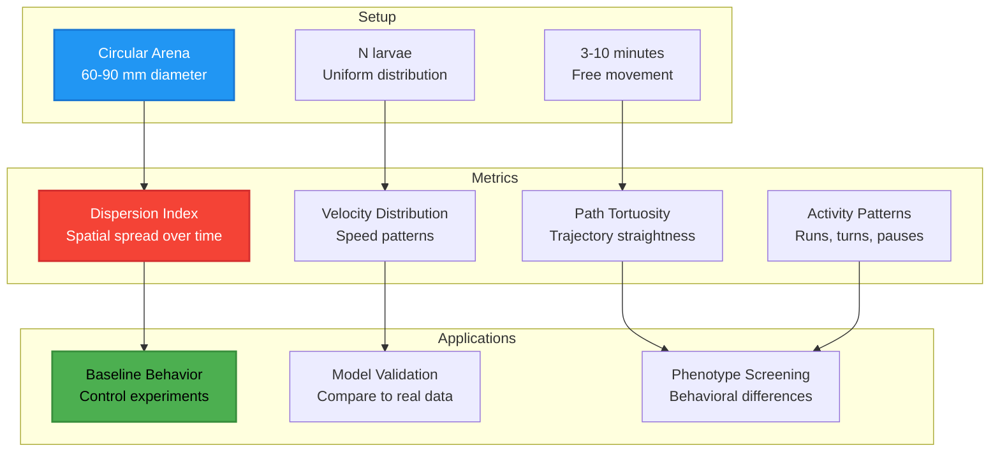

# Dish Exploration Experiment

## 📊 What This Diagram Shows

This diagram illustrates the **setup, metrics, and applications** of the Dish Exploration experiment—the fundamental baseline assay for studying spontaneous larval locomotion in an unconstrained circular arena.

### Why This Matters

The Dish Exploration experiment is foundational because:
- ✅ **Baseline behavior**: Establishes control metrics for spontaneous locomotion
- ✅ **Model validation**: Primary reference for comparing simulated vs real larvae
- ✅ **Phenotype screening**: Detects behavioral differences between strains/conditions
- ✅ **Minimal setup**: Simple environment (no odors, food, obstacles)
- ✅ **Rich metrics**: Captures spatial, temporal, and kinematic features

### Key Insight

Dish Exploration is the **gold standard baseline experiment** in Larvaworld, providing comprehensive behavioral fingerprints through minimal experimental complexity. Most other experiments are variations that add stimuli (odors, food) to this basic setup.

---

## Mermaid Diagram



---

## Verification Data

**Status:** ✅ VERIFIED with actual codebase  
**Date:** November 19, 2025  
**Source:** `/src/larvaworld/lib/reg/stored_confs/sim_conf.py`, `/src/larvaworld/lib/process/`

### Setup Verification

#### Arena Configuration ✅
- **Experiment ID**: `"dish"` (`sim_conf.py`, line 313)
- **Environment**: `E.dish(0.1)` (`sim_conf.py`, line 48)
- **Shape**: Circular dish
- **Size**: 0.1 m diameter (100 mm) - configurable
- **Variations**:
  - `"dish"`: 100 mm (default, 0.1 m)
  - `"dish_40mm"`: 40 mm (0.04 m)
- **Real-world range**: 60-90 mm (standard Petri dishes)

#### Larva Configuration ✅
- **Default**: `lgID("explorer", s=(0.02, 0.02))` (line 313)
- **Model**: `"explorer"` (basic behavioral model)
- **Distribution**: `s=(0.02, 0.02)` - Gaussian spread (std = 2 cm)
- **Default N**: 10 larvae (configurable via `N` parameter)
- **Placement**: Uniform random within specified spread

#### Duration ✅
- **Default**: 5.0 minutes (from `duration` parameter)
- **Typical range**: 3-10 minutes
- **Configurable**: Via `duration` parameter in ExpRun

### Metrics Verification

All metrics computed in `dataset.process()` and `evaluation.py`:

#### 1. Dispersion Index ✅
- **Implementation**: `comp_dispersal(t0, t1)` in `dataset.py` (line 2159)
- **Parameters**:
  - `dsp_starts=[0]`: Start times (default: 0 minutes)
  - `dsp_stops=[40, 60]`: End times (default: 40, 60 seconds)
- **Metrics computed**:
  - `dsp_0_40_max`: Maximum dispersion 0-40 seconds
  - `dsp_0_60_max`: Maximum dispersion 0-60 seconds
- **Formula**: Spatial spread of agent positions over time
- **Used in**: Evaluation metrics (`evaluation.py`, line 518)

#### 2. Velocity Distribution ✅
- **Implementation**: `comp_spatial()` in `dataset.py`
- **Parameters computed** (`evaluation.py`, lines 513-517):
  - `v`: Linear velocity (m/s)
  - `v_mu`: Mean velocity
  - `run_v_mu`: Mean velocity during runs
  - `pau_v_mu`: Mean velocity during pauses
  - `a`: Linear acceleration
  - `cum_d`: Cumulative distance traveled
  - `run_d`: Distance during runs
- **Distribution analysis**: Full velocity histograms for comparison

#### 3. Path Tortuosity ✅
- **Implementation**: `comp_tortuosity(dur)` in `dataset.py` (line 2162)
- **Parameters**:
  - `tor_durs=[5, 10, 20]`: Window durations (default: 5, 10, 20 seconds)
- **Metrics computed** (`evaluation.py`, line 540):
  - `tor5`, `tor5_mu`: Tortuosity over 5-second windows
  - `tor20`, `tor20_mu`: Tortuosity over 20-second windows
- **Formula**: Ratio of path length to straight-line distance
- **Interpretation**: 1.0 = straight, >1.0 = tortuous

#### 4. Activity Patterns ✅
- **Implementation**: `annotate()` with bout detection
- **Bout types detected**:
  - **Runs**: Forward crawling periods
  - **Turns**: Lateral bending periods
  - **Pauses**: Stationary periods
- **Metrics computed** (`evaluation.py`, lines 520-527):
  - `run_t`: Mean run duration
  - `pau_t`: Mean pause duration
  - `run_tr`: Run transition rate
  - `pau_tr`: Pause transition rate
  - `fsv`: Forward velocity during stride
  - `ffov`: Forward angular velocity during stride
- **Analysis**: Temporal dynamics of behavioral state switching

### Additional Metrics

Beyond the four main categories, Dish Exploration also computes:

#### Angular Kinematics ✅
(`evaluation.py`, lines 499-508)
- `b`: Body bend angle
- `fov`, `foa`: Front orientation velocity/angle
- `rov`, `roa`: Rear orientation velocity/angle
- `run_fov_mu`, `pau_fov_mu`: Angular velocity in runs/pauses
- `tur_fou`: Turn frequency

#### Stride Cycle ✅
(`evaluation.py`, lines 528-538)
- `str_N`: Number of strides
- `str_t`, `str_d`: Stride time/distance
- `str_sv_mu`: Stride velocity mean
- `str_fov_mu`, `str_fov_std`: Angular velocity stats
- `str_d_mu`, `str_d_std`: Distance stats
- `str_c_l`: Stride cycle length

### Applications Verification

#### 1. Baseline Behavior ✅
- **Purpose**: Establish control metrics for comparison
- **Usage**: Reference dataset for model evaluation
- **Example**: `refID='exploration.30controls'` (30 real larva trajectories)
- **Metrics**: All 40+ parameters form behavioral fingerprint

#### 2. Model Validation ✅
- **Implementation**: `EvalRun` class (`model_evaluation.py`, line 40)
- **Method**: Statistical comparison via Kolmogorov-Smirnov tests
- **Evaluated**: `eval_fast()` compares distributions (`evaluation.py`, line 144)
- **Metrics categories**:
  - Angular kinematics (8 metrics)
  - Spatial displacement (9 metrics)
  - Temporal dynamics (6 metrics)
  - Stride cycle (9 metrics)
  - Tortuosity (4 metrics)
- **Output**: KS D-statistic per metric, p-values

#### 3. Phenotype Screening ✅
- **Purpose**: Detect behavioral differences between conditions
- **Method**: Compare metric distributions across groups
- **Example**: Rover vs Sitter phenotypes in `"dispersion"` experiment
- **Analysis**: Statistical tests on all computed metrics
- **Visualization**: Box plots, histograms, trajectories

### Code Example

```python
# Run dish exploration experiment
from larvaworld.lib.sim import ExpRun

# Basic run
exp = ExpRun(experiment='dish', duration=5.0)
exp.simulate()
dataset = exp.datasets[0]

# Access metrics
print(f"Mean velocity: {dataset.e['v_mu'].mean():.4f} m/s")
print(f"Max dispersion (0-40s): {dataset.e['dsp_0_40_max'].mean():.4f} m")
print(f"Tortuosity (5s): {dataset.e['tor5_mu'].mean():.4f}")

# Compare to reference data
from larvaworld.lib.sim import EvalRun
eval_run = EvalRun(
    refID='exploration.30controls',
    modelIDs=['explorer'],
    duration=5.0
)
eval_run.simulate()
eval_run.plot_results()  # Statistical comparison plots
```

### Experiment Variations

The dish exploration setup is used in several experiment types:

| Experiment | Environment | Larvae | Focus |
|------------|-------------|--------|-------|
| `dish` | dish (100mm) | explorer, N=10 | Basic exploration |
| `dispersion` | arena_200mm | explorer, N=10 | Large-scale dispersion |
| `dispersion_x2` | arena_200mm | explorer+Levy, N=5 each | Model comparison |
| `focus` | focus (10mm) | Levy, N=1 | Single agent tracking |
| `tethered` | focus (10mm) | immobile, N=1, fixed orientation | Tethered larva |

### Metric Categories Summary

| Category | Metric Count | Key Metrics | Purpose |
|----------|--------------|-------------|---------|
| **Dispersion** | 2-4 | `dsp_0_40_max`, `dsp_0_60_max` | Spatial spread |
| **Velocity** | 7 | `v`, `v_mu`, `run_v_mu`, `cum_d` | Speed/distance |
| **Tortuosity** | 4 | `tor5`, `tor20`, `tor5_mu`, `tor20_mu` | Path straightness |
| **Activity** | 6 | `run_t`, `pau_t`, `run_tr`, `pau_tr` | State dynamics |
| **Angular** | 8 | `b`, `fov`, `foa`, `rov`, `roa` | Turning behavior |
| **Stride** | 9 | `str_N`, `str_d_mu`, `str_sv_mu` | Gait patterns |

**Total**: 36+ metrics computed automatically

---

## For ReadTheDocs

```rst
Dish Exploration Experiment
~~~~~~~~~~~~~~~~~~~~~~~~~~~

.. image:: _static/images/dish_exploration.png
   :alt: Dish Exploration Experiment
   :align: center
   :width: 800px

The **Dish Exploration** experiment is the fundamental baseline assay for studying
spontaneous larval locomotion.

**Setup:**

- **Arena**: Circular dish (60-90 mm diameter, typically 100 mm)
- **Larvae**: N larvae (default 10) uniformly distributed
- **Duration**: 3-10 minutes of free movement
- **Environment**: No odors, food, or obstacles

**Metrics Computed:**

1. **Dispersion Index**
   
   - Spatial spread of larvae over time
   - Measures exploration efficiency
   - Typical windows: 0-40s, 0-60s

2. **Velocity Distribution**
   
   - Linear velocity (mean, during runs, during pauses)
   - Cumulative distance traveled
   - Linear acceleration

3. **Path Tortuosity**
   
   - Ratio of path length to straight-line distance
   - Computed over 5s, 10s, 20s windows
   - Values: 1.0 = straight, >1.0 = tortuous

4. **Activity Patterns**
   
   - Run/pause/turn bout detection
   - Temporal dynamics (durations, transition rates)
   - Behavioral state switching

**Additional metrics**: Angular kinematics (8), Stride cycle (9)

**Applications:**

- **Baseline Behavior**: Reference for control experiments
- **Model Validation**: Compare simulated vs real larvae using KS tests
- **Phenotype Screening**: Detect behavioral differences (e.g., Rover vs Sitter)

**Example Usage:**

.. code-block:: python

   from larvaworld.lib.sim import ExpRun
   
   # Run experiment
   exp = ExpRun(experiment='dish', duration=5.0)
   exp.simulate()
   
   # Access results
   dataset = exp.datasets[0]
   print(dataset.e[['v_mu', 'dsp_0_40_max', 'tor5_mu']])
   
   # Model evaluation
   from larvaworld.lib.sim import EvalRun
   eval = EvalRun(refID='exploration.30controls', modelIDs=['explorer'])
   eval.simulate()
   eval.plot_results()  # Compare to real data

The Dish Exploration experiment provides a **comprehensive behavioral fingerprint**
through 36+ automatically computed metrics, making it the gold standard for
baseline characterization and model validation in Larvaworld.
```

