# Olfactory Learning Experiment

## 📊 What This Diagram Shows

This sequence diagram illustrates the **olfactory conditioning protocol** in Larvaworld, showing how larvae associate odors with food rewards through reinforcement learning across multiple experimental phases.

### Why This Matters

Olfactory learning demonstrates:
- ✅ **Associative learning**: Larvae learn to associate specific odors with food
- ✅ **Memory formation**: RL/MB algorithms store and recall odor-food associations
- ✅ **Behavioral plasticity**: Preference shifts from baseline to trained state
- ✅ **Multi-phase protocol**: Pre-test, training, test, post-test phases
- ✅ **Quantifiable change**: Preference Index (PI) measures learning strength

### Key Insight

Larvaworld implements **computational models of olfactory learning** using reinforcement learning (Q-learning) and mushroom body algorithms that adapt sensory gain based on reward feedback, mimicking the real neural mechanisms of *Drosophila* larval learning.

---

## Mermaid Diagram

```mermaid
sequenceDiagram
    participant L as Larvae
    participant E as Environment
    participant M as Memory System
    
    Note over L,E: Pre-Test Phase
    L->>E: Naive odor preference
    E-->>L: Odor A & B present
    Note over M: Baseline preference (PI₀)
    
    Note over L,E: Training Phase
    L->>E: Conditioning
    E-->>L: Odor A + Food (CS+)
    E-->>L: Odor B alone (CS-)
    L->>M: Associate A with food (reward signal)
    Note over M: Q-learning updates gain
    
    Note over L,E: Test Phase
    L->>E: Trained preference
    E-->>L: Odor A & B present (no food)
    M->>L: Recall association (high gain for A)
    L->>E: Prefer Odor A
    Note over M: Memory expressed (PI > PI₀)
    
    Note over L,E: Post-Test
    L->>E: Extinction or retention
    Note over M: Memory decay analysis
```



---

## Verification Data

**Status:** ✅ VERIFIED with actual codebase  
**Date:** November 19, 2025  
**Source:** `/src/larvaworld/lib/reg/stored_confs/sim_conf.py`, `/src/larvaworld/lib/model/modules/memory.py`

### Experiments Verification

#### Available Learning Experiments ✅

| Experiment | Environment | Duration | Trials | Model | Purpose |
|------------|-------------|----------|--------|-------|---------|
| `PItrain_mini` | CS_UCS_on_food_x2 | 1.0 min | odor_preference_short (8 epochs × 7.5s) | forager_RL | Quick training |
| `PItrain` | CS_UCS_on_food_x2 | 41.0 min | odor_preference (8 epochs × 5 min) | forager_RL | Full training |
| `PItest_off` | CS_UCS_off_food | variable | none | navigator_x2 | Test without food |
| `PItest_on` | CS_UCS_on_food | variable | none | forager_x2 | Test with food |
| `PItest_off_RL` | CS_UCS_off_food | 105.0 min | none | RLnavigator | RL model test |

**Code location**: `sim_conf.py`, lines 410-428

#### Experimental Phases Verification ✅

**1. Pre-Test Phase** (Optional, not in default config)
- **Purpose**: Measure naive odor preference (baseline PI)
- **Setup**: Equal odor concentrations, no food
- **Duration**: Typically 3-5 minutes
- **Output**: PI₀ (baseline preference index)

**2. Training Phase** (`PItrain`, `PItrain_mini`) ✅
- **Trials**: `odor_preference` or `odor_preference_short` (`sim_conf.py`, lines 29-34)
- **Epochs**: `trial_conf([5.0] * 8, [1.0, 0.0] * 4)`
  - 8 epochs total
  - Each 5 minutes (or 7.5 seconds for short version)
  - Alternating pattern: `[1.0, 0.0] * 4`
    - **1.0**: Odor + Food (CS+ conditioning)
    - **0.0**: Odor alone (CS- control)
- **Environment**: `CS_UCS_on_food_x2` (two odor sources + food)
- **Model**: `forager_RL` (includes RL memory module)
- **Learning**: Memory module updates gain based on reward (food detection)

**3. Test Phase** (Separate experiment: `PItest_off`)
- **Setup**: Same odors, no food
- **Duration**: Variable (typically 3-5 minutes)
- **Behavior**: Larvae show learned preference (PI > PI₀ for CS+)
- **Memory**: Recall phase, no new learning

**4. Post-Test Phase** (Extended test)
- **Purpose**: Measure extinction or retention
- **Analysis**: Track PI decay over time
- **Duration**: Can be extended to observe forgetting

### Memory System Verification ✅

#### Memory Module Implementation

**Base Class**: `Memory` (`memory.py`, line 37)
- **Modalities**: olfaction, touch
- **Modes**: RL (reinforcement learning), MB (mushroom body)
- **Integration**: Attached to Brain via `modalities[modality]['mem']` (line 122-126 in `brain.py`)

**RL Memory**: `RLmemory` (`memory.py`, line 87)
- **Algorithm**: Q-learning
- **Parameters**:
  - `alpha=0.05`: Learning rate
  - `gamma=0.6`: Discount factor
  - `epsilon`: Exploration rate
  - `train_dur=30.0`: Training duration (seconds)
  - `update_dt=1.0`: Gain update interval
- **State space**: Discretized sensory input
- **Action space**: `gain_space` (e.g., `[-300, -50, 50, 300]`)
- **Q-table**: (states × actions) updated with rewards

**Olfactory Memory**: `RLOlfMemory` (`memory.py`, line 247)
- **Specialization**: Olfaction-specific memory
- **Properties**:
  - `first_odor_best_gain`: Best gain for first odor (CS+)
  - `second_odor_best_gain`: Best gain for second odor (CS-)
- **Learning**: `learning_on` property checks if within `train_dur` (line 243-244)

**Mushroom Body**: `RemoteBrianModelMemory` (also in `memory.py`)
- **Alternative algorithm**: Mushroom body-inspired plasticity
- **Mechanism**: Kenyon cell → MBON connections

#### Reward Signal ✅

**Food Detection** (`_larva.py`, line 624-630):
```python
if m.space.accessible_sources:
    self.food_detected = m.space.accessible_sources[self]
elif self.brain.locomotor.feeder or self.brain.toucher:
    self.food_detected = util.sense_food(
        pos, sources=m.sources, grid=m.food_grid, radius=self.radius
    )
```

**Reward Passed to Memory** (`brain.py`, line 178-183):
```python
def sense(self, pos=None, reward=False):
    kws = {"pos": pos}
    for m, M in self.modalities.items():
        if M.sensor:
            M.sensor.update_gain_via_memory(mem=M.mem, reward=reward)
            M.A = M.sensor.step(M.func(**kws))
```

**Memory Update** (`memory.py`, line 76-81):
```python
def step(self, reward=False, **kwargs):
    if self.active:
        self.count_time()
    self.rewardSum += int(reward) - 0.01  # Reward accumulation
    self.update_gain(**kwargs)  # Q-learning update
    return self.gain
```

### Preference Index (PI) Calculation ✅

**Implementation**: `comp_PI()` in `dataset.py` (line 2112-2123)

```python
def comp_PI(self, arena_xdim, xs, return_num=False):
    N = len(xs)
    r = 0.2 * arena_xdim  # Radius = 20% of arena width
    xs = np.array(xs)
    N_l = len(xs[xs <= -r / 2])  # Count in left half
    N_r = len(xs[xs >= +r / 2])  # Count in right half
    pI = np.round((N_l - N_r) / N, 3)  # PI formula
    return pI
```

**Formula**: PI = (N_left - N_right) / N_total

**Interpretation**:
- **PI = -1**: All larvae prefer right side (CS-)
- **PI = 0**: No preference
- **PI = +1**: All larvae prefer left side (CS+)
- **Learning**: PI shifts from ~0 (naive) to positive (trained)

**PI2 Calculation**: `comp_PI2()` (line 2098-2110)
- Alternative metric: Mean lateral displacement difference
- More sensitive to small preference changes

### Environment Configuration

**CS_UCS_on_food_x2** (Training environment):
- **CS (Conditioned Stimulus)**: Odor (e.g., Fructose on left, Quinine on right)
- **UCS (Unconditioned Stimulus)**: Food (paired with CS+)
- **Setup**: Two odor sources, food grid
- **Alternating**: Food on/off across epochs

**CS_UCS_off_food** (Test environment):
- **Same odors**, no food
- **Measures**: Learned preference without reward
- **Duration**: Typically shorter than training

### Code Example

```python
# Run olfactory learning experiment
from larvaworld.lib.sim import ExpRun

# Training phase
train_exp = ExpRun(
    experiment='PItrain_mini',  # Short training
    duration=1.0,  # 1 minute
    parameters={
        'env_params': reg.conf.Env.getID('CS_UCS_on_food_x2'),
        'larva_groups': {
            'RL': reg.gen.LarvaGroup(
                mID='forager_RL',  # Model with RL memory
                N=20
            )
        }
    }
)
train_exp.simulate()

# Get trained dataset
trained_dataset = train_exp.datasets[0]

# Calculate PI
trained_dataset.comp_dataPI()
print(f"Learned PI: {trained_dataset.config.PI['PI']:.3f}")
print(f"Number of larvae: {trained_dataset.config.PI['N']}")

# Test phase (separate experiment)
test_exp = ExpRun(
    experiment='PItest_off',  # Test without food
    duration=3.0,
    parameters={
        'larva_groups': {
            'RL': reg.gen.LarvaGroup(
                mID='RLnavigator',  # Same memory state
                N=20
            )
        }
    }
)
test_exp.simulate()
test_dataset = test_exp.datasets[0]
test_dataset.comp_dataPI()
print(f"Test PI: {test_dataset.config.PI['PI']:.3f}")
```

### Learning Mechanisms

#### Q-Learning Algorithm (`RLmemory.update_gain()`)

1. **State**: Discretized sensory input (odor concentration)
2. **Action**: Select gain value from `gain_space`
3. **Reward**: `+1` if on food, `-0.01` per timestep (cost)
4. **Q-update**: Q(s,a) ← Q(s,a) + α[r + γ·max(Q(s',a')) - Q(s,a)]
5. **Exploration**: ε-greedy policy (random vs best action)
6. **Exploitation**: After training, use best Q-values

#### Gain Modulation

- **High gain (positive)**: Attractive response to odor
- **Low gain (negative)**: Aversive response to odor
- **Learning effect**: Gain for CS+ increases, CS- remains low/negative
- **Behavioral outcome**: Larvae turn toward CS+, away from CS-

### Experimental Timeline

**Full Training (`PItrain`)**: 41 minutes
```
Epoch 1 (5 min): Odor A + Food  ← Learning CS+
Epoch 2 (5 min): Odor B         ← Control CS-
Epoch 3 (5 min): Odor A + Food  ← Reinforcement
Epoch 4 (5 min): Odor B         ← No reinforcement
Epoch 5 (5 min): Odor A + Food
Epoch 6 (5 min): Odor B
Epoch 7 (5 min): Odor A + Food
Epoch 8 (5 min): Odor B
```

**Short Training (`PItrain_mini`)**: 1 minute (8 epochs × 7.5s each)

---

## For ReadTheDocs

```rst
Olfactory Learning Experiment
~~~~~~~~~~~~~~~~~~~~~~~~~~~~~~

.. image:: _static/images/olfactory_learning.png
   :alt: Olfactory Learning Protocol
   :align: center
   :width: 800px

Larvaworld implements **olfactory associative learning** through a multi-phase
conditioning protocol with computational memory models.

**Experimental Phases:**

1. **Pre-Test** (optional)
   
   - Measure naive odor preference (baseline PI)
   - No food present

2. **Training Phase** (``PItrain`` or ``PItrain_mini``)
   
   - **Alternating epochs**: Odor A + Food (CS+) vs Odor B alone (CS-)
   - **Full**: 8 epochs × 5 minutes = 41 minutes
   - **Short**: 8 epochs × 7.5 seconds = 1 minute
   - **Learning**: RL memory updates gain based on food reward

3. **Test Phase** (``PItest_off``)
   
   - Same odors, no food
   - Larvae show learned preference for CS+
   - Memory recall without new learning

4. **Post-Test**
   
   - Extended testing for extinction/retention analysis

**Memory System:**

Larvaworld includes two learning algorithms:

- **RL Memory** (Q-learning): State-action-reward Q-table updates
- **MB Memory**: Mushroom body-inspired plasticity rules

**Memory Integration:**

.. code-block:: python

   # Memory module attached to brain
   brain = DefaultBrain(
       conf={
           'olfactor': {'gain': {'odor_A': 0.0, 'odor_B': 0.0}},
           'memory': {
               'mode': 'RL',
               'modality': 'olfaction',
               'alpha': 0.05,  # Learning rate
               'gamma': 0.6,   # Discount factor
               'train_dur': 30.0  # Training duration (s)
           }
       }
   )

**Preference Index (PI):**

.. math::

   PI = \\frac{N_{left} - N_{right}}{N_{total}}

where larvae final positions determine preference (-1 to +1).

**Learning Effect:**

- **Naive**: PI ≈ 0 (no preference)
- **Trained**: PI > 0 (prefer CS+ side)
- **Strength**: |PI| indicates learning magnitude

**Example Usage:**

.. code-block:: python

   # Training
   exp = ExpRun(experiment='PItrain_mini', duration=1.0)
   exp.simulate()
   exp.datasets[0].comp_dataPI()
   
   # Test learned preference
   test = ExpRun(experiment='PItest_off', duration=3.0)
   test.simulate()
   print(f"Learned PI: {test.datasets[0].config.PI['PI']}")

The olfactory learning protocol demonstrates Larvaworld's capability to model
**neural plasticity and behavioral adaptation** through biologically-inspired
reinforcement learning algorithms.
```

