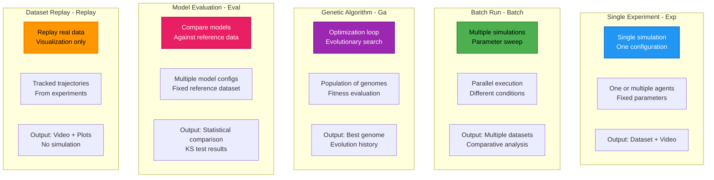

# Simulation Types Comparison

## 📊 What This Diagram Shows

This diagram compares the **five simulation modes** available in Larvaworld, showing their distinct purposes, execution patterns, and outputs.

### Why This Matters

Understanding simulation types enables users to:
- ✅ **Choose the right tool**: Match simulation mode to research question
- ✅ **Optimize workflow**: Use parallel execution when appropriate
- ✅ **Compare systematically**: Understand trade-offs between modes
- ✅ **Plan experiments**: Know what outputs to expect
- ✅ **Scale efficiently**: From single runs to large parameter sweeps

### Key Insight

Larvaworld provides **five specialized simulation modes**, each optimized for different research workflows: single experiments (Exp), parameter exploration (Batch), model optimization (Ga), model validation (Eval), and data visualization (Replay)—covering the full spectrum from hypothesis testing to model refinement.

---

## Mermaid Diagram



---

## Verification Data

**Status:** ✅ VERIFIED with actual codebase  
**Date:** November 19, 2025  
**Source:** `/src/larvaworld/lib/sim/`

### Mode 1: Single Experiment (Exp) ✅

**Class**: `ExpRun` (`single_run.py`, line 22)

**Purpose**: Run a single simulation with fixed parameters

**Characteristics**:
- **Configuration**: One experiment ID (e.g., `'chemotaxis'`, `'dish'`)
- **Agents**: N larvae with specified model (e.g., `mID='explorer'`, `N=10`)
- **Parameters**: Fixed throughout simulation
- **Duration**: Single value (e.g., `duration=5.0` minutes)
- **Execution**: Sequential, single run
- **Timesteps**: All agents step synchronously

**Outputs**:
- **Dataset**: Single `LarvaDataset` with pose, brain data
- **Video**: Optional real-time rendering or export (MP4, AVI)
- **Plots**: Analysis figures via `exp.analyze()`
- **HDF5**: Stored in `DATA/SimGroup/exp_runs/{experiment}/{id}/`

**Use Cases**:
- Exploratory testing
- Video generation for presentations
- Single condition analysis
- Model demonstration

**CLI**: `larvaworld Exp chemotaxis -N 20 -duration 5.0`

**Code**:
```python
from larvaworld.lib.sim import ExpRun
exp = ExpRun(experiment='chemotaxis', duration=5.0)
exp.simulate()
dataset = exp.datasets[0]
```

---

### Mode 2: Batch Run (Batch) ✅

**Class**: `BatchRun` (`batch_run.py`, line 95)

**Purpose**: Run multiple simulations with parameter variations

**Characteristics**:
- **Configuration**: One experiment ID + parameter sweep
- **Agents**: Multiple agent configurations
- **Parameters**: Varied across runs (e.g., `N=[10, 20, 30]`)
- **Parallelization**: Uses `agentpy.Experiment` for parallel execution
- **Iterations**: `Nsims` repetitions per parameter combination
- **Sampling**: Parameter combinations via `sample_space`

**Outputs**:
- **Datasets**: Multiple `LarvaDataset` objects (one per run)
- **Summary**: Aggregated results across conditions
- **Comparison**: Statistical analysis across parameter space
- **Storage**: `DATA/SimGroup/batch_runs/{experiment}/`

**Use Cases**:
- Parameter sensitivity analysis
- Robustness testing
- Comparative studies
- Statistical power analysis

> **Note**: `BatchRun` is an advanced feature that relies on preconfigured Batch entries in the registry (`reg.conf.Batch`). CLI and configuration options may evolve; for most users, starting with `Exp` and `Eval` modes is recommended before moving to Batch-based parameter sweeps.

**CLI**: `larvaworld Batch PItest_off -Nsims 10`

**Code**:
```python
from larvaworld.lib import reg
from larvaworld.lib.sim import BatchRun

# Load preconfigured Batch settings from the registry
batch_conf = reg.conf.Batch.getID("PItest_off")

# Launch batch run (parameter sweep defined in Batch configuration)
batch = BatchRun(experiment="PItest_off", **batch_conf)
par_df, figs = batch.simulate(n_jobs=4)
```

---

### Mode 3: Genetic Algorithm (Ga) ✅

**Class**: `GAlauncher` (`genetic_algorithm.py`, line 305)

**Purpose**: Optimize model parameters using evolutionary algorithm

**Characteristics**:
- **Configuration**: Base experiment + parameter space to optimize
- **Genomes**: Population of parameter sets
- **Fitness**: Evaluated against reference data or target metrics
- **Evolution**: Selection, crossover, mutation
- **Generations**: `Ngenerations` iterations (e.g., 50)
- **Population size**: `Nagents` genomes per generation

**Outputs**:
- **Best Genome**: Optimized parameter set
- **Evolution History**: Fitness over generations
- **Final Population**: All genomes with fitness scores
- **Plots**: Fitness convergence, parameter evolution
- **Storage**: `DATA/SimGroup/ga_runs/{experiment}/`

**Use Cases**:
- Model parameter fitting
- Behavior matching to real data
- Multi-objective optimization
- Sensitivity-guided parameter search

**CLI**: `larvaworld Ga exploration -Ngenerations 50`

**Code**:
```python
from larvaworld.lib import reg
from larvaworld.lib.sim.genetic_algorithm import GAevaluation, optimize_mID

# Define fitness function against a reference dataset
evaluator = GAevaluation(
    refID="exploration.30controls",
    metric_definition="angular",
)

# Run genetic algorithm to optimize a locomotory model
results = optimize_mID(
    mID0="explorer",                # Base model to optimize
    ks=["crawler.f", "turner.ang_v"],  # Parameter keys to vary
    evaluator=evaluator,
    Ngenerations=50,
)

best_conf = results["explorer"]  # Optimized model configuration
```

---

### Mode 4: Model Evaluation (Eval) ✅

**Class**: `EvalRun` (`model_evaluation.py`, line 40)

**Purpose**: Compare multiple models against reference dataset

**Characteristics**:
- **Configuration**: Multiple model IDs + reference dataset
- **Models**: Different behavioral configurations to compare
- **Reference**: Real experimental data (`refID`)
- **Metrics**: 40+ behavioral metrics evaluated
- **Statistical Tests**: Kolmogorov-Smirnov (KS) tests
- **Repetitions**: Multiple runs per model for robustness

**Outputs**:
- **Comparison Report**: KS D-statistic per metric per model
- **Statistical Tests**: p-values for each comparison
- **Plots**: Box plots, trajectories, metric distributions
- **Rankings**: Models ranked by overall fit
- **Storage**: `DATA/SimGroup/eval_runs/{experiment}/`

**Use Cases**:
- Model validation
- Model selection
- Behavioral fingerprinting
- Hypothesis testing

**CLI**: `larvaworld Eval -refID exploration.30controls -mIDs explorer navigator`

**Code**:
```python
from larvaworld.lib.sim import EvalRun

eval_run = EvalRun(
    refID='exploration.30controls',  # Reference dataset
    modelIDs=['explorer', 'navigator', 'forager'],  # Models to compare
    duration=5.0,
    Nagents=20  # Per model
)
eval_run.simulate()
eval_run.plot_results()  # Statistical comparison plots
eval_run.plot_models()   # Model-specific visualizations

# Access results
print(eval_run.error_dict['end'])  # Endpoint metric errors
print(eval_run.error_dict['step'])  # Distribution metric errors
```

---

### Mode 5: Dataset Replay (Replay) ✅

**Class**: `ReplayRun` (`dataset_replay.py`, line 17)

**Purpose**: Visualize real tracked data without simulation

**Characteristics**:
- **Configuration**: Reference dataset ID
- **No Simulation**: No agent stepping, no physics
- **Replay Only**: Playback of recorded trajectories
- **Visualization**: Real-time rendering or video export
- **Analysis**: Can apply processing/plotting to real data
- **Fast**: No computational overhead of simulation

**Outputs**:
- **Video**: Rendered trajectories (MP4, AVI)
- **Images**: Snapshots at specific timepoints
- **Plots**: Same analysis as simulation data
- **No HDF5**: Uses existing reference dataset

**Use Cases**:
- Visualizing experimental data
- Creating videos from tracked data
- Quality control of imported datasets
- Comparative visualization

**CLI**: `larvaworld Replay -refID exploration.30controls -video_name replay.mp4`

**Code**:
```python
from larvaworld.lib.sim import ReplayRun

replay = ReplayRun(
    refID='exploration.30controls',
    screen_kws={
        'vis_mode': 'video',
        'video_name': 'exploration_replay.mp4'
    }
)
replay.run()  # No simulation, just visualization
```

---

## Comparison Table

| Feature | Exp | Batch | Ga | Eval | Replay |
|---------|-----|-------|----|----|--------|
| **# Simulations** | 1 | N × M × Nsims | Ngenerations × Nagents | Nmodels × Nruns | 0 (replay only) |
| **Parameter Variation** | Fixed | Sweep | Evolving | Fixed per model | N/A |
| **Parallel Execution** | No | Yes | Yes | Yes | N/A |
| **Optimization** | No | No | Yes | No | No |
| **Reference Data** | Optional | Optional | Required | Required | Required |
| **Statistical Tests** | No | Optional | Yes (fitness) | Yes (KS tests) | No |
| **Video Output** | Yes | Optional | Optional | Optional | Yes |
| **HDF5 Storage** | Yes | Yes | Yes | Yes | No (uses existing) |
| **Duration** | Minutes | Hours | Hours-Days | Hours | Seconds-Minutes |
| **Use Case** | Single test | Parameter study | Optimization | Validation | Visualization |

---

## Execution Patterns

### Sequential (Exp, Replay)
```
Run 1 → Dataset 1 → End
```

### Parallel (Batch, Eval)
```
Run 1 ─┐
Run 2 ─┼→ Datasets 1-N → Aggregated Analysis
Run 3 ─┘
```

### Iterative (Ga)
```
Generation 1 → Fitness Evaluation → Selection
    ↓
Generation 2 → Fitness Evaluation → Selection
    ↓
Generation N → Best Genome
```

---

## Performance Considerations

| Mode | CPU Usage | Memory | Disk I/O | Time Complexity |
|------|-----------|--------|----------|----------------|
| **Exp** | Single core | Low | Low | O(N_steps) |
| **Batch** | Multi-core | Medium | High | O(N_sims × N_steps) |
| **Ga** | Multi-core | Medium-High | High | O(N_gen × N_agents × N_steps) |
| **Eval** | Multi-core | Medium | Medium | O(N_models × N_runs × N_steps) |
| **Replay** | Single core | Low | Low | O(N_frames) |

---

## Decision Tree

```
Do you need to run a simulation?
├─ No → Use **Replay** (visualize existing data)
└─ Yes
   ├─ Single configuration? → Use **Exp** (quick test/video)
   ├─ Parameter exploration? → Use **Batch** (sweep parameters)
   ├─ Find best parameters? → Use **Ga** (optimize)
   └─ Compare models? → Use **Eval** (validate against real data)
```

---

## For ReadTheDocs

```rst
Simulation Types
~~~~~~~~~~~~~~~~

Larvaworld provides **five simulation modes**, each optimized for different workflows:

**1. Single Experiment (Exp)**

Run one simulation with fixed parameters.

.. code-block:: bash

   larvaworld Exp chemotaxis -N 20 -duration 5.0

**Use for:** Quick tests, video generation, demonstrations

---

**2. Batch Run (Batch)**

Sweep parameter space with parallel execution.

.. code-block:: python

   from larvaworld.lib import reg
   from larvaworld.lib.sim import BatchRun

   batch_conf = reg.conf.Batch.getID("PItest_off")
   batch = BatchRun(experiment="PItest_off", **batch_conf)
   par_df, figs = batch.simulate(n_jobs=4)

**Use for:** Parameter sensitivity, robustness testing, comparative studies

---

**3. Genetic Algorithm (Ga)**

Optimize model parameters via evolutionary search.

.. code-block:: python

   from larvaworld.lib.sim.genetic_algorithm import GAevaluation, optimize_mID

   evaluator = GAevaluation(
       refID="exploration.30controls",
       metric_definition="angular",
   )

   results = optimize_mID(
       mID0="explorer",
       ks=["crawler.f", "turner.ang_v"],
       evaluator=evaluator,
       Ngenerations=50,
   )

**Use for:** Parameter fitting, behavior matching, optimization

---

**4. Model Evaluation (Eval)**

Compare multiple models against reference data with statistical tests.

.. code-block:: python

   EvalRun(
       refID='exploration.30controls',
       modelIDs=['explorer', 'navigator', 'forager']
   )

**Use for:** Model validation, model selection, hypothesis testing

---

**5. Dataset Replay (Replay)**

Visualize real tracked data without simulation.

.. code-block:: python

   ReplayRun(
       refID='exploration.30controls',
       screen_kws={'vis_mode': 'video'}
   )

**Use for:** Data visualization, quality control, video creation

---

**Decision Guide:**

- **Exp**: Single test or video
- **Batch**: Parameter exploration
- **Ga**: Find best parameters
- **Eval**: Validate models
- **Replay**: Visualize real data

All modes share common interfaces and produce compatible `LarvaDataset` outputs
(except Replay, which uses existing datasets).
```
