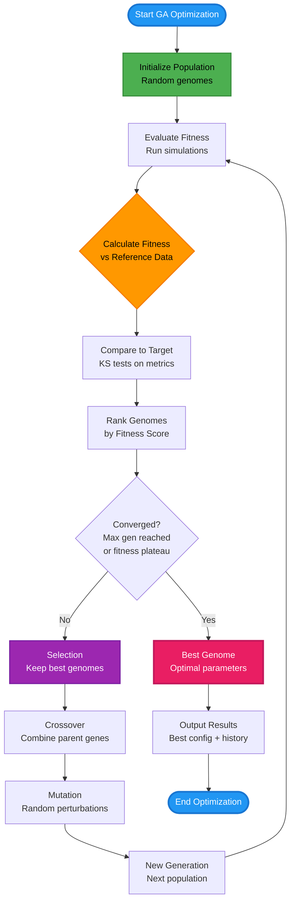

# Genetic Algorithm Optimization

## 📊 What This Diagram Shows

This flowchart illustrates the **genetic algorithm (GA) optimization process** in Larvaworld, showing how model parameters evolve across generations to maximize fitness against reference data.

### Why This Matters

GA optimization enables:
- ✅ **Automated parameter fitting**: Find optimal parameters without manual tuning
- ✅ **Multi-parameter optimization**: Simultaneously optimize many parameters
- ✅ **Behavioral matching**: Evolve models to match real larval behavior
- ✅ **Exploration-exploitation**: Balance searching new parameter space vs refining good solutions
- ✅ **Convergence tracking**: Monitor fitness improvement across generations

### Key Insight

Larvaworld's GA implements an **evolutionary optimization** strategy where populations of parameter sets ("genomes") compete based on behavioral fitness, with the best performers selected, crossed, and mutated to produce improved offspring—mimicking natural selection to automatically discover optimal model configurations.

---

## Mermaid Diagram



---

## Verification Data

**Status:** ✅ VERIFIED with actual codebase  
**Date:** November 19, 2025  
**Source:** `/src/larvaworld/lib/sim/genetic_algorithm.py`, `/src/larvaworld/lib/reg/`

### GA Implementation ✅

**Class**: `GAlauncher` (`genetic_algorithm.py`, line 305)

**Inherits from**: `BaseRun` (simulation capabilities)

**Key Attributes**:
- `evaluator`: `GAevaluation` instance (fitness function)
- `selector`: `GAselector` instance (evolution parameters)
- `genome_dict`: Current generation genomes
- `best_genome`: Best genome across all generations
- `best_fitness`: Fitness of best genome
- `generation_num`: Current generation number

### Step-by-Step Verification

#### 1. Initialize Population ✅

**Method**: `build_generation()` (`genetic_algorithm.py`)

**Process**:
```python
# First generation: random initialization
if self.generation_num == 0:
    genomes = self.selector.init_genome_dict(
        self.selector.Nagents,  # Population size
        self.parameter_space   # Parameter ranges
    )
```

**Parameters**:
- `Nagents`: Population size (e.g., 30-100 genomes)
- `parameter_space`: Dict of parameters with ranges
  - Example: `{'interference': [0.0, 1.0], 'turner.amp': [10.0, 50.0]}`
- **Initialization**: Random uniform sampling within ranges

**Code**: `GAselector.init_genome_dict()` in `generators.py`

#### 2. Evaluate Fitness ✅

**Method**: `evaluate_fitness()` in `GAevaluation` (`generators.py`, line 977)

**Process**:
1. **Run Simulation**: Each genome → `ExpRun` → `LarvaDataset`
2. **Process Data**: Apply `process()` and `annotate()`
3. **Compare to Reference**: Compute error metrics vs `refDataset`
4. **Calculate Fitness**: Aggregate errors across metrics

**Fitness Function**:
```python
def evaluate_fitness(self, dataset, mode='default'):
    # Compute error dict (KS tests)
    error_dict = eval_fast(
        datasets=[dataset],
        data=self.data,
        symbols=self.symbols,
        mode=self.mode
    )
    # Aggregate errors
    fitness = self.compute_final_fitness(error_dict, mode=mode)
    return fitness
```

**Metrics Used** (from `evaluation.py`, lines 496-541):
- **Angular kinematics**: `b`, `fov`, `foa`, `rov`, `roa`, etc. (8 metrics)
- **Spatial displacement**: `cum_d`, `v_mu`, `dsp_0_40_max`, etc. (9 metrics)
- **Temporal dynamics**: `run_t`, `pau_t`, `fsv`, `ffov`, etc. (6 metrics)
- **Stride cycle**: `str_d_mu`, `str_sv_mu`, `str_fov_mu`, etc. (9 metrics)
- **Tortuosity**: `tor5`, `tor20`, `tor5_mu`, `tor20_mu` (4 metrics)

**Fitness Score**: Lower is better (minimizes error)

#### 3. Compare to Target / Rank Genomes ✅

**Method**: `sorted_genomes` property (`genetic_algorithm.py`)

**Process**:
```python
@property
def sorted_genomes(self):
    """Sort genomes by fitness (ascending - lower is better)"""
    genome_list = list(self.genome_dict.items())
    return sorted(genome_list, key=lambda x: x[1]['fitness'])
```

**Ranking**:
- **Best**: Lowest fitness score (smallest error)
- **Worst**: Highest fitness score (largest error)
- **Tracking**: `best_genome` and `best_fitness` updated each generation

#### 4. Convergence Check ✅

**Method**: `generation_completed` and `max_generation_completed` properties

**Conditions** (`genetic_algorithm.py`, lines 537-564):
```python
@property
def generation_completed(self):
    return self.t >= self.Nsteps or len(self.agents) <= self.selector.Nagents_min

@property
def max_generation_completed(self):
    return (
        self.selector.Ngenerations is not None
        and self.generation_num >= self.selector.Ngenerations
    )
```

**Termination Criteria**:
- **Max generations reached**: `generation_num >= Ngenerations`
- **Fitness plateau**: (implicit, can track `best_fitness` changes)
- **Minimum population**: `len(agents) <= Nagents_min`

#### 5. Selection ✅

**Method**: `select_survivors()` in `GAselector` (`generators.py`)

**Strategies**:
- **Elitism**: Keep top `Nelits` genomes unchanged
- **Tournament selection**: Random subsets compete
- **Roulette wheel**: Probability proportional to fitness
- **Rank-based**: Selection based on rank, not raw fitness

**Default**: Elitism + tournament selection

**Code**:
```python
def select_survivors(self, sorted_genomes):
    Nelits = int(self.Nagents * self.elitism_ratio)  # e.g., 10%
    survivors = sorted_genomes[:Nelits]  # Keep best
    # Additional selection for remaining slots
    return survivors
```

#### 6. Crossover ✅

**Method**: `crossover()` in `GAselector`

**Process**:
- **Parents**: Select two survivors
- **Crossover point**: Random position in genome
- **Offspring**: Combine parent genes
  - Gene 1 to crossover point from Parent A
  - Remaining genes from Parent B

**Types**:
- **Single-point**: One crossover point
- **Two-point**: Two crossover points
- **Uniform**: Each gene randomly from either parent

**Code**:
```python
def crossover(self, parent1, parent2):
    crossover_point = random.randint(1, len(parent1) - 1)
    offspring1 = parent1[:crossover_point] + parent2[crossover_point:]
    offspring2 = parent2[:crossover_point] + parent1[crossover_point:]
    return offspring1, offspring2
```

#### 7. Mutation ✅

**Method**: `mutate()` in `GAselector`

**Process**:
- **Mutation rate**: Probability per gene (e.g., 5-10%)
- **Mutation strength**: Magnitude of perturbation
- **Bounded**: Keep within parameter ranges
- **Random**: Gaussian noise or uniform random

**Code**:
```python
def mutate(self, genome, mutation_rate=0.05, mutation_strength=0.1):
    for key in genome:
        if random.random() < mutation_rate:
            # Add Gaussian noise
            param_range = self.parameter_space[key]
            noise = random.gauss(0, mutation_strength)
            genome[key] += noise * (param_range[1] - param_range[0])
            # Clip to bounds
            genome[key] = np.clip(genome[key], param_range[0], param_range[1])
    return genome
```

#### 8. New Generation ✅

**Method**: `build_generation()` with sorted genomes

**Process**:
1. **Select survivors** (top performers)
2. **Generate offspring** (crossover + mutation)
3. **Fill population** to `Nagents`
4. **Create agents** with new genomes
5. **Increment** `generation_num`

**Code**:
```python
def build_generation(self, sorted_genomes):
    self.generation_num += 1
    
    # Selection
    survivors = self.selector.select_survivors(sorted_genomes)
    
    # Crossover + Mutation
    offspring = []
    while len(survivors) + len(offspring) < self.selector.Nagents:
        parent1, parent2 = random.sample(survivors, 2)
        child1, child2 = self.selector.crossover(parent1, parent2)
        child1 = self.selector.mutate(child1)
        child2 = self.selector.mutate(child2)
        offspring.extend([child1, child2])
    
    # New generation
    new_genomes = survivors + offspring[:self.selector.Nagents - len(survivors)]
    self.genome_dict = {f"gen{self.generation_num}_g{i}": g 
                        for i, g in enumerate(new_genomes)}
    
    # Create agents with new genomes
    self.build_agents(self.genome_dict)
```

### GA Configuration ✅

**Class**: `GAselector` (`generators.py`)

**Key Parameters**:
```python
GAselector(
    Nagents=30,           # Population size
    Ngenerations=50,      # Max generations
    Nelits=3,             # Number of elites to preserve
    elitism_ratio=0.1,    # % of population to keep unchanged
    mutation_rate=0.05,   # Probability of mutation per gene
    mutation_strength=0.1,# Magnitude of mutations
    Nagents_min=5         # Min population before termination
)
```

**Class**: `GAevaluation` (`generators.py`, line 977)

**Key Parameters**:
```python
GAevaluation(
    refID='exploration.30controls',  # Reference dataset
    metric_definition='angular',     # Metric category to optimize
    # or
    eval_metrics={  # Custom metric selection
        'angular kinematics': ['b', 'fov'],
        'spatial displacement': ['cum_d', 'v_mu']
    },
    mode='pooled',  # Evaluation mode
    minimization=True  # Minimize error (lower = better)
)
```

### Output Data ✅

**Stored Attributes**:
- `best_genome`: Dict of optimal parameter values
- `best_fitness`: Fitness score of best genome
- `fitness_history`: Fitness per generation
- `genome_history`: All genomes across generations
- `generation_num`: Total generations completed

**Files Saved**:
- `best_genome.pkl`: Best parameter set
- `fitness_history.csv`: Convergence data
- `generation_X/`: Datasets for each generation

**Example Output**:
```python
>>> ga.best_genome
{
    'brain.locomotor.crawler.freq': 1.85,
    'brain.locomotor.turner.amp': 35.2,
    'brain.locomotor.interference': 0.67
}
>>> ga.best_fitness
0.245  # Low error = good fit
```

### Code Example

```python
from larvaworld.lib.sim import GAlauncher
from larvaworld.lib.reg import GAevaluation, GAselector

# Define what to optimize
evaluator = GAevaluation(
    refID='exploration.30controls',  # Target behavior
    metric_definition='angular'      # Focus on turning
)

# Define evolution parameters
selector = GAselector(
    Nagents=30,          # Population size
    Ngenerations=50,     # Max generations
    elitism_ratio=0.1,   # Keep top 10%
    mutation_rate=0.05   # 5% mutation rate
)

# Run genetic algorithm
ga = GAlauncher(
    experiment='exploration',
    evaluator=evaluator,
    ga_select_kws=selector.params
)

ga.simulate()

# Access results
print(f"Best fitness: {ga.best_fitness:.4f}")
print(f"Best genome: {ga.best_genome}")
print(f"Generations: {ga.generation_num}")

# Plot convergence
import matplotlib.pyplot as plt
plt.plot(ga.fitness_history)
plt.xlabel('Generation')
plt.ylabel('Best Fitness')
plt.title('GA Convergence')
plt.show()
```

---

## For ReadTheDocs

```rst
Genetic Algorithm Optimization
~~~~~~~~~~~~~~~~~~~~~~~~~~~~~~

.. image:: _static/images/genetic_algorithm.png
   :alt: Genetic Algorithm Optimization Flow
   :align: center
   :width: 800px

Larvaworld implements **evolutionary optimization** to automatically fit model
parameters to real behavioral data.

**Algorithm Steps:**

1. **Initialize Population**
   
   - Generate random parameter sets ("genomes")
   - Population size: 30-100 genomes

2. **Evaluate Fitness**
   
   - Run simulation for each genome
   - Compare to reference dataset using KS tests
   - Lower fitness = better match

3. **Selection**
   
   - Rank genomes by fitness
   - Keep best performers (elitism)
   - Tournament or roulette wheel selection

4. **Crossover**
   
   - Combine genes from two parents
   - Create offspring with mixed parameters

5. **Mutation**
   
   - Random perturbations (5-10% rate)
   - Maintain diversity in population

6. **Iterate**
   
   - Repeat for N generations (typically 50-200)
   - Stop when fitness plateaus or max generations reached

**Configuration:**

.. code-block:: python

   from larvaworld.lib.sim import GAlauncher
   from larvaworld.lib.reg import GAevaluation
   
   # Define fitness function
   evaluator = GAevaluation(
       refID='exploration.30controls',
       metric_definition='angular'
   )
   
   # Run optimization
   ga = GAlauncher(
       experiment='exploration',
       evaluator=evaluator,
       ga_select_kws={
           'Nagents': 30,
           'Ngenerations': 50,
           'elitism_ratio': 0.1,
           'mutation_rate': 0.05
       }
   )
   ga.simulate()
   
   # Best parameters
   print(ga.best_genome)

**Optimizable Parameters:**

Any model parameter can be optimized, including:

- Locomotor parameters (crawler frequency, turner amplitude)
- Sensory gains (olfactor, toucher)
- Neural oscillator parameters
- Interference coefficients
- Memory parameters (learning rates)

**Fitness Metrics:**

Optimization can target specific behavioral aspects:

- **Angular kinematics**: Turning behavior
- **Spatial displacement**: Movement patterns
- **Temporal dynamics**: Bout structure
- **Stride cycle**: Gait patterns
- **Custom**: User-defined metric combinations

The GA automatically discovers parameter values that produce realistic
*Drosophila* larval behavior, eliminating the need for manual parameter tuning.
```

