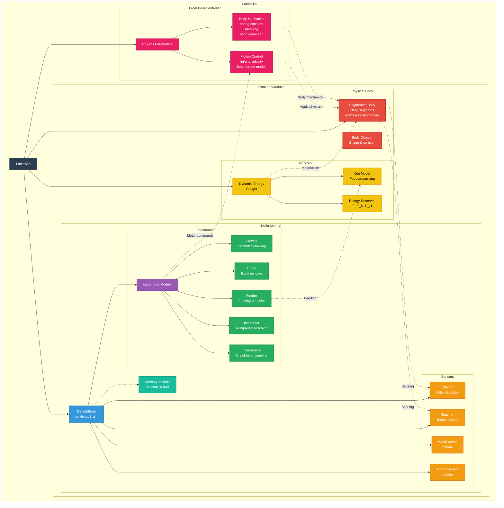

# Larva Agent Architecture (LarvaSim)

## 📊 What This Diagram Shows

This diagram illustrates the **hierarchical component architecture** of a `LarvaSim` agent, showing how it combines behavioral capabilities from `LarvaMotile` with physics control from `BaseController` to create a fully simulated larva.

### Why This Matters

Understanding the agent architecture reveals:
- ✅ **Multiple inheritance**: `LarvaSim(LarvaMotile, BaseController)` combines two parent classes
- ✅ **Component hierarchy**: How modules are organized and nested
- ✅ **Functional separation**: Clear distinction between behavior (LarvaMotile) and physics (BaseController)
- ✅ **Integration points**: How components communicate and coordinate
- ✅ **Modularity**: Components can be independently configured or replaced

### Key Insight

`LarvaSim` implements **multiple inheritance** combining:
1. **LarvaMotile**: Brain, sensors, locomotor, DEB, segmented body
2. **BaseController**: Physics parameters, motion control, body mechanics

---

## Mermaid Diagram



---

## Verification Data

**Status:** ✅ VERIFIED with actual codebase  
**Date:** November 19, 2025  
**Source:** `/src/larvaworld/lib/model/agents/_larva.py`, `/src/larvaworld/lib/model/agents/_larva_sim.py`, `/src/larvaworld/lib/model/modules/`

### Multiple Inheritance Structure ✅

**Class Definition**: `LarvaSim` (`_larva_sim.py`, line 106)

```python
class LarvaSim(LarvaMotile, BaseController):
    """
    Physically-simulated larva agent with realistic biomechanics.

    Combines LarvaMotile behavioral capabilities with BaseController
    physics to provide realistic simulation including body mechanics,
    collision detection, and arena boundary handling.
    """
    __displayname__ = "Simulated larva"
    
    def __init__(self, physics={}, Box2D={}, sensorimotor=None, **kwargs):
        BaseController.__init__(self, **physics)  # Initialize physics
        LarvaMotile.__init__(self, **kwargs)      # Initialize behavior
        self.collision_with_object = False
```

**Key**: `LarvaSim` inherits from **BOTH** `LarvaMotile` and `BaseController`!

### Parent Class 1: LarvaMotile ✅

**Class**: `LarvaMotile` (`_larva.py`, line 295)

**Display Name**: `"Behaving & growing larva"` (line 329)

**Initialization** (`_larva.py`, lines 331-344):
```python
def __init__(self, brain, energetics, life_history, body, **kwargs):
    super().__init__(**body, **kwargs)  # LarvaSegmented initialization
    self.carried_objects = []
    self.brain = self.build_brain(brain)  # Build brain
    self.build_energetics(energetics, life_history=life_history)  # Build DEB
    self.food_detected, self.feeder_motion = None, False
    self.cum_food_detected, self.amount_eaten = 0, 0
```

**Components from LarvaMotile**:
- `brain`: Brain instance (DefaultBrain or NengoBrain)
  - `brain.olfactor`, `brain.toucher`, `brain.windsensor`, `brain.thermosensor`
  - `brain.locomotor` (contains crawler, turner, feeder, intermitter, interference)
  - `brain.modalities` (optional memory attached to modality)
- `deb`: DEB model instance
  - `deb.gut`: Gut model
  - `deb.E`, `deb.E_R`, `deb.E_H`: Energy reserves
- `segmented body`: Inherited from LarvaSegmented
  - `Nseg` segments
  - Body contour for collision

### Parent Class 2: BaseController ✅

**Class**: `BaseController` (`_larva_sim.py`, line 35)

**Initialization** (`_larva_sim.py`, lines 35-76):
```python
class BaseController(param.Parameterized):
    """
    Physics controller for larva kinematic simulation.

    Provides motion generation modes (velocity/force/torque), damping
    coefficients, and body mechanics (torsional spring, bend correction)
    for realistic larva movement simulation.
    """
    # Physics parameters
    lin_vel_coef = PositiveNumber(1.0)
    ang_vel_coef = PositiveNumber(1.0)
    lin_force_coef = PositiveNumber(1.0)
    torque_coef = PositiveNumber(0.5)
    
    # Body mechanics
    body_spring_k = PositiveNumber(1.0, doc="Torsional spring constant")
    bend_correction_coef = PositiveNumber(1.0)
    
    # Damping
    lin_damping = PositiveNumber(1.0)
    ang_damping = PositiveNumber(1.0)
    
    # Motion modes
    lin_mode = param.Selector(objects=["velocity", "force", "impulse"])
    ang_mode = param.Selector(objects=["torque", "velocity"])
```

**Components from BaseController**:
- **Physics Parameters**: velocity/force/torque coefficients
- **Motion Control**: lin_mode, ang_mode (velocity/force/torque/impulse)
- **Body Mechanics**: 
  - `body_spring_k`: Torsional spring for body bending
  - `bend_correction_coef`: Bend angle correction
  - `lin_damping`, `ang_damping`: Damping coefficients
- **Methods**:
  - `compute_delta_rear_angle()`: Body bend mechanics
  - `compute_ang_vel()`: Angular velocity computation

### Integration in LarvaSim ✅

**Initialization Order** (`_larva_sim.py`, lines 146-148):
```python
def __init__(self, physics={}, Box2D={}, sensorimotor=None, **kwargs):
    BaseController.__init__(self, **physics)  # 1. Initialize physics first
    LarvaMotile.__init__(self, **kwargs)      # 2. Then initialize behavior
    self.collision_with_object = False        # 3. Add simulation-specific attrs
```

**Key Integration Points**:
1. **Locomotor → Motion Control**: Brain.locomotor generates (lin_vel, ang_vel, feeder_motion)
2. **Motion Control → Physics**: BaseController applies physics parameters to velocities
3. **Physics → Body**: Final motion is applied to segmented body with damping, spring, etc.

### Data Flow in LarvaSim ✅

```
Environment → Sensors (olfactor, toucher) → Brain.sense()
    ↓
Brain.A_in (total sensory input)
    ↓
Brain → Locomotor.step(A_in, ...)
    ↓
Locomotor → Modules (crawler, turner, feeder, intermitter)
    ↓
(raw_linear_vel, raw_angular_vel, feed_motion)
    ↓
BaseController physics (apply coefficients, damping, modes)
    ↓
(final_lin_vel, final_ang_vel) with body mechanics
    ↓
LarvaSim.prepare_motion() → Update body position/orientation
    ↓
Apply torsional spring, bend correction, collision detection
```

### Correct Hierarchy ✅

```
LarvaSim(LarvaMotile, BaseController)
├── FROM LarvaMotile:
│   ├── brain: Brain
│   │   ├── olfactor, toucher, windsensor, thermosensor
│   │   ├── locomotor: Locomotor
│   │   │   ├── crawler, turner, feeder, intermitter, interference
│   │   └── memory (optional)
│   ├── deb: DEBModel
│   │   ├── gut
│   │   └── reserves (E, E_R, E_H)
│   └── segmented_body (from LarvaSegmented)
│
└── FROM BaseController:
    ├── Physics Parameters (lin_vel_coef, ang_vel_coef, lin_force_coef, torque_coef)
    ├── Motion Control (lin_mode, ang_mode)
    └── Body Mechanics (body_spring_k, damping, bend_correction)
```

### Code Example ✅

```python
# Create a LarvaSim agent
larva = LarvaSim(
    # LarvaMotile parameters
    brain={'olfactor': {'gain': {'odor1': 1.0}}, 'locomotor': {...}},
    energetics={'X_substrate': 0.8},
    body={'length': 0.003, 'Nseg': 11},
    # BaseController parameters
    physics={
        'torque_coef': 0.5,
        'body_spring_k': 1.0,
        'lin_damping': 1.0,
        'ang_damping': 1.0
    }
)

# Access components from both parents
print(f"Brain: {larva.brain}")  # From LarvaMotile
print(f"DEB: {larva.deb}")      # From LarvaMotile
print(f"Torque coef: {larva.torque_coef}")  # From BaseController
print(f"Body spring: {larva.body_spring_k}") # From BaseController

# Step simulation
larva.step()
  → larva.sense()  # LarvaMotile
  → lin, ang, feed = larva.brain.step()  # LarvaMotile.brain
  → apply BaseController physics to (lin, ang)
  → larva.prepare_motion(lin, ang)  # With body mechanics
  → larva.feed()  # LarvaMotile
  → larva.run_energetics()  # LarvaMotile.deb
```

### Comparison: LarvaMotile vs LarvaSim ✅

| Feature | LarvaMotile | LarvaSim |
|---------|-------------|----------|
| **Inheritance** | `LarvaMotile(LarvaSegmented)` | `LarvaSim(LarvaMotile, BaseController)` |
| **Brain** | ✅ Yes | ✅ Inherited from LarvaMotile |
| **DEB** | ✅ Yes | ✅ Inherited from LarvaMotile |
| **Sensors** | ✅ Yes (in brain) | ✅ Inherited from LarvaMotile |
| **Locomotor** | ✅ Yes (in brain) | ✅ Inherited from LarvaMotile |
| **Physics Control** | ❌ No | ✅ From BaseController |
| **Body Mechanics** | ❌ No | ✅ From BaseController |
| **Motion Modes** | ❌ No | ✅ From BaseController |
| **Collision Detection** | ❌ No | ✅ Added in LarvaSim |
| **Use Case** | Abstract behavioral model | Fully simulated larva with physics |

### Why LarvaSim, not just LarvaMotile? ✅

**LarvaMotile** provides:
- Behavioral decision-making (brain)
- Energetics and growth (DEB)
- Raw motor commands (lin_vel, ang_vel)

**BaseController** adds:
- Physics realism (damping, spring constants)
- Motion control modes (velocity/force/torque)
- Body mechanics (torsional spring, bend correction)

**LarvaSim** combines both to create a **fully physically-simulated larva** that:
1. Makes behavioral decisions based on sensory input
2. Generates motor commands through locomotor modules
3. Applies realistic physics to those commands
4. Updates body position with proper body mechanics
5. Handles collisions and boundary conditions

---

## For ReadTheDocs

```rst
Larva Agent Architecture (LarvaSim)
~~~~~~~~~~~~~~~~~~~~~~~~~~~~~~~~~~~~

.. image:: _static/images/larvasim_architecture.png
   :alt: LarvaSim Component Architecture
   :align: center
   :width: 900px

The **LarvaSim** agent combines behavioral and physical simulation through
multiple inheritance:

.. code-block:: python

   class LarvaSim(LarvaMotile, BaseController):
       """Physically-simulated larva with behavior and physics."""

**From LarvaMotile (Behavior)**

``LarvaMotile`` provides behavioral capabilities:

- **Brain**: Sensory processing and decision-making
  
  - Sensors: ``olfactor``, ``toucher``, ``windsensor``, ``thermosensor``
  - Locomotor: Coordinates behavioral modules
  - Memory: Optional RL/MB learning

- **DEB Model**: Metabolism and growth
  
  - Gut model for food processing
  - Energy reserves (E, E_R, E_H)

- **Segmented Body**: Physical structure (from ``LarvaSegmented``)

**From BaseController (Physics)**

``BaseController`` provides physics simulation:

- **Physics Parameters**
  
  - Velocity/force/torque coefficients
  - Motion control modes (velocity/force/impulse)

- **Body Mechanics**
  
  - Torsional spring constant (``body_spring_k``)
  - Damping coefficients (``lin_damping``, ``ang_damping``)
  - Bend correction factor

**Integration Flow**

1. **Sensing**: Environment → Sensors → Brain
2. **Decision**: Brain processes sensory input
3. **Motor Commands**: Locomotor generates raw velocities
4. **Physics**: BaseController applies physics parameters
5. **Execution**: Final motion applied to body with mechanics

**Why Multiple Inheritance?**

- **Separation of Concerns**: Behavior (LarvaMotile) vs Physics (BaseController)
- **Modularity**: Each parent can be modified independently
- **Reusability**: LarvaMotile can be used without physics for abstract models
- **Realism**: BaseController adds physical constraints to behavioral decisions

**Usage Example**

.. code-block:: python

   from larvaworld.lib.model.agents import LarvaSim

   # Create simulated larva
   larva = LarvaSim(
       # Behavioral parameters (LarvaMotile)
       brain={'olfactor': {'gain': 2.0}},
       energetics={'X_substrate': 0.8},
       body={'length': 0.003, 'Nseg': 11},
       # Physics parameters (BaseController)
       physics={
           'torque_coef': 0.5,
           'body_spring_k': 1.0,
           'lin_damping': 1.0
       }
   )

   # Access components from both parents
   larva.brain.olfactor  # From LarvaMotile
   larva.torque_coef     # From BaseController

   # Step simulation (uses both)
   larva.step()

This architecture enables realistic larva simulation by combining autonomous
behavior with physically-grounded motion.
```
