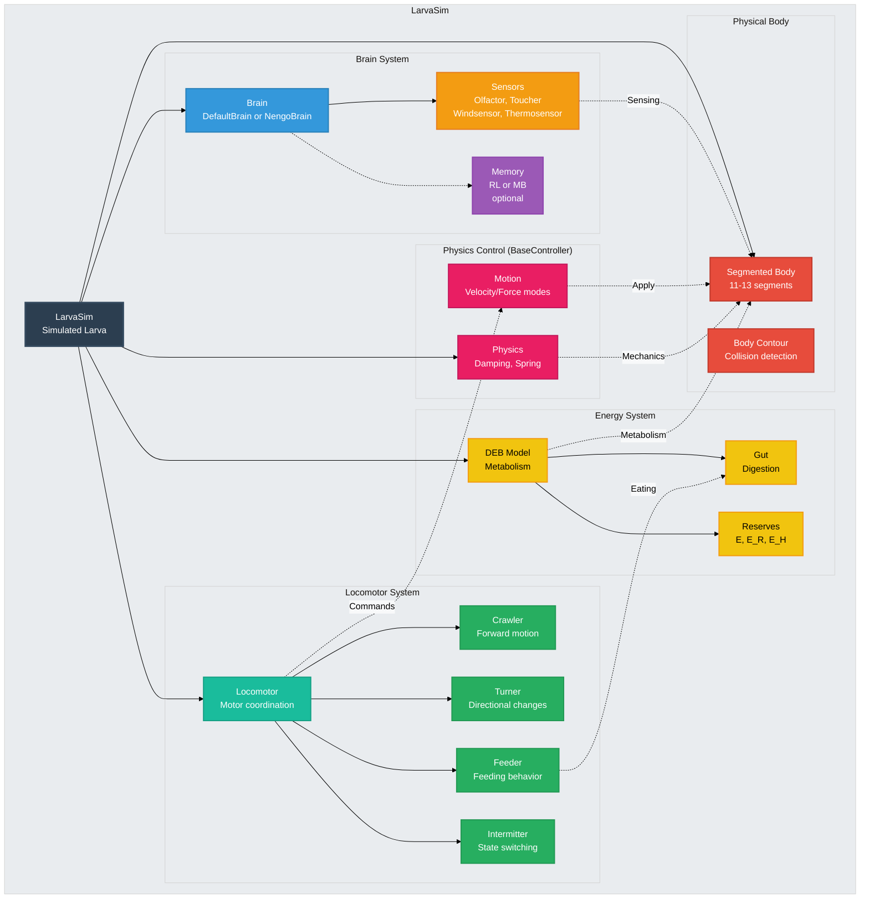

# LarvaSim Architecture (Simplified)

This diagram shows a **simplified view** of the `LarvaSim` class architecture, focusing on the main functional groups rather than exact code structure.

## Description

This simplified view groups `LarvaSim` components by **functional purpose** rather than strict code hierarchy.

### Color Legend

- **⚫ Dark Blue**: LarvaSim agent
- **🔴 Red**: Physical body
- **🟠 Orange**: Sensory systems
- **🔵 Blue**: Brain module
- **🟣 Purple**: Memory (learning)
- **🟢 Green**: Behavioral modules
- **🟡 Yellow**: Energy/metabolism
- **🔷 Cyan**: Locomotor coordination
- **🔴 Pink**: Physics control

### Functional Groups

#### Physical Body (Red)
- **Segmented Body**: 11-13 segments with realistic biomechanics
- **Body Contour**: Shape representation for collision detection

#### Brain System (Blue/Orange/Purple)
- **Brain**: Central control (DefaultBrain or NengoBrain)
- **Sensors**: Environmental perception (olfaction, touch, temperature, wind)
- **Memory**: Optional learning system (RL or model-based)

#### Locomotor System (Cyan/Green)
- **Locomotor**: Coordinates all motor modules
- **Crawler**: Generates forward peristaltic motion
- **Turner**: Controls body bending for direction changes
- **Feeder**: Manages head-sweeping feeding behavior
- **Intermitter**: Switches between run/pause/turn states

#### Energy System (Yellow)
- **DEB Model**: Dynamic Energy Budget for metabolism
- **Gut**: Digestive system and food processing
- **Reserves**: Energy storage (E, E_R, E_H)

#### Physics Control (Pink)
- **Physics**: Body mechanics (damping, torsional spring)
- **Motion**: Motion control modes (velocity/force/torque)

### Information Flow

1. **Perception**: Sensors detect environmental stimuli
2. **Processing**: Brain integrates sensory information
3. **Memory**: Optional learning modulates responses
4. **Motor Generation**: Locomotor coordinates behavioral modules
5. **Physics Application**: BaseController applies realistic motion physics
6. **Execution**: Final motion applied to segmented body
7. **Metabolism**: DEB regulates energy and growth

### Key Differences from Detailed View

This simplified view:
- Groups components by function rather than inheritance
- Hides internal brain structure (modalities dict)
- Shows high-level data flow instead of method calls
- Emphasizes system integration over implementation details

For the **detailed, code-accurate architecture**, see `13_a_larvasim_architecture_verified.md`.

### Biological Fidelity

- **Segmented body**: Matches real larva anatomy
- **Sensory integration**: Realistic multi-modal perception
- **Behavioral modules**: Based on neural oscillators
- **Energy constraints**: Metabolic limits on behavior
- **Physics realism**: Damping, inertia, body mechanics

### Design Principles

1. **Modularity**: Independent, replaceable components
2. **Biological Realism**: Structure mirrors real larvae
3. **Multiple Inheritance**: Combines behavior (LarvaMotile) + physics (BaseController)
4. **Hierarchical Control**: Brain → Locomotor → Modules → Body
5. **Energy Constraints**: DEB limits behavioral capacity
