# Brain Module Architecture

## 📊 What This Diagram Shows

This diagram illustrates the **detailed architecture of the Brain module** from `/src/larvaworld/lib/model/modules/`, showing how sensory modalities, memory systems, and locomotor control are organized within the brain.

### Why This Matters

Understanding the brain architecture reveals:

- ✅ **Sensorimotor integration**: How multiple sensory modalities are processed
- ✅ **Memory attachment**: How learning modules attach to sensory modalities
- ✅ **Locomotor control**: How the brain generates motor commands
- ✅ **Two implementations**: DefaultBrain vs NengoBrain
- ✅ **Modularity**: Each sensor and module can be configured independently

### Key Insight

The Brain module implements a **modular sensorimotor control architecture** where:

1. **Sensors** detect environmental stimuli (olfaction, touch, thermo, wind)
2. **Modalities** process sensory signals and attach optional memory
3. **Memory** (optional) modulates sensory gains through learning
4. **Locomotor** translates integrated sensory input into motor commands

---

## Mermaid Diagram

```mermaid
graph TB
    subgraph BRAIN_CLASSES ["Brain Module Classes"]
        BRAIN[Brain<br/>Base class]:::base
        DEFAULT[DefaultBrain<br/>Standard implementation]:::impl
        NENGO[NengoBrain<br/>Nengo neural network]:::impl

        BRAIN --> DEFAULT
        BRAIN --> NENGO
    end

    subgraph BRAIN_STRUCTURE ["Brain Internal Structure"]
        subgraph SENSORY ["Sensory Modalities (self.modalities)"]
            OLFACTION[olfaction]:::modality
            TOUCH[touch]:::modality
            THERMO[thermosensation]:::modality
            WIND[windsensation]:::modality

            subgraph OLF_DETAIL ["olfaction modality"]
                OLF_SENSOR[sensor: Olfactor]:::sensor
                OLF_FUNC[func: sense_odors]:::func
                OLF_A[A: float<br/>sensory signal]:::signal
                OLF_MEM[mem: Memory<br/>optional]:::memory
            end

            subgraph TOUCH_DETAIL ["touch modality"]
                TOUCH_SENSOR[sensor: Toucher]:::sensor
                TOUCH_FUNC[func: sense_food_multi]:::func
                TOUCH_A[A: float<br/>sensory signal]:::signal
                TOUCH_MEM[mem: Memory<br/>optional]:::memory
            end
        end

        OLFACTION --> OLF_SENSOR
        OLFACTION --> OLF_FUNC
        OLFACTION --> OLF_A
        OLFACTION -.-> OLF_MEM

        TOUCH --> TOUCH_SENSOR
        TOUCH --> TOUCH_FUNC
        TOUCH --> TOUCH_A
        TOUCH -.-> TOUCH_MEM

        subgraph LOCO_MODULE ["Locomotor Module"]
            LOCOMOTOR[Locomotor]:::locomotor
            CRAWLER[Crawler]:::locomod
            TURNER[Turner]:::locomod
            FEEDER[Feeder]:::locomod
            INTERMITTER[Intermitter]:::locomod
            INTERFERENCE[Interference]:::locomod

            LOCOMOTOR --> CRAWLER
            LOCOMOTOR --> TURNER
            LOCOMOTOR --> FEEDER
            LOCOMOTOR --> INTERMITTER
            LOCOMOTOR --> INTERFERENCE
        end

        A_IN[A_in<br/>Total sensory input<br/>sum of all modalities.A]:::output
    end

    subgraph SENSOR_TYPES ["Sensor Modules (from sensor.py)"]
        SENSOR_BASE[Sensor<br/>Base class]:::sensorclass
        OLFACTOR_CLASS[Olfactor<br/>Odor detection]:::sensorclass
        TOUCHER_CLASS[Toucher<br/>Touch/food detection]:::sensorclass
        WIND_CLASS[WindSensor<br/>Wind direction]:::sensorclass
        THERMO_CLASS[Thermosensor<br/>Temperature gradients]:::sensorclass

        SENSOR_BASE --> OLFACTOR_CLASS
        SENSOR_BASE --> TOUCHER_CLASS
        SENSOR_BASE --> WIND_CLASS
        SENSOR_BASE --> THERMO_CLASS
    end

    subgraph MEMORY_TYPES ["Memory Modules (from memory.py)"]
        MEMORY_BASE[Memory<br/>Base class]:::memclass
        RL_MEM[RLmemory<br/>Q-learning]:::memclass
        RLOLF_MEM[RLOlfMemory<br/>Olfactory RL]:::memclass
        MB_MEM[RemoteBrianModelMemory<br/>Mushroom Body]:::memclass

        MEMORY_BASE --> RL_MEM
        RL_MEM --> RLOLF_MEM
        MEMORY_BASE --> MB_MEM
    end

    %% Connections
    DEFAULT --> OLFACTION
    DEFAULT --> TOUCH
    DEFAULT --> THERMO
    DEFAULT --> WIND
    DEFAULT --> LOCOMOTOR

    OLF_SENSOR -.->|Modulates<br/>gain| OLF_MEM
    TOUCH_SENSOR -.->|Modulates<br/>gain| TOUCH_MEM

    OLF_A --> A_IN
    TOUCH_A --> A_IN

    A_IN --> LOCOMOTOR

    OLFACTOR_CLASS -.->|Instantiated as| OLF_SENSOR
    TOUCHER_CLASS -.->|Instantiated as| TOUCH_SENSOR

    RLOLF_MEM -.->|Can attach to| OLF_MEM
    MB_MEM -.->|Can attach to| TOUCH_MEM

    %% Color definitions
    classDef base fill:#2c3e50,stroke:#34495e,stroke-width:3px,color:#ffffff
    classDef impl fill:#3498db,stroke:#2980b9,stroke-width:2px,color:#ffffff
    classDef modality fill:#9b59b6,stroke:#8e44ad,stroke-width:2px,color:#ffffff
    classDef sensor fill:#f39c12,stroke:#e67e22,stroke-width:2px,color:#ffffff
    classDef func fill:#1abc9c,stroke:#16a085,stroke-width:2px,color:#ffffff
    classDef signal fill:#e74c3c,stroke:#c0392b,stroke-width:2px,color:#ffffff
    classDef memory fill:#e91e63,stroke:#c2185b,stroke-width:2px,color:#ffffff
    classDef locomotor fill:#27ae60,stroke:#229954,stroke-width:2px,color:#ffffff
    classDef locomod fill:#2ecc71,stroke:#27ae60,stroke-width:2px,color:#ffffff
    classDef output fill:#f1c40f,stroke:#f39c12,stroke-width:3px,color:#000000
    classDef sensorclass fill:#f39c12,stroke:#e67e22,stroke-width:2px,color:#000000
    classDef memclass fill:#e91e63,stroke:#c2185b,stroke-width:2px,color:#000000
```



---

## Verification Data

**Status:** ✅ VERIFIED with actual codebase
**Date:** November 19, 2025
**Source:** `/src/larvaworld/lib/model/modules/brain.py`, `/sensor.py`, `/memory.py`, `/locomotor.py`

### Brain Class Hierarchy ✅

**Base Class**: `Brain` (`brain.py`, line 35)

```python
class Brain(NestedConf):
    """
    Base brain class for agent behavioral control.

    Orchestrates sensory processing and locomotor control for autonomous
    agents in simulation. Integrates multiple sensory modalities (olfaction,
    touch, thermosensation, wind) with memory and locomotor modules.
    """
    # Sensor attributes
    olfactor = ClassAttr(class_=MD.parent_class("olfactor"), default=None)
    toucher = ClassAttr(class_=MD.parent_class("toucher"), default=None)
    windsensor = ClassAttr(class_=MD.parent_class("windsensor"), default=None)
    thermosensor = ClassAttr(class_=MD.parent_class("thermosensor"), default=None)
```

**Implementation 1**: `DefaultBrain` (`brain.py`, line 207)

```python
class DefaultBrain(Brain):
    """
    Default larva brain implementation with full sensory integration.

    Extends base Brain with automatic sensor module construction
    and integrated locomotor stepping.
    """
    def __init__(self, conf, agent=None, dt=None, **kwargs):
        kws = {"dt": dt, "brain": self}
        kwargs.update(MD.build_sensormodules(conf=conf, **kws))  # Build sensors
        super().__init__(agent=agent, dt=dt, conf=conf, **kwargs)

    def step(self, pos, on_food=False, **kwargs):
        self.sense(pos=pos, reward=on_food)  # Process all sensors
        return self.locomotor.step(A_in=self.A_in, on_food=on_food, **kwargs)
```

**Implementation 2**: `NengoBrain` (`nengobrain.py`, line 15)

```python
class NengoBrain(Network, Brain):
    """Brain implementation using Nengo neural networks."""
```

### Modalities Structure ✅

**Initialization** (`brain.py`, lines 90-117):

```python
self.modalities = util.AttrDict({
    "olfaction": {
        "sensor": self.olfactor,       # Olfactor instance or None
        "func": self.sense_odors,      # Processing function
        "A": 0.0,                       # Current sensory signal
        "mem": None,                    # Optional memory module
    },
    "touch": {
        "sensor": self.toucher,
        "func": self.sense_food_multi,
        "A": 0.0,
        "mem": None,
    },
    "thermosensation": {
        "sensor": self.thermosensor,
        "func": self.sense_thermo,
        "A": 0.0,
        "mem": None,
    },
    "windsensation": {
        "sensor": self.windsensor,
        "func": self.sense_wind,
        "A": 0.0,
        "mem": None,
    },
})
```

**Memory Attachment** (`brain.py`, lines 120-126):

```python
m = conf["memory"]
if m is not None:
    M = self.modalities[m.modality]  # Get target modality (e.g., "olfaction")
    if M.sensor:
        m.gain = M.sensor.gain
        kws = {"dt": dt, "brain": self}
        M.mem = MD.build_memory_module(conf=m, **kws)  # Attach memory
```

### Sensor Modules ✅

**Base Class**: `Sensor` (`sensor.py`)

**Olfactor** (`sensor.py`, line 163):

```python
class Olfactor(Sensor):
    """
    Olfactory sensor for odor detection.

    Attributes:
        gain_dict: Dict mapping odor IDs to gain values
        sensed_odors: List of currently detected odors
    """
```

**Toucher** (`sensor.py`, line 206):

```python
class Toucher(Sensor):
    """
    Tactile sensor for food/substrate detection.

    Attributes:
        radius: Detection radius
        source_contact: Currently detected food source
    """
```

**Windsensor**, **Thermosensor**: Similar structure

### Memory Modules ✅

**Base Class**: `Memory` (`memory.py`, line 37)

```python
class Memory(Timer):
    """
    Base memory module for learning.

    Attributes:
        brain: Parent brain instance
        modality: Target sensory modality
    """
```

**RLmemory** (`memory.py`, line 87):

```python
class RLmemory(Memory):
    """Q-learning reinforcement learning memory."""
```

**RLOlfMemory** (`memory.py`, line 247):

```python
class RLOlfMemory(RLmemory):
    """Olfactory-specific RL memory that modulates odor gains."""
```

**RemoteBrianModelMemory**: Mushroom Body (MB) memory using remote Brian2 neural simulation

### Locomotor Module ✅

**Class**: `Locomotor` (`locomotor.py`, line 32)

**Attributes**:

- `crawler`: Peristaltic crawling module
- `turner`: Body bending module
- `feeder`: Feeding behavior module
- `intermitter`: Run/pause/turn state switching
- `interference`: Crawl-bend coupling

**Integration** (`brain.py`, line 89):

```python
from .locomotor import Locomotor as _Locomotor
self.locomotor = _Locomotor(conf=conf, dt=self.dt)
```

### Data Flow ✅

**1. Sensing Phase** (`brain.py`, `sense()` method):

```python
def sense(self, pos, reward=False):
    """Process all sensory modalities."""
    for mod in self.modalities.values():
        if mod.sensor:
            # Call processing function (e.g., sense_odors, sense_food_multi)
            mod.func(pos=pos)

            # Optional memory modulation
            if mod.mem:
                mod.A = mod.mem.step(A=mod.A, reward=reward)
```

**2. Integration** (`brain.py`, properties):

```python
@property
def A_in(self):
    """Total sensory input = sum of all modality signals."""
    return sum(m.A for m in self.modalities.values())

@property
def A_olf(self):
    return self.modalities["olfaction"].A

@property
def A_touch(self):
    return self.modalities["touch"].A
```

**3. Motor Generation** (`DefaultBrain.step()`):

```python
def step(self, pos, on_food=False, **kwargs):
    self.sense(pos=pos, reward=on_food)  # Process sensors
    return self.locomotor.step(
        A_in=self.A_in,  # Total sensory input
        on_food=on_food,
        **kwargs
    )  # Returns (lin_vel, ang_vel, feeding_flag)
```

### Configuration Example ✅

```python
brain_conf = {
    # Sensors (optional)
    'olfactor': {
        'gain': {'odor1': 1.0, 'odor2': 0.5}
    },
    'toucher': {
        'radius': 0.001
    },
    'windsensor': None,  # Disabled
    'thermosensor': None,  # Disabled

    # Memory (optional)
    'memory': {
        'modality': 'olfaction',  # Attach to olfaction modality
        'type': 'RL',             # RLOlfMemory
        'learning_rate': 0.01
    },

    # Locomotor
    'locomotor': {
        'crawler': {'freq': 1.0},
        'turner': {...},
        'feeder': {...},
        'intermitter': {...}
    }
}

# Create brain
brain = DefaultBrain(conf=brain_conf, agent=my_larva, dt=0.1)

# Access structure
brain.olfactor                       # Olfactor sensor instance
brain.modalities['olfaction'].sensor # Same as above
brain.modalities['olfaction'].A      # Current olfactory signal
brain.modalities['olfaction'].mem    # Memory module (if attached)
brain.A_in                           # Total sensory input
brain.locomotor                      # Locomotor module
brain.locomotor.crawler              # Crawler module

# Step brain
lin_vel, ang_vel, feeding = brain.step(pos=larva.pos, on_food=False)
```

### Key Design Patterns ✅

**1. Modality Pattern**

Each sensory modality is a dictionary with:

- `sensor`: Sensor module instance (or None if disabled)
- `func`: Processing function (method of Brain)
- `A`: Current sensory signal value
- `mem`: Optional memory module for learning

**2. Optional Components**

- Sensors can be `None` (disabled)
- Memory is optional and attaches to a specific modality
- Each module can be independently configured

**3. Separation of Concerns**

- **Brain**: Orchestration and integration
- **Sensors**: Environmental perception
- **Memory**: Learning and adaptation
- **Locomotor**: Motor command generation

---

## For ReadTheDocs

```rst
Brain Module Architecture
~~~~~~~~~~~~~~~~~~~~~~~~~~

.. image:: _static/images/brain_architecture.png
   :alt: Brain Module Internal Structure
   :align: center
   :width: 900px

The **Brain** module orchestrates sensory processing and locomotor control
through a modular architecture.

Class Hierarchy
^^^^^^^^^^^^^^^

**Base Class: Brain**

The abstract base class defining the sensorimotor control interface.

**Implementations:**

- ``DefaultBrain``: Standard implementation with automatic sensor construction
- ``NengoBrain``: Neural network implementation using Nengo framework

Internal Structure
^^^^^^^^^^^^^^^^^^

**Sensory Modalities**

The brain organizes sensors into modalities (``self.modalities`` dict):

.. code-block:: python

   modalities = {
       "olfaction": {
           "sensor": Olfactor instance,
           "func": sense_odors method,
           "A": 0.0,  # Current signal
           "mem": None  # Optional memory
       },
       "touch": {...},
       "thermosensation": {...},
       "windsensation": {...}
   }

Each modality contains:

- **sensor**: Sensor module instance (or None if disabled)
- **func**: Processing function to compute sensory signal
- **A**: Current sensory signal value (float)
- **mem**: Optional memory module for learning

**Sensory Integration**

Total sensory input is computed as:

.. code-block:: python

   A_in = sum(modality.A for modality in modalities.values())

This integrated signal drives locomotor behavior.

**Memory Attachment**

Memory modules can attach to any modality:

.. code-block:: python

   # Attach RL memory to olfaction
   memory_conf = {
       'modality': 'olfaction',
       'type': 'RL',
       'learning_rate': 0.01
   }

   # Memory modulates sensor gain during learning
   modality.A = modality.mem.step(A=raw_signal, reward=on_food)

**Locomotor Integration**

The brain contains a ``Locomotor`` module that translates sensory input
into motor commands:

.. code-block:: python

   lin_vel, ang_vel, feeding = brain.locomotor.step(
       A_in=brain.A_in,
       on_food=on_food,
       length=body_length
   )

Sensor Modules
^^^^^^^^^^^^^^

Available sensor types (from ``sensor.py``):

- ``Olfactor``: Odor concentration detection with gain modulation
- ``Toucher``: Food/substrate contact detection
- ``WindSensor``: Wind direction sensing
- ``Thermosensor``: Temperature gradient detection

Memory Modules
^^^^^^^^^^^^^^

Available memory types (from ``memory.py``):

- ``RLmemory``: Q-learning reinforcement learning
- ``RLOlfMemory``: Olfactory-specific RL (modulates odor gains)
- ``RemoteBrianModelMemory``: Mushroom Body (MB) memory using remote Brian2 neural simulation

Data Flow
^^^^^^^^^

1. **Sensing**: Each modality's sensor detects environmental stimuli
2. **Processing**: Processing function computes sensory signal
3. **Memory**: Optional memory modulates signal based on learning
4. **Integration**: All modality signals summed to ``A_in``
5. **Motor**: Locomotor translates ``A_in`` to motor commands

Configuration
^^^^^^^^^^^^^

.. code-block:: python

   from larvaworld.lib.model.modules import DefaultBrain

   brain_conf = {
       'olfactor': {'gain': {'odor1': 1.0}},
       'toucher': {'radius': 0.001},
       'memory': {
           'modality': 'olfaction',
           'type': 'RL'
       },
       'locomotor': {
           'crawler': {...},
           'turner': {...}
       }
   }

   brain = DefaultBrain(conf=brain_conf, agent=larva, dt=0.1)
   lin_vel, ang_vel, feeding = brain.step(pos=larva.pos, on_food=False)

This modular design enables flexible configuration of sensory capabilities,
learning mechanisms, and motor behaviors.
```
