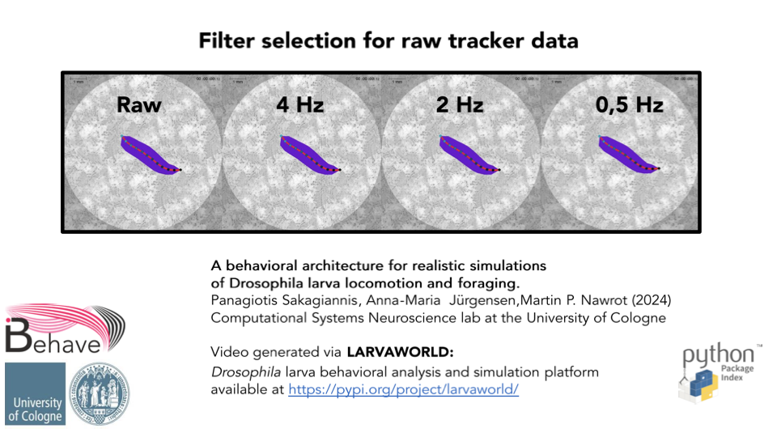
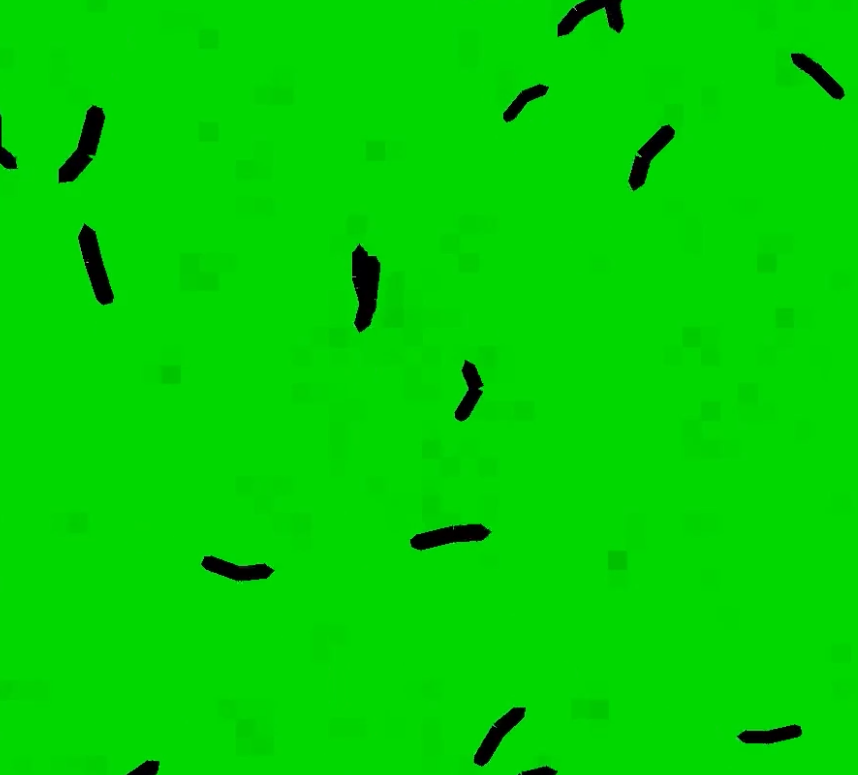
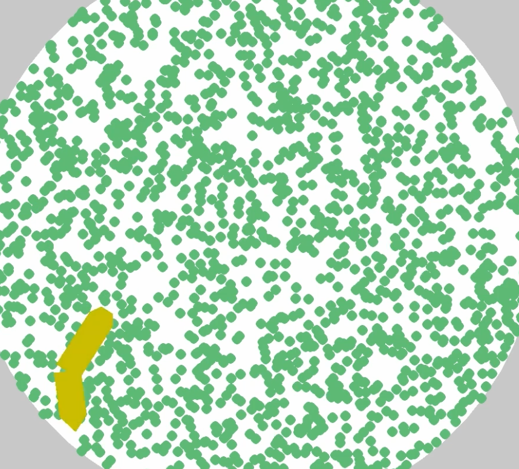
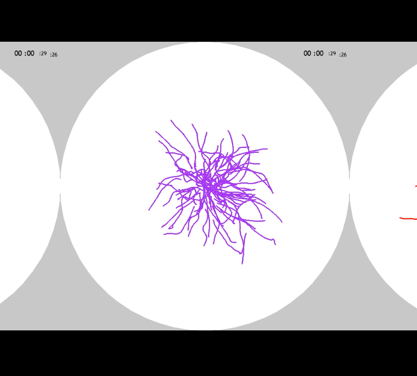
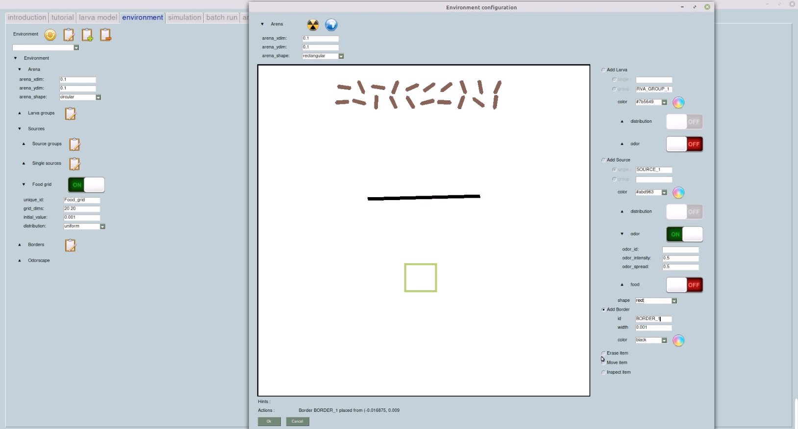

# Video Examples

Quick links to rendered Larvaworld simulations. Click a thumbnail to open the MP4 in your browser.

### Behavioral simulations (from [Sakagiannis et al. 2025](https://doi.org/10.7554/eLife.104262.1))

  

    <a href="https://computational-systems-neuroscience.de/wp-content/uploads/2024/10/1.mp4">
      
      
Bisegmental simplification of the larva body

    </a>
  

  

    <a href="https://computational-systems-neuroscience.de/wp-content/uploads/2024/10/2.mp4">
      
      
Locomotory model for Drosophila larva

    </a>
  

  

    <a href="https://computational-systems-neuroscience.de/wp-content/uploads/2024/10/3.mp4">
      
      
Linear & angular speed during a 3' larva trajectory

    </a>
  

  

    <a href="https://computational-systems-neuroscience.de/wp-content/uploads/2024/10/4.mp4">
      
      
Linear & angular speed during a 40'' larva trajectory

    </a>
  

  

    <a href="https://computational-systems-neuroscience.de/wp-content/uploads/2024/10/5.mp4">
      
      
Dispersion for real VS simulated larvae

    </a>
  

  

    <a href="https://computational-systems-neuroscience.de/wp-content/uploads/2024/10/6.mp4">
      
      
Chemotaxis behavioral simulations

    </a>
  

  

    <a href="https://computational-systems-neuroscience.de/wp-content/uploads/2024/10/7.mp4">
      
      
Odor preference behavioral simulations

    </a>
  

  

    <a href="https://computational-systems-neuroscience.de/wp-content/uploads/2024/10/8.mp4">
      
      
Filter selection for raw tracker data

    </a>
  

  

    <a href="https://computational-systems-neuroscience.de/wp-content/uploads/2024/10/9.mp4">
      
      
Free exploration for bisegmental real VS simulated larvae

    </a>
  

### Foraging & growth simulations

  

    <a href="https://computational-systems-neuroscience.de/wp-content/uploads/2025/07/feed_grid_20l_1h.mp4">
      
      
Feeding grid (20 larvae, 1 h)

    </a>
  

  

    <a href="https://computational-systems-neuroscience.de/wp-content/uploads/2025/07/growth_7hours.mp4">
      
      
Growth over 7 hours

    </a>
  

  

    <a href="https://computational-systems-neuroscience.de/wp-content/uploads/2025/03/3conditions.mp4">
      
      
Nutritional state - dependent dispersal

    </a>
  

### GUI usage videos (deprecated)

  

    <a href="https://computational-systems-neuroscience.de/wp-content/uploads/2025/03/gui_1.mp4">
      
      
GUI: Simulation &amp; Analysis

    </a>
  

  

    <a href="https://computational-systems-neuroscience.de/wp-content/uploads/2025/03/gui_2.mp4">
      
      
GUI: Environment configuration

    </a>
  

### Dynamic sensory landscapes (windscape & odorscape)

  

    <a href="https://computational-systems-neuroscience.de/wp-content/uploads/2025/03/wind_speed.mp4">
      
      
Wind of variable speed

    </a>
  

  

    <a href="https://computational-systems-neuroscience.de/wp-content/uploads/2025/03/windNodorscape.mp4">
      
      
Wind-affected odorscape

    </a>
  

  

    <a href="https://computational-systems-neuroscience.de/wp-content/uploads/2025/03/wind_direction.mp4">
      
      
Wind of variable direction

    </a>
  

  

    <a href="https://computational-systems-neuroscience.de/wp-content/uploads/2025/03/single_air-puffs.mp4">
      
      
Single air-puff of variable direction

    </a>
  

  

    <a href="https://computational-systems-neuroscience.de/wp-content/uploads/2025/03/repetitive_air-puffs.mp4">
      
      
Repetitive air-puffs

    </a>
  

_Credits: Sakagiannis PP. Larvaworld platform generated videos, 2025._
