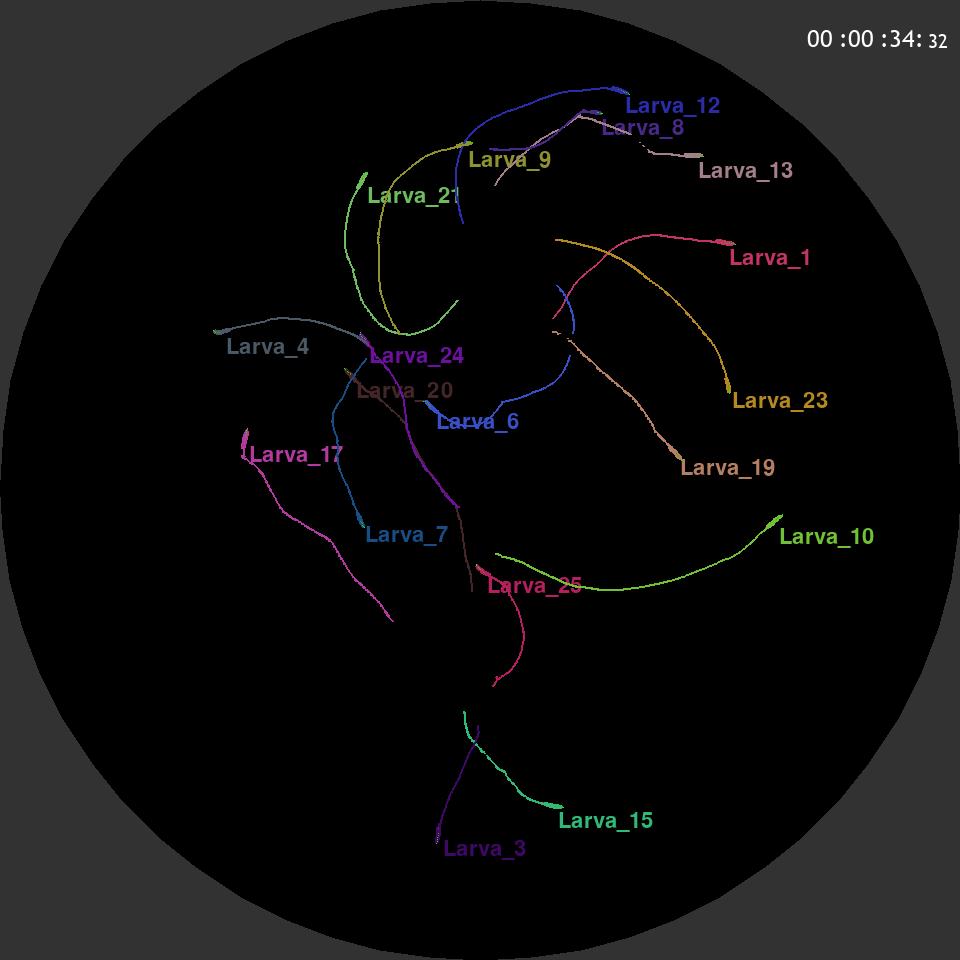
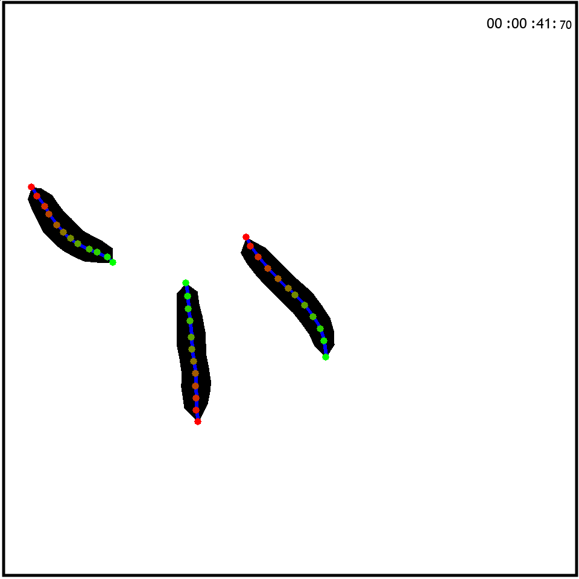
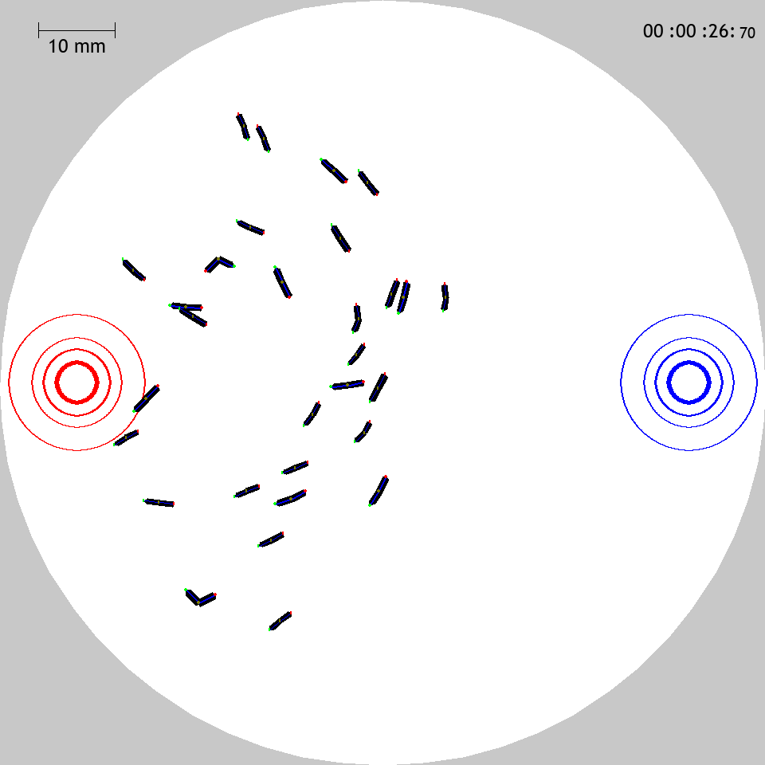

# Visualization Snapshots

This page showcases examples of Larvaworld visualizations across different modes.

---

## Figure: Visualization Snapshots



**Figure**: Replay mode with black background showing larva trajectories.

---



**Figure**: Zoomed view of individual larva with midline and contour.

---



**Figure**: Olfactory preference test simulation showing larvae navigating between odor sources.

---


**Figure**: Multi-agent game simulation ("capture the flag").

---

## Visualization Modes

### 1. Real-Time Display

**Purpose**: Interactive exploration

```python
from larvaworld.lib.sim import ExpRun

run = ExpRun(
    experiment="dish",
    N=10,
    screen_kws={"vis_mode": "video"}
)
run.simulate()
```

**Features**:

- Real-time rendering
- Interactive controls (see {doc}`keyboard_controls`)
- Adjustable drawing options

---

### 2. Video Export

**Purpose**: Create videos for presentations

```python
run = ExpRun(
    experiment="chemotaxis",
    N=20,
    screen_kws={
        'vis_mode': 'video',
        'video_name': 'chemotaxis.mp4',
        'fps': 10
    }
)
run.simulate()
```

**Supported Formats**: MP4, AVI

---

### 3. Image Snapshots

**Purpose**: Save specific frames

```python
run = ExpRun(
    experiment="dish",
    N=5,
    screen_kws={
        'vis_mode': 'image',
        'snapshot_times': [0, 60, 120]  # Times in seconds
    }
)
run.simulate()
```

---

## Drawing Options

### Midline

Shows 12-point body posture:

```python
screen_kws = {"draw_midline": True, "Nsegs": 12}
```

### Contour

Shows full body outline:

```python
screen_kws = {"draw_contour": True}
```

### Trails

Shows trajectory history:

```python
screen_kws = {"draw_trails": True, "trail_dt": 5.0}  # 5 seconds
```

### Color by Behavior

Colors indicate behavior state:

```python
screen_kws = {"color_behavior": True}
```

- **Green**: Running
- **Red**: Paused
- **Blue**: Turning

---

## Related Documentation

- {doc}`keyboard_controls` - Interactive controls
- {doc}`web_applications` - Web-based dashboards
- {doc}`plotting_api` - Analysis plots
