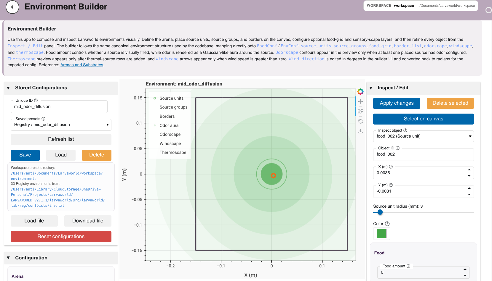
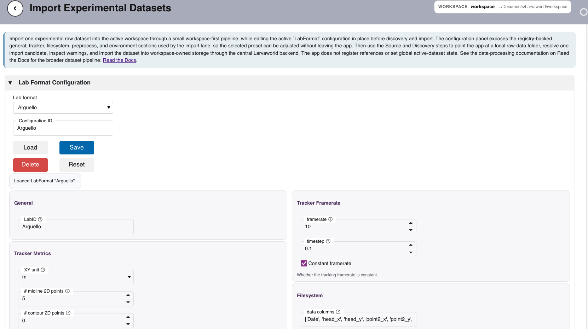
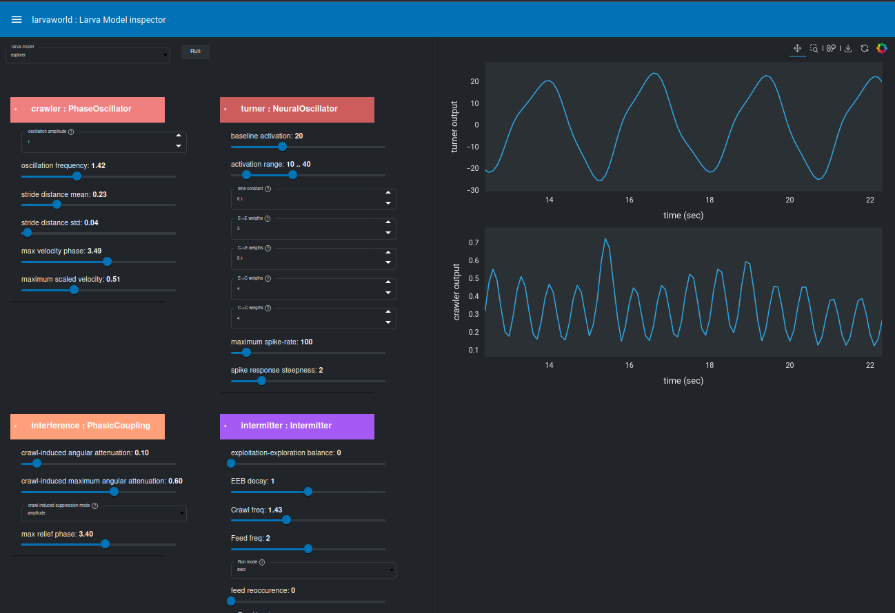

# Web Applications

Larvaworld provides browser-based applications for simulation setup, environment
configuration, experimental dataset import, dataset management, model inspection,
and trajectory visualization. The current browser entry point is the
**Larvaworld Portal**, launched with `larvaworld-portal`.

The portal is built with **Panel** and the HoloViz/Bokeh stack. It combines
workspace-aware workflows, curated landing-page navigation, notebook launch
shortcuts, and the established Larvaworld visualization dashboards in one served
application.

---

## Launching the Portal

```bash
larvaworld-portal
```

**Access**: `http://localhost:5006`

The default port can be overridden with:

```bash
LARVAWORLD_PORTAL_PORT=5010 larvaworld-portal
```

Browser opening can be controlled with:

```bash
LARVAWORLD_PORTAL_OPEN_BROWSER=false larvaworld-portal
```

Stop the server with **Ctrl+C**.

The legacy dashboard launcher remains available as:

```bash
larvaworld-app
```

---

## Portal Structure

The portal serves multiple Panel applications from a single Bokeh process. The
main entry point opens a loading and workspace setup screen, then redirects to
the landing page.

| Area                             | App ID / Route           | Purpose                                                                          |
| -------------------------------- | ------------------------ | -------------------------------------------------------------------------------- |
| **Loading / Workspace Setup**    | `/`, `loading`           | Initialize the portal and select or initialize a Larvaworld workspace            |
| **Landing Page**                 | `landing`                | Browse workflows by user mode and application lane                               |
| **Notebook Launcher**            | `notebook`               | Open workflow-specific tutorial notebooks from the portal context                |
| **Single Experiment**            | `wf.run_experiment`      | Configure one Larvaworld experiment run in the browser                           |
| **Import Experimental Datasets** | `wf.open_dataset`        | Discover raw experimental datasets and import one dataset into workspace storage |
| **Dataset Manager**              | `wf.dataset_manager`     | Browse, inspect, copy paths, refresh, and remove imported workspace datasets     |
| **Environment Builder**          | `wf.environment_builder` | Build arenas, borders, obstacles, food layouts, and sensory landscapes           |
| **Dataset Replay**               | `track_viewer`           | Replay and inspect larval trajectory datasets                                    |
| **Model Inspector**              | `larva_models`           | Browse available larva model presets and parameters                              |
| **Module Inspector**             | `locomotory_modules`     | Inspect locomotory and sensorimotor module parameters                            |

---

## Workspace-Aware Workflows

The portal uses an active Larvaworld workspace for persistent browser workflows.
Workspace-owned artifacts, such as imported datasets and saved environment
presets, are stored under the selected workspace.

The workspace setup screen appears before entering the landing page. Once a
workspace is selected, portal apps can share a consistent storage location for
dataset imports, environment presets, notebook outputs, and other workflow
artifacts.

---

## Single Experiment

**Purpose**: Configure one Larvaworld experiment run from the browser.

**Features**:

- Select an experiment template from the Larvaworld registry
- Adjust key run settings such as duration and larvae-per-group override
- Apply a workspace environment preset or use the template default
- Preview arena and environment configuration before running

**Access**: `wf.run_experiment`

---

## Environment Builder

**Purpose**: Build reusable environment presets for experiments and simulations.

**Features**:

- Configure arena geometry and dimensions
- Add borders, obstacles, and other spatial structures
- Define food layouts and source distributions
- Configure odor, wind, and thermal landscapes
- Save environment presets for reuse from the active workspace

**Access**: `wf.environment_builder`



**Figure**: Larvaworld Portal Environment Builder with arena, food, border, and
scape configuration controls.

---

## Import Experimental Datasets

**Purpose**: Import one raw experimental dataset into workspace-owned storage.

**Features**:

- Select a stored `LabFormat` configuration
- Inspect and edit tracker, filesystem, preprocessing, and environment settings
- Choose or browse to a raw-data root
- Discover candidate raw datasets from the selected source
- Import one selected candidate through the central Larvaworld import backend
- Save the imported dataset under the active workspace

**Access**: `wf.open_dataset`



**Figure**: Import Experimental Datasets workflow with `LabFormat`
configuration, source selection, discovery, and workspace import controls.

---

## Dataset Manager

**Purpose**: Browse and manage imported datasets stored in the active workspace.

**Features**:

- List workspace-imported datasets as lightweight records
- Search and filter the imported dataset catalog
- Inspect dataset IDs, lab IDs, group IDs, reference IDs, and agent counts
- View paths to the dataset directory, `conf.txt`, and `data.h5`
- Copy dataset paths and remove imported datasets from workspace storage

**Access**: `wf.dataset_manager`

---

## Dataset Replay

**Purpose**: Replay larval trajectories frame by frame.

**Features**:

- Inspect trajectory geometry and motion quality
- Step through movement over time
- Compare individuals within a dataset
- Use the established Larvaworld replay dashboard from the portal

**Access**: `track_viewer`

---

## Model Inspector

**Purpose**: Explore larva model presets and model parameters.

**Features**:

- Browse available model configurations
- Inspect model parameter values
- Compare model presets before simulation
- Review locomotory model assumptions from the browser

**Access**: `larva_models`

---

## Module Inspector

**Purpose**: Inspect behavioral and locomotory modules.

**Features**:

- Browse locomotory and sensorimotor module settings
- Inspect module parameters and roles
- Review how modules contribute to larval control

**Access**: `locomotory_modules`

---

## Legacy Dashboard Launcher

The `larvaworld-app` command serves the established dashboard collection
directly. These dashboards are also available through the portal routes where
they are part of the landing registry.

| Dashboard              | App ID               | Purpose                                |
| ---------------------- | -------------------- | -------------------------------------- |
| **Experiment Viewer**  | `experiment_viewer`  | View experiment results interactively  |
| **Track Viewer**       | `track_viewer`       | Inspect trajectories                   |
| **Model Inspector**    | `larva_models`       | Explore locomotory models              |
| **Module Inspector**   | `locomotory_modules` | Inspect behavioral modules             |
| **Lateral Oscillator** | `lateral_oscillator` | Visualize the neural oscillator module |

---

## Web App Architecture



**Figure**: Larvaworld web application architecture showing interactive
visualization and control panels.

The portal keeps the browser UI separated from core Larvaworld model, registry,
and dataset functionality. App controllers orchestrate existing backend
functions and configuration classes, while persistent workflow artifacts are
written to the active workspace.

The main architecture layers are:

- **Portal server**: maps route IDs to lazily loaded Panel app factories
- **Landing registry**: defines application metadata, lanes, quick-start modes,
  documentation links, and notebook shortcuts
- **Workspace layer**: stores portal-owned artifacts under the selected workspace
- **Dataset lane**: discovers raw datasets, imports them into the workspace, and
  lists imported dataset records
- **Configuration widgets**: expose reusable editors for Larvaworld
  `param.Parameterized` configuration classes
- **Legacy dashboards**: remain available for established replay, model, module,
  and oscillator inspection views

---

## Related Documentation

- {doc}`keyboard_controls` - Interactive controls
- {doc}`visualization_snapshots` - Visualization examples
- {doc}`../concepts/architecture_overview` - Platform architecture
